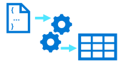
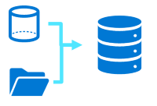
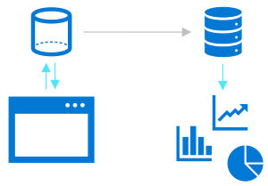
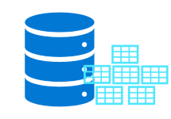
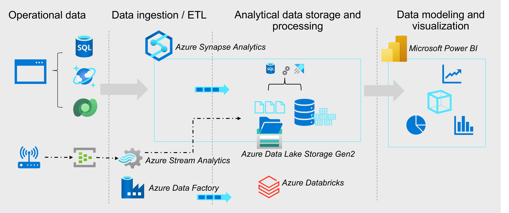

# M01.01 Introduction to data engineering on Azure

## Unit 1 of 6

### Introduction

In most organizations, a data engineer is the primary role responsible for integrating, transforming, and consolidating data from various structured and unstructured data systems into structures that are suitable for building analytics solutions. An Azure data engineer also helps ensure that data pipelines and data stores are high-performing, efficient, organized, and reliable, given a specific set of business requirements and constraints.

### Next unit: What is data engineering

## Unit 2 of 6

### What is data engineering

The data engineer will often work with multiple types of data to perform many operations using many scripting or coding languages that are appropriate to their individual organization.

#### Types of data

There are three primary types of data that a data engineer will work with.

| Structured | Semi-structured | Unstructured |
| :-- | :-- | :-- |
|  |  |  |
| Structured data primarily comes from table-based source systems such as a relational database or from a flat file such as a comma separated (CSV) file. The primary element of a structured file is that the rows and columns are aligned consistently throughout the file. | Semi-structured data is data such as JavaScript object notation (JSON) files, which may require flattening prior to loading into your source system. When flattened, this data doesn't have to fit neatly into a table structure. | Unstructured data includes data stored as key-value pairs that don't adhere to standard relational models and Other types of unstructured data that are commonly used include portable data format (PDF), word processor documents, and images. |

#### Data operations

As a data engineer some of the main tasks that you'll perform in Azure include *data integration*, *data transformation*, and *data consolidation*.

##### Data integration

Data Integration involves establishing links between operational and analytical services and data sources to enable secure, reliable access to data across multiple systems. For example, a business process might rely on data that is spread across multiple systems, and a data engineer is required to establish links so that the required data can be extracted from all of these systems.

##### Data transformation

Operational data usually needs to be *transformed* into suitable structure and format for analysis, often as part of an *extract, transform, and load* (ETL) process; though increasingly a variation in which you *extract, load, and transform* (ELT) the data is used to quickly ingest the data into a data lake and then apply "big data" processing techniques to transform it. Regardless of the approach used, the data is prepared to support downstream analytical needs.

##### Data consolidation

Data consolidation is the process of combining data that has been extracted from multiple data sources into a consistent structure - usually to support analytics and reporting. Commonly, data from operational systems is extracted, transformed, and loaded into analytical stores such as a data lake or data warehouse.

#### Common languages

Data Engineers must be proficient with a range of tools and scripting languages - in particular SQL and Python, and potentially others.

- **SQL** - One of the most common languages data engineers use is SQL, or Structured Query Language, which is a relatively easy language to learn. SQL uses queries that include SELECT, INSERT, UPDATE, and DELETE statements to directly work with the data stored in tables.

- **Python** - Python is one of the most popular and fastest growing programming languages in the world. It's used for all sorts of tasks, including web programming and data analysis. It has emerged as the language to learn for machine learning, and is increasing in popularity in data engineering with the use of notebooks.

- **Others** - Depending upon the needs of the organization and your individual skill set, you may also use other popular languages within or outside of notebooks including R, Java, Scala, .NET, and more. The use of notebooks is growing in popularity, and allows collaboration using different languages within the same notebook.

### Next unit: Important data engineering concepts

## Unit 3 of 6

### Important data engineering concepts

There are some core concepts with which data engineers should be familiar. These concepts underpin many of the workloads that data engineers must implement and support.

#### Operational and analytical data

*Operational* data is usually transactional data that is generated and stored by applications, often in a relational or non-relational database. *Analytical* data is data that has been optimized for analysis and reporting, often in a data warehouse.

One of the core responsibilities of a data engineer is to design, implement, and manage solutions that integrate operational and analytical data sources or extract operational data from multiple systems, transform it into appropriate structures for analytics, and load it into an analytical data store (usually referred to as ETL solutions).

#### Streaming data

Streaming data refers to perpetual sources of data that generate data values in real-time, often relating to specific events. Common sources of streaming data include internet-of-things (IoT) devices and social media feeds.

Data engineers often need to implement solutions that capture real-time stream of data and ingest them into analytical data systems, often combining the real-time data with other application data that is processed in batches.

#### Data pipelines

Data pipelines are used to orchestrate activities that transfer and transform data. Pipelines are the primary way in which data engineers implement repeatable extract, transform, and load (ETL) solutions that can be triggered based on a schedule or in response to events.

#### Data lakes

A data lake is a storage repository that holds large amounts of data in native, raw formats. Data lake stores are optimized for scaling to massive volumes (terabytes or petabytes) of data. The data typically comes from multiple heterogeneous sources, and may be structured, semi-structured, or unstructured.

The idea with a data lake is to store everything in its original, untransformed state. This approach differs from a traditional data warehouse, which transforms and processes the data at the time of ingestion.

#### Data warehouses

A data warehouse is a centralized repository of integrated data from one or more disparate sources. Data warehouses store current and historical data in relational tables that are organized into a schema that optimizes performance for analytical queries.

Data engineers are responsible for designing and implementing relational data warehouses, and managing regular data loads into tables.

#### Apache Spark

Apache Spark is a parallel processing framework that takes advantage of in-memory processing and a distributed file storage. It's a common open-source software (OSS) tool for big data scenarios.

Data engineers need to be proficient with Spark, using notebooks and other code artifacts to process data in a data lake and prepare it for modeling and analysis.

### Next unit: Data engineering in Microsoft Azure

## Unit 4 of 6

### Data engineering in Microsoft Azure

Microsoft Azure includes many services that can be used to implement and manage data engineering workloads.

The diagram displays the flow from left to right of a typical enterprise data analytics solution, including some of the key Azure services that may be used. Operational data is generated by applications and devices and stored in Azure data storage services such as Azure SQL Database, Azure Cosmos DB, and Microsoft Dataverse. Streaming data is captured in event broker services such as Azure Event Hubs.

This operational data must be captured, ingested, and consolidated into analytical stores; from where it can be modeled and visualized in reports and dashboards. These tasks represent the core area of responsibility for the data engineer. The core Azure technologies used to implement data engineering workloads include:

- Azure Synapse Analytics
- Azure Data Lake Storage Gen2
- Azure Stream Analytics
- Azure Data Factory
- Azure Databricks

The analytical data stores that are populated with data produced by data engineering workloads support data modeling and visualization for reporting and analysis, often using sophisticated visualization tools such as Microsoft Power BI.

### Next unit: Knowledge check

## Unit 5 of 6

### Knowledge check

Choose the best response for each of the questions.

1. Data in a relational database table is…

    - ☑ Structured
    > That's correct. Relational databases contain structured data in tables.
    - ☐ Semi-structured
    - ☐ Unstructured

2. In a data lake, data is stored in?

    - ☐ Relational tables
    - ☑ Files
    > That's correct. Data in a data lake is stored in files.
    - ☐ A single JSON document

3. Which of the following Azure services provides capabilities for running data pipelines AND managing analytical data in a data lake or relational data warehouse?

    - ☐ Azure Stream Analytics
    - ☑ Azure Synapse Analytics
    > That's correct. Azure Synapse Analytics includes functionality for pipelines, data lakes, and relational data warehouses.
    - ☐ Azure Databricks

### Next unit: Summary

## Unit 6 of 6

### Summary

Data engineering is a well established industry role that is supported by multiple services in Microsoft Azure. Data engineers can use these services to work with different types of data, building integration, transformation, and consolidation solutions to support enterprise analytics.

> Tip: To learn more about Azure architecture solutions for data analytics, see [Analytics architecture design](https://learn.microsoft.com/en-us/azure/architecture/solution-ideas/articles/analytics-start-here).

### All units complete
