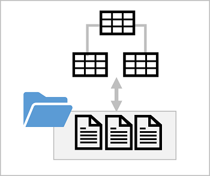
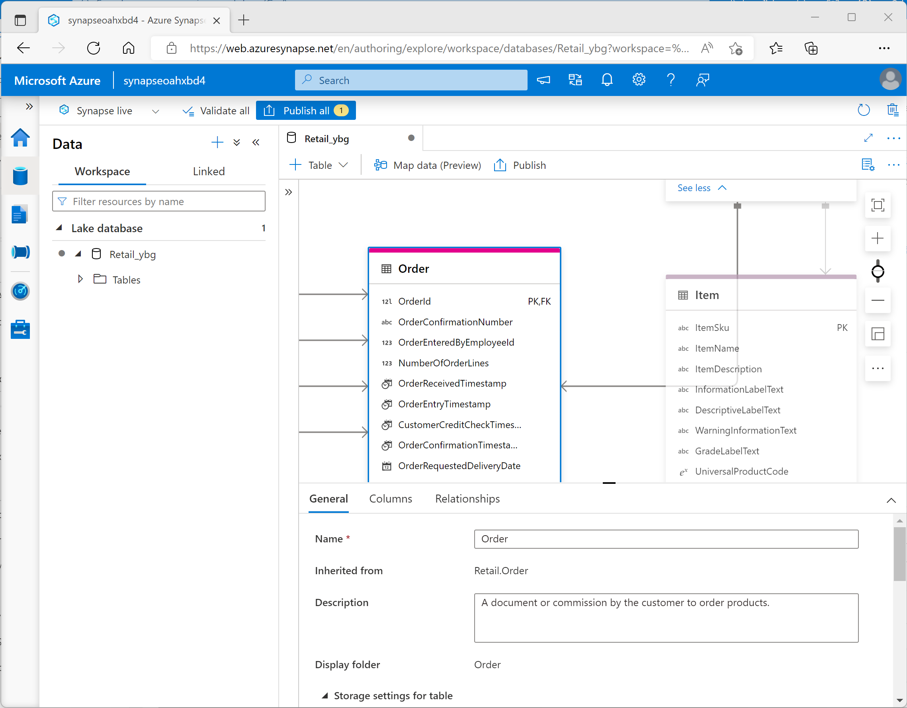

# M02.03 Create a lake database in Azure Synapse Analytics

## Unit 1 of 8

### Introduction

Data analysts and engineers often find themselves forced to choose between the flexibility of storing data files in a data lake, with the advantages of a structured schema in a relational database. *Lake databases* in Azure Synapse Analytics provide a way to combine these two approaches and benefit from an explicit relational schema of tables, views, and relationships that is decoupled from file-based storage.

In this module, you'll learn how to:

- Understand lake database concepts and components
- Describe database templates in Azure Synapse Analytics
- Create a lake database

### Prerequisites

Before starting this module, you should have the following prerequisite skills and knowledge:

- Familiarity with the Microsoft Azure portal
- Familiarity with data lake and data warehouse concepts
- Experience of using SQL to query database tables

### Next unit: Understand lake database concepts

## Unit 2 of 8

### Understand lake database concepts

In a traditional relational database, the database schema is composed of tables, views, and other objects. Tables in a relational database define the entities for which data is stored - for example, a retail database might include tables for products, customers, and orders. Each entity consists of a set of attributes that are defined as columns in the table, and each column has a name and a data type. The data for the tables is stored in the database, and is tightly coupled to the table definition; which enforces data types, nullability, key uniqueness, and referential integrity between related keys. All queries and data manipulations must be performed through the database system.

In a data lake, there is no fixed schema. Data is stored in files, which may be structured, semi-structured, or unstructured. Applications and data analysts can work directly with the files in the data lake using the tools of their choice; without the constraints of a relational database system.

A *lake database* provides a relational metadata layer over one or more files in a data lake. You can create a lake database that includes definitions for tables, including column names and data types as well as relationships between primary and foreign key columns. The tables reference files in the data lake, enabling you to apply relational semantics to working with the data and querying it using SQL. However, the storage of the data files is decoupled from the database schema; enabling more flexibility than a relational database system typically offers.



#### Lake database schema

You can create a lake database in Azure Synapse Analytics, and define the tables that represent the entities for which you need to store data. You can apply proven data modeling principles to create relationships between tables and use appropriate naming conventions for tables, columns, and other database objects.

Azure Synapse Analytics includes a graphical database design interface that you can use to model complex database schema, using many of the same best practices for database design that you would apply to a traditional database.

#### Lake database storage

The data for the tables in your lake database is stored in the data lake as Parquet or CSV files. The files can be managed independently of the database tables, making it easier to manage data ingestion and manipulation with a wide variety of data processing tools and technologies.

#### Lake database compute

To query and manipulate the data through the tables you have defined, you can use an Azure Synapse serverless SQL pool to run SQL queries or an Azure Synapse Apache Spark pool to work with the tables using the Spark SQL API.

### Next unit: Explore database templates

## Unit 3 of 8

### Explore database templates

You can create a Lake database from an empty schema, to which you add definitions for tables and the relationships between them. However, Azure Synapse Analytics provides a comprehensive collection of database templates that reflect common schemas found in multiple business scenarios; including:

- Agriculture
- Automotive
- Banking
- Consumer goods
- Energy and commodity trading
- Freight and logistics
- Fund management
- Healthcare insurance
- Healthcare provider
- Manufacturing
- Retail
- and many others...


You can use one of the enterprise database templates as the starting point for creating your lake database, or you can start with a blank schema and add and modify tables from the templates as required.

### Next unit: Create a lake database

## Unit 4 of 8

### Create a lake database

You can create a lake database using the lake database designer in Azure Synapse Studio. Start by adding a new lake database on the **Data** page, selecting a template from the gallery or starting with a blank lake database; and then add and customize tables using the visual database designer interface.

As you create each table, you can specify the type and location of the files you want to use to store the underlying data, or you can create a table from existing files that are already in the data lake. In most cases, it's advisable to store all of the database files in a consistent format within the same root folder in the data lake.

#### Database designer

The database designer interface in Azure Synapse Studio provides a drag-and-drop surface on which you can edit the tables in your database and the relationships between them.



Using the database designer, you can define the schema for your database by adding or removing tables and:

- Specifying the name and storage settings for each table.
- Specifying the names, key usage, nullability, and data types for each column.
- Defining relationships between key columns in tables.

When your database schema is ready for use, you can publish the database and start using it.

### Next unit: Use a lake database

## Unit 5 of 8

### Use a lake database

After creating a lake database, you can store data files that match the table schemas in the appropriate folders in the data lake, and query them using SQL.

#### Using a serverless SQL pool

You can query a lake database in a SQL script by using a serverless SQL pool.

For example, suppose a lake database named **RetailDB** contains an **Customer** table. You could query it using a standard SELECT statement like this:

```sql
USE RetailDB;
GO

SELECT CustomerID, FirstName, LastName
FROM Customer
ORDER BY LastName;
```

There is no need to use an OPENROWSET function or include any additional code to access the data from the underlying file storage. The serverless SQL pool handles the mapping to the files for you.

#### Using an Apache Spark pool

In addition to using a serverless SQL pool, you can work with lake database tables using Spark SQL in an Apache Spark pool.

For example, you could use the following code to insert a new customer record into the **Customer** table.

```sql
%%sql
INSERT INTO `RetailDB`.`Customer` VALUES (123, 'John', 'Yang')
```

You could then use the following code to query the table:

```sql
%%sql
SELECT * FROM `RetailDB`.`Customer` WHERE CustomerID = 123
```

### Next unit: Exercise - Analyze data in a lake database

## Unit 6 of 8

### Exercise - Analyze data in a lake database

Now it's your opportunity to create and use a lake database. In this exercise, you'll use a provided script to provision an Azure Synapse Analytics workspace in your Azure subscription; and then create a lake database in Azure Synapse Studio.

> **Note:** To complete this lab, you will need an [Azure subscription](https://azure.microsoft.com/free) in which you have administrative access.

Launch the exercise and follow the instructions.

[Launch Exercise](https://aka.ms/mslearn-synapse-lakedb)

### Next unit: Knowledge check

## Unit 7 of 8

### Knowledge check

1. Which if the following statements is true of a lake database?

    - ☐ Data is stored in a relational database store and can't be directly accessed in the data lake files.
    - ☐ Data is stored in files that can't be queried using SQL.
    - ☑ A relational schema is overlaid on the underlying files, and can be queried using a serverless SQL pool or a Spark pool.
    > Correct. A lake database abstracts files with a relational schema that can be queried using SQL in a serverless SQL pool or a Spark pool.

2. You need to create a new lake database for a retail solution. What's the most efficient way to do this?

    - ☐ Create a sample database in Azure SQL Database and export the SQL scripts to create the schema for the lake database.
    - ☑ Start with the Retail database template in Azure Synapse Studio, and adapt it as necessary.
    > Correct. The Gallery in Azure Synapse Studio includes industry-proven database schema templates, including one for retail.
    - ☐ Start with an empty database and create a normalized schema.

3. You have Parquet files in an existing data lake folder for which you want to create a table in a lake database. What should you do?

    - ☐ Use a CREATE EXTERNAL TABLE AS SELECT (CETAS) query to create the table.
    - ☐ Convert the files in the folder to CSV format.
    - ☑ Use the database designer to create a table based on the existing folder.
    > Correct. You can add a table to a database from existing files.

### Next unit: Summary

## Unit 8 of 8

### Summary

A lake database can provide the benefits of a relational schema and query interface with the flexibility of file storage in a data lake.

In this module, you learned how to:

- Understand lake database concepts and components
- Describe database templates in Azure Synapse Analytics
- Create a lake database

### Learn more

To learn more about lake databases, refer to the [Azure Synapse Analytics documentation](https://learn.microsoft.com/en-us/azure/synapse-analytics/database-designer/concepts-lake-database).

### All units complete
