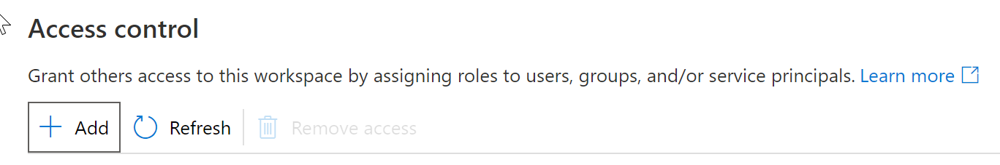
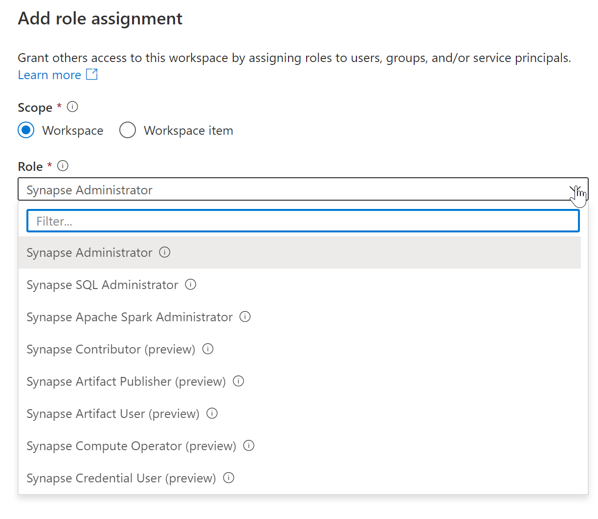

# M02.04 Secure data and manage users in Azure Synapse serverless SQL pools

## Unit 1 of 6

### Introduction

In this lesson, you will learn how you can set up security when using Azure Synapse serverless SQL pools

After the completion of this lesson, you will be able to:

- Choose an authentication method in Azure Synapse serverless SQL pools
- Manage users in Azure Synapse serverless SQL pools
- Manage user permissions in Azure Synapse serverless SQL pools

### Prerequisites

Before taking this lesson, it is recommended that the student is able to:

- Log into the Azure portal
- Explain the different components of Azure Synapse Analytics
- Use Azure Synapse Studio

### Next unit: Choose an authentication method in Azure Synapse serverless SQL pools

## Unit 2 of 6

### Choose an authentication method in Azure Synapse serverless SQL pools

Serverless SQL pool authentication refers to how users prove their identity when connecting to the endpoint. Two types of authentication are supported:

- **SQL Authentication**

    This authentication method uses a username and password.

- **Microsoft Entra authentication**

    This authentication method uses identities managed by Microsoft Entra ID. For Microsoft Entra users, multi-factor authentication can be enabled. Use Active Directory authentication (integrated security) whenever possible.

#### Authorization

Authorization refers to what a user can do within a serverless SQL pool database and is controlled by your user account's database role memberships and object-level permissions.

If SQL Authentication is used, the SQL user exists only in the serverless SQL pool and permissions are scoped to the objects in the serverless SQL pool. Access to securable objects in other services (such as Azure Storage) can't be granted to a SQL user directly since it only exists in scope of serverless SQL pool. The SQL user needs get authorization to access the files in the storage account.

If Microsoft Entra authentication is used, a user can sign in to a serverless SQL pool and other services, like Azure Storage, and can grant permissions to the Microsoft Entra user.

#### Access to storage accounts

A user that is logged into the serverless SQL pool service must be authorized to access and query the files in Azure Storage. Serverless SQL pool supports the following authorization types:

- Anonymous access

    To access publicly available files placed on Azure storage accounts that allow anonymous access.

- Shared access signature (SAS)

    Provides delegated access to resources in storage account. With a SAS, you can grant clients access to resources in storage account, without sharing account keys. A SAS gives you granular control over the type of access you grant to clients who have the SAS: validity interval, granted permissions, acceptable IP address range, acceptable protocol (https/http).

- Managed Identity.

    Is a feature of Microsoft Entra ID that provides Azure services for serverless SQL pool. Also, it deploys an automatically managed identity in Microsoft Entra ID. This identity can be used to authorize the request for data access in Azure Storage. Before accessing the data, the Azure Storage administrator must grant permissions to Managed Identity for accessing the data. Granting permissions to Managed Identity is done the same way as granting permission to any other Microsoft Entra user.

- User Identity

    Also known as "pass-through", is an authorization type where the identity of the Microsoft Entra user that logged into serverless SQL pool is used to authorize access to the data. Before accessing the data, Azure Storage administrator must grant permissions to Microsoft Entra user for accessing the data. This authorization type uses the Microsoft Entra user that logged into serverless SQL pool, therefore it's not supported for SQL user types.

Supported authorization types for database users can be found in the table below:

| Authorization type | SQL user | Microsoft Entra user |
| :-- | :-- | :-- |
| User Identity | Not supported | Supported |
| SAS | Supported | Supported |
| Managed Identity | Not supported | Supported |

Supported storage and authorization types can be found in the table below:

| Authorization type | Blob Storage | ADLS Gen1 | ADLS Gen2 |
| :-- | :-- | :-- | :-- |
|User Identity | Supported - SAS token can be used to access storage that is not protected with firewall | Not supported | Supported - SAS token can be used to access storage that is not protected with firewall |
| SAS | Supported | Supported | Supported |
| Managed Identity | Supported | Supported | Supported |

### Next unit: Manage users in Azure Synapse serverless SQL pools

## Unit 3 of 6

### Manage users in Azure Synapse serverless SQL pools

You can give administrator privileges to a user to Azure Synapse serverless SQL pool. To do this you should open the Azure Synapse workspace and do the following steps:

1. Go to **Manage** menu

2. Go to **Access control**

3. Click on **Add**

    

4. Choose **Synapse Administrator**

    

5. Select a User or Security group (a security group is the recommended option here)
6. Click **Apply**

Now this user or group is the administrator of the Azure Synapse workspace and serverless SQL pool.

### Next unit: Manage user permissions in Azure Synapse serverless SQL pools

## Unit 4 of 6

### Manage user permissions in Azure Synapse serverless SQL pools

To secure data, Azure Storage implements an access control model that supports both Azure role-based access control (Azure RBAC) and access control lists (ACLs) like Portable Operating System Interface for Unix (POSIX)

You can associate a security principal with an access level for files and directories. These associations are captured in an access control list (ACL). Each file and directory in your storage account has an access control list. When a security principal attempts an operation on a file or directory, an ACL check determines whether that security principal (user, group, service principal, or managed identity) has the correct permission level to perform the operation.

There are two kinds of access control lists:

- **Access ACLs**

    Controls access to an object. Files and directories both have access ACLs.

- **Default ACLs**

    Are templates of ACLs associated with a directory that determine the access ACLs for any child items that are created under that directory. Files do not have default ACLs.

Both access ACLs and default ACLs have the same structure.

The permissions on a container object are Read, Write, and Execute, and they can be used on files and directories as shown in the following table:

#### Levels of permissions

| Permission | File | Directory |
| :-- | :-- | :-- |
| Read (R) | Can read the contents of a file | Requires Read and Execute to list the contents of the directory |
| Write (W) | Can write or append to a file | Requires Write and Execute to create child items in a directory |
| Execute (X) | Does not mean anything in the context of Data Lake Storage Gen2 | Required to traverse the child items of a directory |

#### Guidelines in setting up ACLs

Always use Microsoft Entra security groups as the assigned principal in an ACL entry. Resist the opportunity to directly assign individual users or service principals. Using this structure will allow you to add and remove users or service principals without the need to reapply ACLs to an entire directory structure. Instead, you can just add or remove users and service principals from the appropriate Microsoft Entra security group.

There are many ways to set up groups. For example, imagine that you have a directory named **/LogData** which holds log data that is generated by your server. Azure Data Factory (ADF) ingests data into that folder. Specific users from the service engineering team will upload logs and manage other users of this folder, and various Databricks clusters will analyze logs from that folder.

To enable these activities, you could create a LogsWriter group and a LogsReader group. Then, you could assign permissions as follows:

- Add the LogsWriter group to the ACL of the **/LogData** directory with rwx permissions.
- Add the LogsReader group to the ACL of the **/LogData** directory with r-x permissions.
- Add the service principal object or Managed Service Identity (MSI) for ADF to the LogsWriters group.
- Add users in the service engineering team to the LogsWriter group.
- Add the service principal object or MSI for Databricks to the LogsReader group.

If a user in the service engineering team leaves the company, you could just remove them from the LogsWriter group. If you did not add that user to a group, but instead, you added a dedicated ACL entry for that user, you would have to remove that ACL entry from the **/LogData** directory. You would also have to remove the entry from all subdirectories and files in the entire directory hierarchy of the **/LogData** directory.

#### Roles necessary for serverless SQL pool users

For users which need **read only** access you should assign role named **Storage Blob Data Reader**.

For users which need **read/write** access you should assign role named **Storage Blob Data Contributor**. Read/Write access is needed if user should have access to create external table as select (CETAS).

> **Note:** If user has a role Owner or Contributor, that role is not enough. Azure Data Lake Storage gen 2 has super-roles which should be assigned.

#### Database level permission

To provide more granular access to the user, you should use Transact-SQL syntax to create logins and users.

To grant access to a user to a single serverless SQL pool database, follow the steps in this example:

1. Create LOGIN

    ```sql
    use master
    CREATE LOGIN [alias@domain.com] FROM EXTERNAL PROVIDER;
    ```

2. Create USER

    ```sql
    use yourdb -- Use your DB name
    CREATE USER alias FROM LOGIN [alias@domain.com];
    ```

3. Add USER to members of the specified role

    ```sql
    use yourdb -- Use your DB name
    alter role db_datareader 
    Add member alias -- Type USER name from step 2
    -- You can use any Database Role which exists 
    -- (examples: db_owner, db_datareader, db_datawriter)
    -- Replace alias with alias of the user you would like to give access and domain with the company domain you are using.
    ```

#### Server level permission

1. To grant full access to a user to all serverless SQL pool databases, follow the step in this example:

    ```sql
    CREATE LOGIN [alias@domain.com] FROM EXTERNAL PROVIDER;
    ALTER SERVER ROLE sysadmin ADD MEMBER [alias@domain.com];
    ```

### Next unit: Knowledge check

## Unit 5 of 6

### Knowledge check

1. Which authentication method would be the likeliest choice to use for an individual who needs to access your serverless SQL pool who works for an external organization?

    - ☑ Local authentication.
    - ☐ SQL Authentication.
    - ☐ Microsoft Entra ID.

2. Which Azure Synapse Studio hub is where you assign administrator privileges to an Azure Synapse workspace?

    - ☑ Manage.
    - ☐ Data.
    - ☐ Develop.

3. Which role enables a user to create external table as select (CETAS) against an Azure Data Lake Gen2 data store?

    - ☑ Storage Blob Data Reader.
    - ☐ Storage Blob Data Contributor.
    - ☐ Executor.

### Next unit: Summary

## Unit 6 of 6
