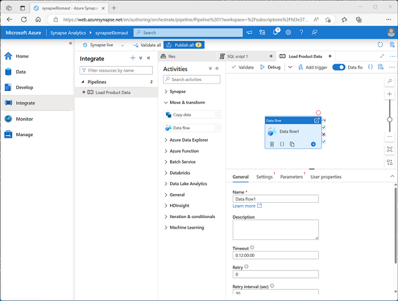
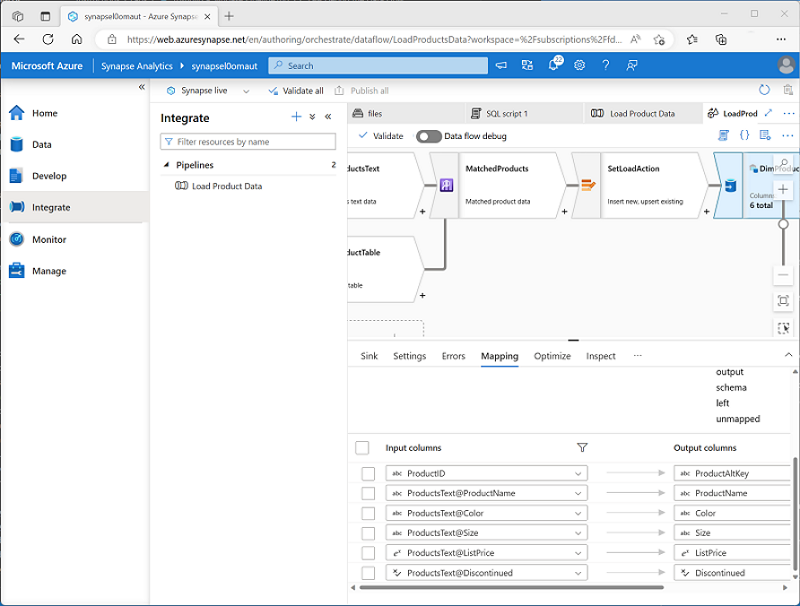
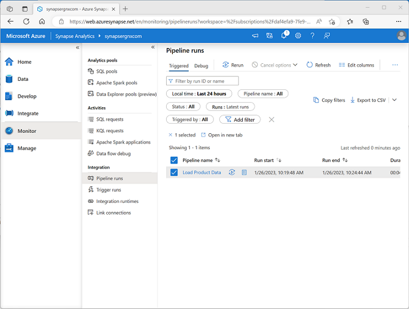

# M05.06 Build a data pipeline in Azure Synapse Analytics

## Unit 1 of 8

### Introduction

With the wide range of data stores available in Azure, there's the need to manage and orchestrate the movement data between them. In fact, you'll usually want to automate *extract, transform, and load* (ETL) workloads as a regular process in a wider enterprise analytical solution. *Pipelines* are a mechanism for defining and orchestrating data movement activities. In this module, you'll be introduced to Azure Synapse Analytics pipelines, their component parts, and how to implement and run a pipeline in Azure Synapse Studio.

> **Note:** Azure Synapse Analytics pipelines are built on the same technology as Azure Data Factory, and offer a similar authoring experience. The authoring processes described in this module are also applicable to Azure Data Factory. For a detailed discussion of the differences between Azure Synapse Analytics pipelines and Azure Data Factory, see [Data integration in Azure Synapse Analytics versus Azure Data Factory](https://learn.microsoft.com/en-us/azure/synapse-analytics/data-integration/concepts-data-factory-differences).

### Next unit: Understand pipelines in Azure Synapse Analytics

## Unit 2 of 8

### Understand pipelines in Azure Synapse Analytics

Pipelines in Azure Synapse Analytics encapsulate a sequence of *activities* that perform data movement and processing tasks. You can use a pipeline to define data transfer and transformation activities, and orchestrate these activities through control flow activities that manage branching, looping, and other typical processing logic. The graphical design tools in Azure Synapse Studio enable you to build complex pipelines with minimal or no coding required.

#### Core pipeline concepts

Before building pipelines in Azure Synapse Analytics, you should understand a few core concepts.


##### Activities

Activities are the executable tasks in a pipeline. You can define a flow of activities by connecting them in a sequence. The outcome of a particular activity (success, failure, or completion) can be used to direct the flow to the next activity in the sequence.

Activities can encapsulate data transfer operations, including simple data copy operations that extract data from a source and load it to a target (or *sink*), as well as more complex data flows that apply transformations to the data as part of an *extract, transfer, and load* (ETL) operation. Additionally, there are activities that encapsulate processing tasks on specific systems, such as running a Spark notebook or calling an Azure function. Finally, there are *control flow* activities that you can use to implement loops, conditional branching, or manage variable and parameter values.

##### Integration runtime

The pipeline requires compute resources and an execution context in which to run. The pipeline's *integration runtime* provides this context, and is used to initiate and coordinate the activities in the pipeline.

##### Linked services

While many of the activities are run directly in the integration runtime for the pipeline, some activities depend on external services. For example, a pipeline might include an activity to run a notebook in Azure Databricks or to call a stored procedure in Azure SQL Database. To enable secure connections to the external services used by your pipelines, you must define *linked services* for them.

> **Note:** Linked services are defined at the Azure Synapse Analytics workspace level, and can be shared across multiple pipelines.

##### Datasets

Most pipelines process data, and the specific data that is consumed and produced by activities in a pipeline is defined using *datasets*. A dataset defines the schema for each data object that will be used in the pipeline, and has an associated linked service to connect to its source. Activities can have datasets as inputs or outputs.

> **Note:** Similarly to linked services, datasets are defined at the Azure Synapse Analytics workspace level, and can be shared across multiple pipelines.

### Next unit: Create a pipeline in Azure Synapse Studio

## Unit 3 of 8

### Create a pipeline in Azure Synapse Studio

You can create a pipeline in Azure Synapse Studio by using shortcuts on the **Home** page, but the primary place where pipelines are created and managed is the **Integrate** page.

When you create a pipeline in Azure Synapse Studio, you can use the graphical design interface.



The pipeline designer includes a set of activities, organized into categories, which you can drag onto a visual design canvas. You can select each activity on the canvas and use the properties pane beneath the canvas to configure the settings for that activity.

To define the logical sequence of activities, you can connect them by using the **Succeeded**, **Failed**, and **Completed** dependency conditions, which are shown as small icons on the right-hand edge of each activity.

#### Defining a pipeline with JSON

While the graphical development environment is the preferred way to create a pipeline, you can also create or edit the underlying JSON definition of a pipeline. The following code example shows the JSON definition of a pipeline that includes a **Copy Data** activity:

```python
{
  "name": "CopyPipeline",
  "properties": {
    "description": "Copy data from a blob to Azure SQL table",
    "activities": [
      {
        "name": "CopyFromBlobToSQL",
        "type": "Copy",
        "inputs": [
          {
            "name": "InputDataset"
          }
        ],
        "outputs": [
          {
            "name": "OutputDataset"
          }
        ],
        "typeProperties": {
          "source": {
            "type": "BlobSource"
          },
          "sink": {
            "type": "SqlSink",
            "writeBatchSize": 10000,
            "writeBatchTimeout": "60:00:00"
          }
        },
        "policy": {
          "retry": 2,
          "timeout": "01:00:00"
        }
      }
    ]
  }
}
```

### Next unit: Define data flows

## Unit 4 of 8

### Define data flows

A **Data Flow** is a commonly used activity type to define data flow and transformation. Data flows consist of:

- **Sources** - The input data to be transferred.
- **Transformations** – Various operations that you can apply to data as it streams through the data flow.
- **Sinks** – Targets into which the data will be loaded.

When you add a **Data Flow** activity to a pipeline, you can open it in a separate graphical design interface in which to create and configure the required data flow elements.



An important part of creating a data flow is to define mappings for the columns as the data flows through the various stages, ensuring column names and data types are defined appropriately. While developing a data flow, you can enable the **Data flow debug** option to pass a subset of data through the flow, which can be useful to test that your columns are mapped correctly.

> **Tip:** To learn more about implementing a **Data Flow** activity, see [Data Flow activity in Azure Data Factory and Azure Synapse Analytics](https://learn.microsoft.com/en-us/azure/data-factory/control-flow-execute-data-flow-activity) in the Azure documentation.

### Next unit: Run a pipeline

## Unit 5 of 8

### Run a pipeline

When you’re ready, you can publish a pipeline and use a trigger to run it. Triggers can be defined to run the pipeline:

- Immediately
- At explicitly scheduled intervals
- In response to an event, such as new data files being added to a folder in a data lake.

You can monitor each individual run of a pipeline in the **Monitor** page in Azure Synapse Studio.



The ability to monitor past and ongoing pipeline runs is useful for troubleshooting purposes. Additionally, when combined with the ability to integrate Azure Synapse Analytics and Microsoft Purview, you can use pipeline run history to track data lineage data flows.

> **Tip:** To learn more about integration between Azure Synapse Analytics and Microsoft Purview, consider completing the [Integrate Microsoft Purview and Azure Synapse Analytics](https://learn.microsoft.com/en-us/training/modules/integrate-microsoft-purview-azure-synapse-analytics) module.

### Next unit: Exercise - Build a data pipeline in Azure Synapse Analytics

## Unit 6 of 8

### Exercise - Build a data pipeline in Azure Synapse Analytics

Now it's your chance to build an Azure Synapse Analytics pipeline. In this exercise, you'll implement a run an Azure Synapse Analytics pipeline that transfers and transforms data.

> **Note:** To complete this lab, you will need an [Azure subscription](https://azure.microsoft.com/free) in which you have administrative access.

Launch the exercise and follow the instructions.

[Launch Exercise](https://aka.ms/mslearn-build-synapse-pipeline)

### Next unit: Knowledge check

## Unit 7 of 8

### Knowledge check

1. What does a pipeline use to access external data source and processing resources?

    - ☑ Data Explorer pools
    - ☐ Linked services
    - ☐ External tables

2. What kind of object should you add to a data flow to define a target to which data is loaded?

    - ☑ Source
    - ☐ Transformation
    - ☐ Sink

3. What must you create to run a pipeline at scheduled intervals?

    - ☑ A control flow
    - ☐ A trigger
    - ☐ An activity

### Next unit: Summary

## Unit 8 of 8
