# M06.03 Manage and monitor data warehouse activities in Azure Synapse Analytics

## Unit 1 of 8

### Introduction

In this module, you will learn some of the features you can use to manage and monitor Azure Synapse Analytics.

At the end of this module, you will

- Scale compute resources in Azure Synapse Analytics
- Pause compute in Azure Synapse Analytics
- Manage workloads in Azure Synapse Analytics
- Use Azure Advisor to review recommendations
- Use Dynamic Management Views to identify and troubleshoot query performance

#### Prerequisites

Before taking this module, it is recommended that the student is able to:

- Log into the Azure portal
- Create a Synapse Analytics Workspace
- Create an Azure Synapse Analytics SQL Pool

### Next unit: Scale compute resources in Azure Synapse Analytics

## Unit 2 of 8

### Scale compute resources in Azure Synapse Analytics

One of the key management features that you have at your disposal within Azure Synapse Analytics, is the ability to scale the compute resources for SQL or Spark pools to meet the demands of processing your data. In SQL pools, the unit of scale is an abstraction of compute power that is known as a data warehouse unit. Compute is separate from storage, which enables you to scale compute independently of the data in your system. This means you can scale up and scale down the compute power to meet your needs.

You can scale a Synapse SQL pool either through the Azure portal, Azure Synapse Studio or programmatically using TSQL or PowerShell.

In the Azure portal, you can click on **scale** icon

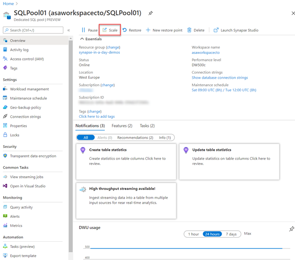

And then you can adjust the **slider** to scale the SQL Pool

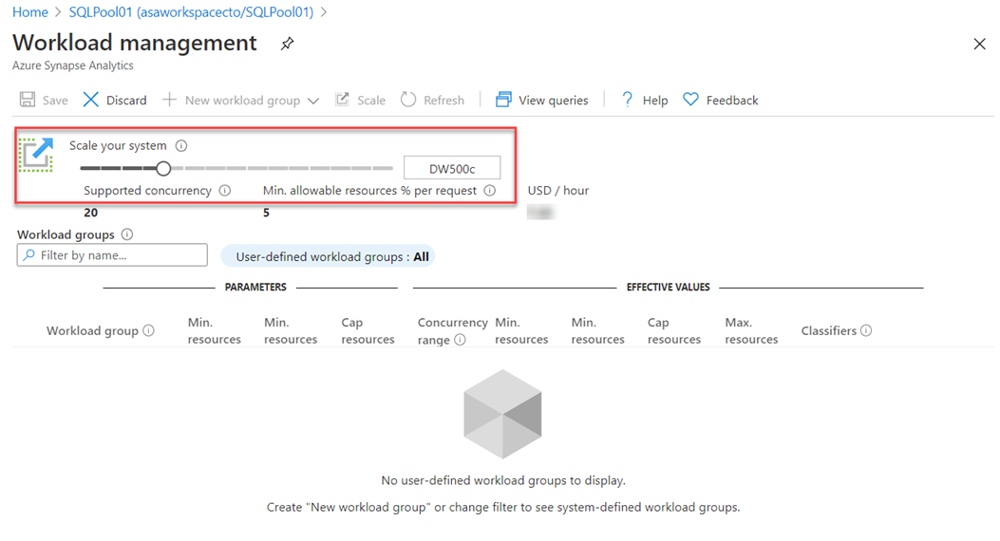

Another option to scale is within Azure Synapse Studio, click on the **scale** icon:

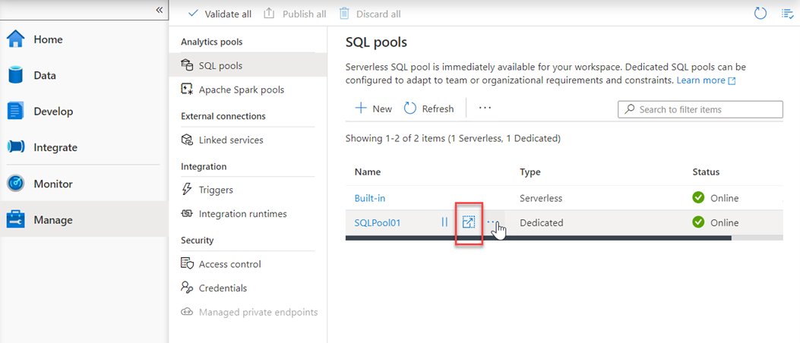

And then move the **slider** as follows:

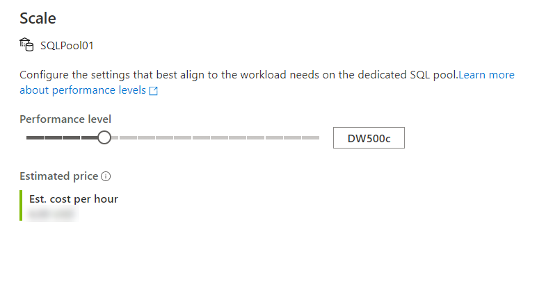

You can also make the modification using Transact-SQL

```sql
ALTER DATABASE mySampleDataWarehouse
MODIFY (SERVICE_OBJECTIVE = 'DW300c');
```

Or by using PowerShell

```PowerShell
Set-AzSqlDatabase -ResourceGroupName "resourcegroupname" -DatabaseName "mySampleDataWarehouse" -ServerName "sqlpoolservername" -RequestedServiceObjectiveName "DW300c"
```

#### Scaling Apache Spark pools in Azure Synapse Analytics

Apache Spark pools for Azure Synapse Analytics uses an **Autoscale** feature that automatically scales the number of nodes in a cluster instance up and down. During the creation of a new Spark pool, a minimum and maximum number of nodes can be set when **Autoscale** is selected. Autoscale then monitors the resource requirements of the load and scales the number of nodes up or down. To enable the Autoscale feature, complete the following steps as part of the normal pool creation process:

1. On the **Basics** tab, select the **Enable autoscale** checkbox.
2. Enter the desired values for the following properties:
    - **Min** number of nodes.
    - **Max** number of nodes.

The initial number of nodes will be the minimum. This value defines the initial size of the instance when it's created. The minimum number of nodes can't be fewer than three.

You can also modify this in the Azure portal, you can click on **auto-scale settings** icon

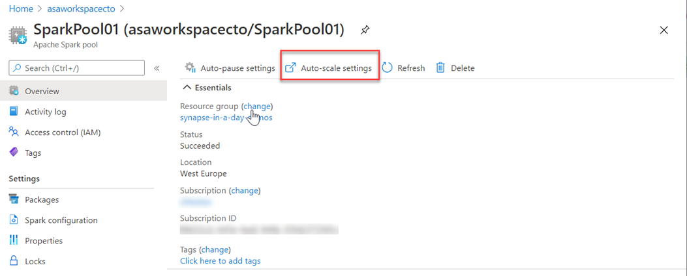

Choose the node size and the number of nodes

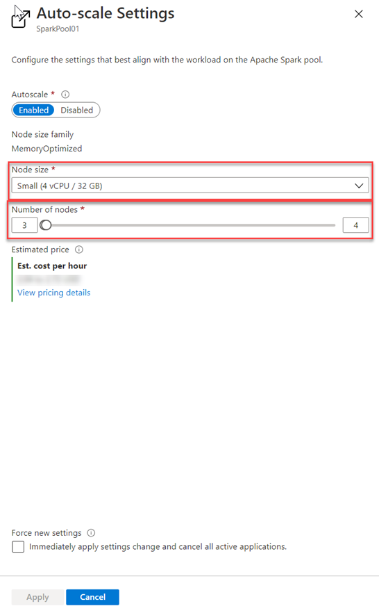

and for Azure Synapse Studio as follows

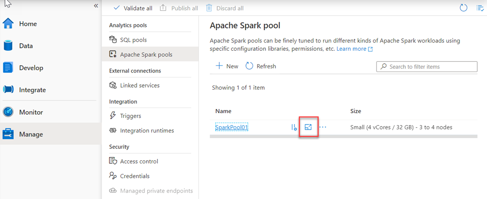

And Choose the node size and the number of nodes

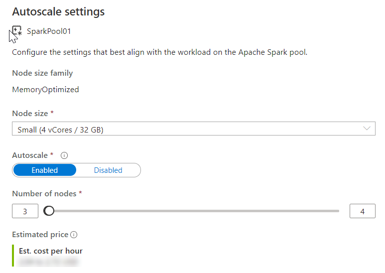

Autoscale continuously monitors the Spark instance and collects the following metrics:

| Metric | Description |
| :-- | :-- |
| Total Pending CPU | The total number of cores required to start execution of all pending nodes. |
| Total Pending Memory | The total memory (in MB) required to start execution of all pending nodes. |
| Total Free CPU | The sum of all unused cores on the active nodes. |
| Total Free Memory | The sum of unused memory (in MB) on the active nodes. |
| Used Memory per Node | The load on a node. A node on which 10 GB of memory is used, is considered under more load than a worker with 2 GB of used memory. |

The following conditions will then autoscale the memory or CPU

| Scale-up | Scale-down |
| :-- | :-- |
| Total pending CPU is greater than total free CPU for more than 1 minute. | Total pending CPU is less than total free CPU for more than 2 minutes. |
| Total pending memory is greater than total free memory for more than 1 minute. | Total pending memory is less than total free memory for more than 2 minutes. |

The scaling operation can take between 1 -5 minutes. During an instance where there is a scale down process, Autoscale will put the nodes in decommissioning state so that no new executors can launch on that node.

The running jobs will continue to run and finish. The pending jobs will wait to be scheduled as normal with fewer available nodes.

### Next unit: Pause compute in Azure Synapse Analytics

## Unit 3 of 8

### Pause compute in Azure Synapse Analytics

When performing the batch movement of data to populate a data warehouse, it is typical for the data engineer to understand the schedule on which the data loads take place. In these circumstances, you may be able to predict the periods of downtime in the data loading and querying process and take advantage of the pause operations to minimize your costs.

In the Azure portal you can use the Pause command within the dedicated SQL pool

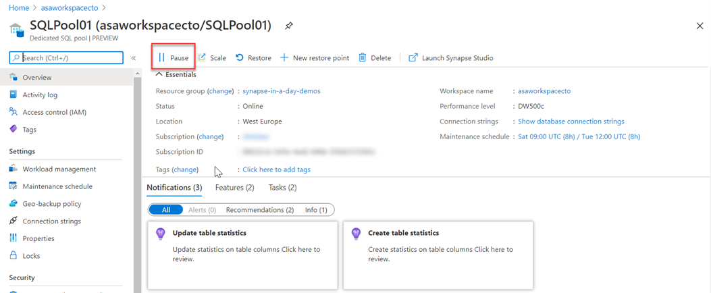

And this can also be used within Azure Synapse Studio for Apache Spark pools too, in the Manage hub.

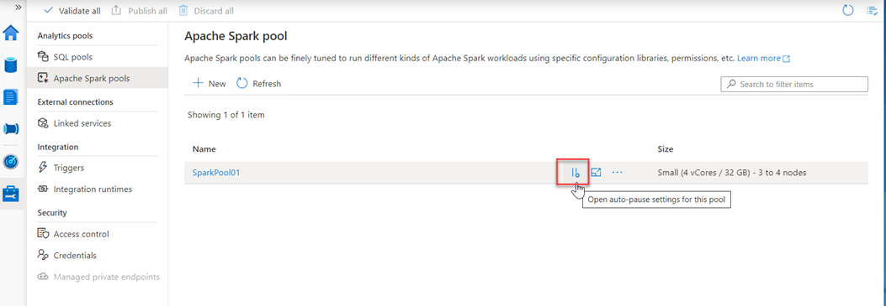

Which allows you to enable it, and set the number of minutes idle

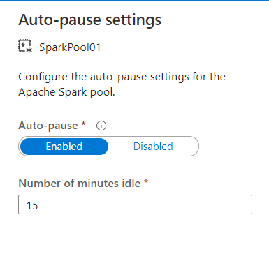

### Next unit: Manage workloads in Azure Synapse Analytics

## Unit 4 of 8

### Manage workloads in Azure Synapse Analytics

Azure Synapse Analytics allows you to create, control and manage resource availability when workloads are competing. This allows you to manage the relative importance of each workload when waiting for available resources.

To facilitate faster load times, you can create a workload classifier for the load user with the “importance” set to above_normal or High. Workload importance ensures that the load takes precedence over other waiting tasks of a lower importance rating. Use this in conjunction with your own workload group definitions for workload isolation to manage minimum and maximum resource allocations during peak and quiet periods.

Dedicated SQL pool workload management in Azure Synapse consists of three high-level concepts:

- Workload Classification
- Workload Importance
- Workload Isolation

These capabilities give you more control over how your workload utilizes system resources.

#### Workload classification

Workload management classification allows workload policies to be applied to requests through assigning resource classes and importance.

While there are many ways to classify data warehousing workloads, the simplest and most common classification is load and query. You load data with insert, update, and delete statements. You query the data using selects. A data warehousing solution will often have a workload policy for load activity, such as assigning a higher resource class with more resources. A different workload policy could apply to queries, such as lower importance compared to load activities.

You can also subclassify your load and query workloads. Subclassification gives you more control of your workloads. For example, query workloads can consist of cube refreshes, dashboard queries or ad-hoc queries. You can classify each of these query workloads with different resource classes or importance settings. Load can also benefit from subclassification. Large transformations can be assigned to larger resource classes. Higher importance can be used to ensure key sales data is loaded before weather data or a social data feed.

Not all statements are classified as they do not require resources or need importance to influence execution. DBCC commands, BEGIN, COMMIT, and ROLLBACK TRANSACTION statements are not classified.

#### Workload importance

Workload importance influences the order in which a request gets access to resources. On a busy system, a request with higher importance has first access to resources. Importance can also ensure ordered access to locks. There are five levels of importance: low, below_normal, normal, above_normal, and high. Requests that don't set importance are assigned the default level of normal. Requests that have the same importance level have the same scheduling behavior that exists today.

#### Workload isolation

Workload isolation reserves resources for a workload group. Resources reserved in a workload group are held exclusively for that workload group to ensure execution. Workload groups also allow you to define the amount of resources that are assigned per request, much like resource classes do. Workload groups give you the ability to reserve or cap the amount of resources a set of requests can consume. Finally, workload groups are a mechanism to apply rules, such as query timeout, to requests.

You can perform the following steps to implement workload management

##### Create a workload classifier to add importance to certain queries

Your organization has asked you if there is a way to mark queries executed by the CEO as more important than others, so they don't appear slow due to heavy data loading or other workloads in the queue. You decide to create a workload classifier and add importance to prioritize the CEO's queries.

1. Select the *Develop* hub.

    

2. From the **Develop** menu, select the **+** button **(1)** and choose **SQL Script (2)** from the context menu.

    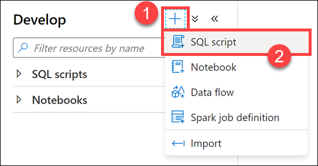

3. In the toolbar menu, connect to the **SQL Pool** database to execute the query.

    

4. In the query window, replace the script with the following to confirm that there are no queries currently being run by users logged in as `asa.sql.workload01`, representing the CEO of the organization or `asa.sql.workload02` representing the data analyst working on the project:

    ```sql
    --First, let's confirm that there are no queries currently being run by users logged in workload01 or workload02

    SELECT s.login_name, r.[Status], r.Importance, submit_time, 
    start_time ,s.session_id FROM sys.dm_pdw_exec_sessions s 
    JOIN sys.dm_pdw_exec_requests r ON s.session_id = r.session_id
    WHERE s.login_name IN ('asa.sql.workload01','asa.sql.workload02') and Importance
    is not NULL AND r.[status] in ('Running','Suspended') 
    --and submit_time>dateadd(minute,-2,getdate())
    ORDER BY submit_time ,s.login_name
    ```

5. Select **Run** from the toolbar menu to execute the SQL command.

    

    Now that we have confirmed that there are no running queries, we need to flood the system with queries and see what happens for `asa.sql.workload01` and `asa.sql.workload02`. To do this, we'll run a Azure Synapse Pipeline which triggers queries.

6. Select the **Integrate** hub.

    

7. Select the **Lab 08 - Execute Data Analyst and CEO Queries** Pipeline **(1)**, which will run / trigger the `asa.sql.workload01` and `asa.sql.workload02` queries. Select **Add trigger (2)**, then **Trigger now (3)**. In the dialog that appears, select **OK**.

    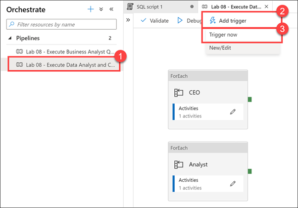

8. Let's see what happened to all the queries we just triggered as they flood the system. In the query window, replace the script with the following:

    ```sql
    SELECT s.login_name, r.[Status], r.Importance, submit_time, start_time ,s.session_id FROM sys.dm_pdw_exec_sessions s 
    JOIN sys.dm_pdw_exec_requests r ON s.session_id = r.session_id
    WHERE s.login_name IN ('asa.sql.workload01','asa.sql.workload02') and Importance
    is not NULL AND r.[status] in ('Running','Suspended') and submit_time>dateadd(minute,-2,getdate())
    ORDER BY submit_time ,status
    ```

9. Select **Run** from the toolbar menu to execute the SQL command.

    

    You should see an output similar to the following:

    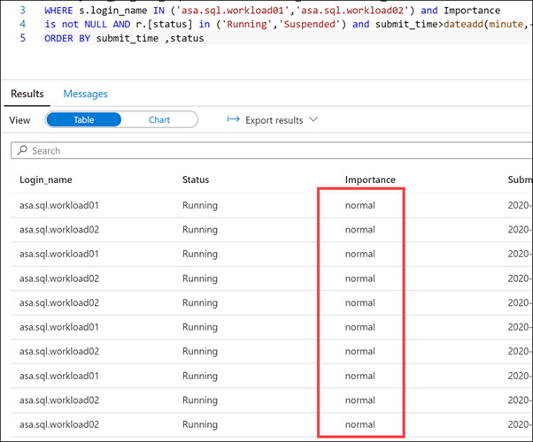

    Notice that the **Importance** level for all queries is set to **normal**.

10. We will give our `asa.sql.workload01` user queries priority by implementing the **Workload Importance** feature. In the query window, replace the script with the following:

    ```sql
    IF EXISTS (SELECT * FROM sys.workload_management_workload_classifiers WHERE name = 'CEO')
    BEGIN
        DROP WORKLOAD CLASSIFIER CEO;
    END
    CREATE WORKLOAD CLASSIFIER CEO
    WITH (WORKLOAD_GROUP = 'largerc'
    ,MEMBERNAME = 'asa.sql.workload01',IMPORTANCE = High);
    ```

    We are executing this script to create a new **Workload Classifier** named `CEO` that uses the `largerc` Workload Group and sets the **Importance** level of the queries to **High**.

11. Select **Run** from the toolbar menu to execute the SQL command.

    

12. Let's flood the system again with queries and see what happens this time for `asa.sql.workload01` and asa.sql.workload02 queries. To do this, we'll run an Azure Synapse Pipeline which triggers queries. **Select** the `Integrate` Tab, **run** the **Lab 08 - Execute Data Analyst and CEO Queries** Pipeline, which will run / trigger the `asa.sql.workload01` and `asa.sql.workload02` queries.

13. In the query window, replace the script with the following to see what happens to the `asa.sql.workload01` queries this time:

    ```sql
    SELECT s.login_name, r.[Status], r.Importance, submit_time, start_time ,s.session_id FROM sys.dm_pdw_exec_sessions s 
    JOIN sys.dm_pdw_exec_requests r ON s.session_id = r.session_id
    WHERE s.login_name IN ('asa.sql.workload01','asa.sql.workload02') and Importance
    is not NULL AND r.[status] in ('Running','Suspended') and submit_time>dateadd(minute,-2,getdate())
    ORDER BY submit_time ,status desc
    ```

14. Select **Run** from the toolbar menu to execute the SQL command.

    

    You should see an output similar to the following:

    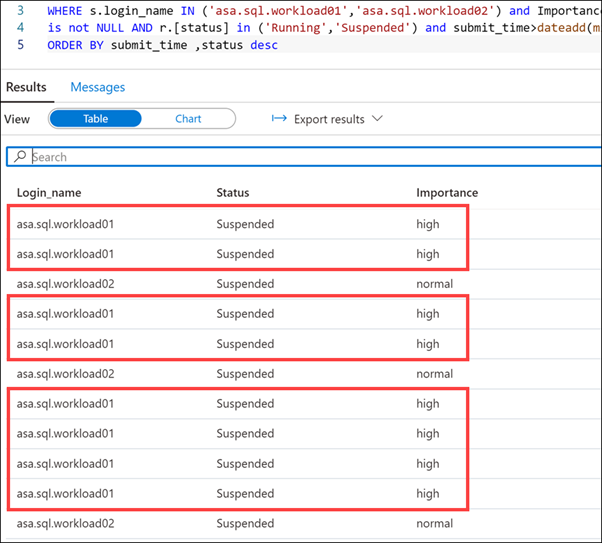

    Notice that the queries executed by the `asa.sql.workload01` user have a **high** importance.

15. Select the **Monitor** hub.

    

16. Select **Pipeline runs (1)**, and then select **Cancel recursive (2)** for each running Lab 08 pipelines, marked **In progress (3)**. This will help speed up the remaining tasks.

    

##### Reserve resources for specific workloads through workload isolation

Workload isolation means resources are reserved, exclusively, for a workload group. Workload groups are containers for a set of requests and are the basis for how workload management, including workload isolation, is configured on a system. A simple workload management configuration can manage data loads and user queries.

In the absence of workload isolation, requests operate in the shared pool of resources. Access to resources in the shared pool is not guaranteed and is assigned on an importance basis.

Given the workload requirements provided by Tailwind Traders, you decide to create a new workload group called `CEODemo` to reserve resources for queries executed by the CEO.

Let's start by experimenting with different parameters.

1. In the query window, replace the script with the following:

    ```sql
    IF NOT EXISTS (SELECT * FROM sys.workload_management_workload_groups where name = 'CEODemo')
    BEGIN
        Create WORKLOAD GROUP CEODemo WITH  
        ( MIN_PERCENTAGE_RESOURCE = 50        -- integer value
        ,REQUEST_MIN_RESOURCE_GRANT_PERCENT = 25 --  
        ,CAP_PERCENTAGE_RESOURCE = 100
        )
    END
    ```

    The script creates a workload group called `CEODemo` to reserve resources exclusively for the workload group. In this example, a workload group with a `MIN_PERCENTAGE_RESOURCE` set to 50% and `REQUEST_MIN_RESOURCE_GRANT_PERCENT` set to 25% is guaranteed 2 concurrency.

2. Select **Run** from the toolbar menu to execute the SQL command.

    

3. In the query window, replace the script with the following to create a Workload Classifier called `CEODreamDemo` that assigns a workload group and importance to incoming requests:

    ```sql
    IF NOT EXISTS (SELECT * FROM sys.workload_management_workload_classifiers where  name = 'CEODreamDemo')
    BEGIN
        Create Workload Classifier CEODreamDemo with
        ( Workload_Group ='CEODemo',MemberName='asa.sql.workload02',IMPORTANCE = BELOW_NORMAL);
    END
    ```

    This script sets the Importance to **BELOW_NORMAL** for the `asa.sql.workload02` user, through the new `CEODreamDemo` Workload Classifier.

4. Select **Run** from the toolbar menu to execute the SQL command.

    

5. In the query window, replace the script with the following to confirm that there are no active queries being run by `asa.sql.workload02` (suspended queries are OK):

    ```sql
    SELECT s.login_name, r.[Status], r.Importance, submit_time,
    start_time ,s.session_id FROM sys.dm_pdw_exec_sessions s
    JOIN sys.dm_pdw_exec_requests r ON s.session_id = r.session_id
    WHERE s.login_name IN ('asa.sql.workload02') and Importance
    is not NULL AND r.[status] in ('Running','Suspended')
    ORDER BY submit_time, status
    ```

6. Select **Run** from the toolbar menu to execute the SQL command.

    

7. Select the **Integrate** hub.

    

8. Select the **Lab 08 - Execute Business Analyst Queries** Pipeline **(1)**, which will run / trigger `asa.sql.workload02` queries. Select **Add trigger (2)**, then **Trigger now (3)**. In the dialog that appears, select **OK**.

    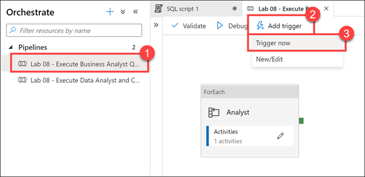

9. In the query window, replace the script with the following to see what happened to all the `asa.sql.workload02` queries we just triggered as they flood the system:

    ```sql
    SELECT s.login_name, r.[Status], r.Importance, submit_time,
    start_time ,s.session_id FROM sys.dm_pdw_exec_sessions s
    JOIN sys.dm_pdw_exec_requests r ON s.session_id = r.session_id
    WHERE s.login_name IN ('asa.sql.workload02') and Importance
    is not NULL AND r.[status] in ('Running','Suspended')
    ORDER BY submit_time, status
    ```

10. Select **Run** from the toolbar menu to execute the SQL command.

    

    You should see an output similar to the following that shows the importance for each session set to `below_normal`:

    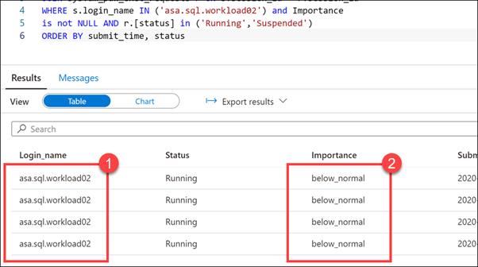

    Notice that the running scripts are executed by the `asa.sql.workload02` user **(1)** with an Importance level of **below_normal (2)**. We have successfully configured the business analyst queries to execute at a lower importance than the CEO queries. We can also see that the `CEODreamDemo` Workload Classifier works as expected.

11. Select the **Monitor** hub.

    

12. Select **Pipeline runs (1)**, and then select **Cancel recursive (2)** for each running Lab 08 pipelines, marked **In progress (3)**. This will help speed up the remaining tasks.

    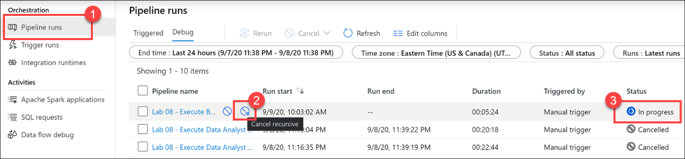

13. Return to the query window under the **Develop** hub. In the query window, replace the script with the following to set 3.25% minimum resources per request:

    ```sql
    IF  EXISTS (SELECT * FROM sys.workload_management_workload_classifiers where group_name = 'CEODemo')
    BEGIN
        Drop Workload Classifier CEODreamDemo
        DROP WORKLOAD GROUP CEODemo
        --- Creates a workload group 'CEODemo'.
            Create  WORKLOAD GROUP CEODemo WITH  
        (MIN_PERCENTAGE_RESOURCE = 26 -- integer value
            ,REQUEST_MIN_RESOURCE_GRANT_PERCENT = 3.25 -- factor of 26 (guaranteed more than 4 concurrencies)
        ,CAP_PERCENTAGE_RESOURCE = 100
        )
        --- Creates a workload Classifier 'CEODreamDemo'.
        Create Workload Classifier CEODreamDemo with
        (Workload_Group ='CEODemo',MemberName='asa.sql.workload02',IMPORTANCE = BELOW_NORMAL);
    END
    ```

    > **Note:** Configuring workload containment implicitly defines a maximum level of concurrency. With a CAP_PERCENTAGE_RESOURCE set to 60% and a REQUEST_MIN_RESOURCE_GRANT_PERCENT set to 1%, up to a 60-concurrency level is allowed for the workload group. Consider the method included below for determining the maximum concurrency: [Max Concurrency] = [CAP_PERCENTAGE_RESOURCE] / [REQUEST_MIN_RESOURCE_GRANT_PERCENT]

14. Select **Run** from the toolbar menu to execute the SQL command.

    

15. Let's flood the system again and see what happens for `asa.sql.workload02`. To do this, we will run an Azure Synapse Pipeline which triggers queries. Select the `Integrate` Tab. `Run` the **Lab 08 - Execute Business Analyst Queries** Pipeline, which will run / trigger `asa.sql.workload02` queries.

16. In the query window, replace the script with the following to see what happened to all of the `asa.sql.workload02` queries we just triggered as they flood the system:

    ```sql
    SELECT s.login_name, r.[Status], r.Importance, submit_time,
    start_time ,s.session_id FROM sys.dm_pdw_exec_sessions s
    JOIN sys.dm_pdw_exec_requests r ON s.session_id = r.session_id
    WHERE s.login_name IN ('asa.sql.workload02') and Importance
    is  not NULL AND r.[status] in ('Running','Suspended')
    ORDER BY submit_time, status
    ```

17. Select **Run** from the toolbar menu to execute the SQL command.

    

    After several moments (up to a minute), we should see several concurrent executions by the `asa.sql.workload02` user running at **below_normal** importance. We have validated that the modified Workload Group and Workload Classifier works as expected.

    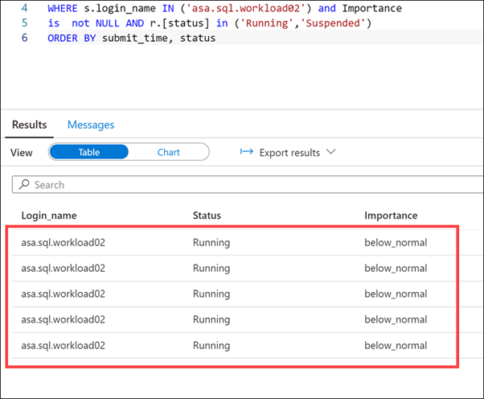

18. Select the **Monitor** hub.

    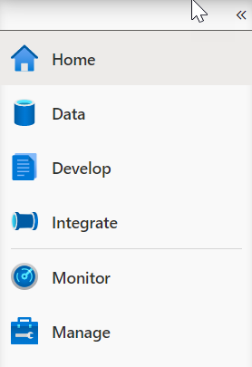

19. Select **Pipeline runs (1)**, and then select **Cancel recursive (2)** for each running Lab 08 pipelines, marked **In progress (3)**. This will help speed up the remaining tasks.

    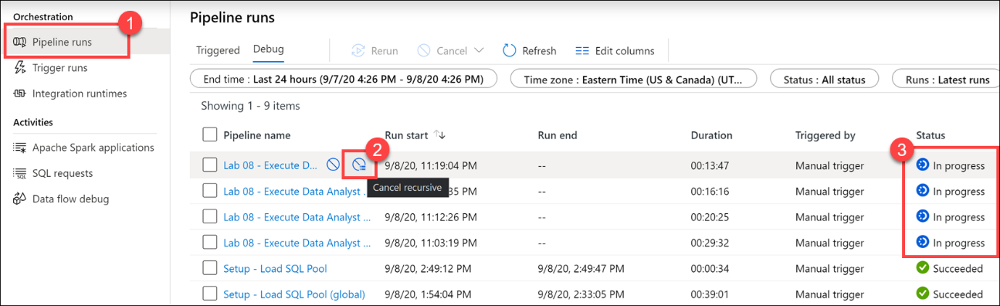

### Next unit: Use Azure Advisor to review recommendations

## Unit 5 of 8

### Use Azure Advisor to review recommendations

Azure Advisor provides you with personalized messages that provide information on best practices to optimize the setup of your Azure services. It analyzes your resource configuration and usage telemetry and then recommends solutions that can help you improve the cost effectiveness, performance, Reliability (formerly called High availability), and security of your Azure resources.

The Advisor may appear when you log into the Azure portal, but you can also access the Advisor by selecting Advisor in the navigation menu.

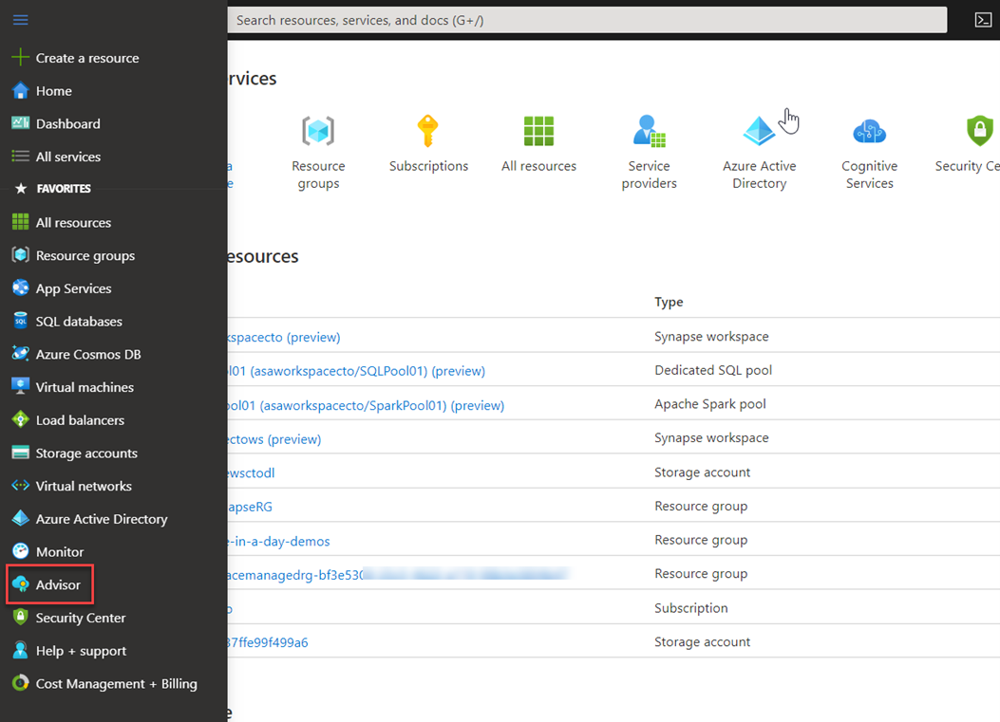

On accessing Advisor, a dashboard is presented that provides recommendations in the following areas:

- Cost
- Security
- Reliability
- Operational excellence
- Performance

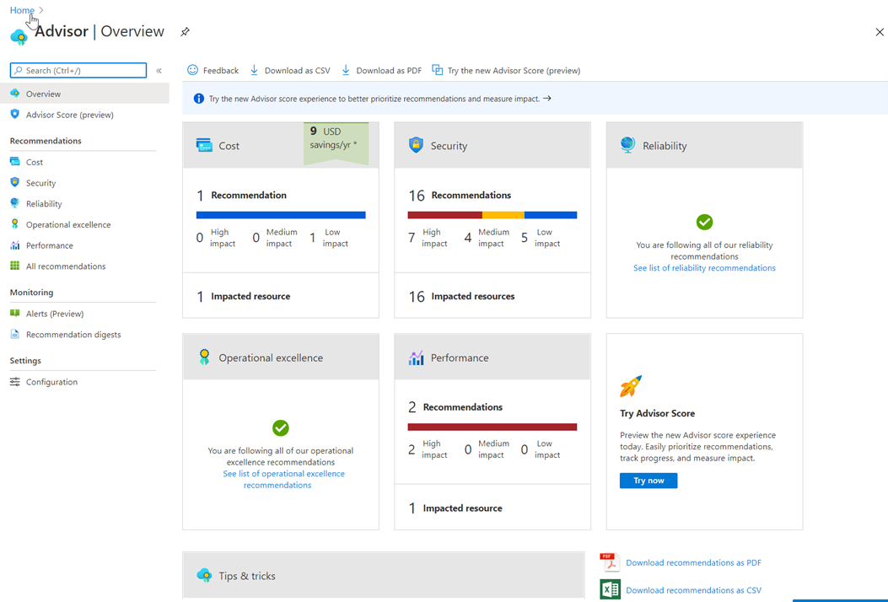

You can click on any of the dashboard items for more information. In the following example, the performance dashboard item is showing more information on two high impact items in Azure Synapse Analytics.

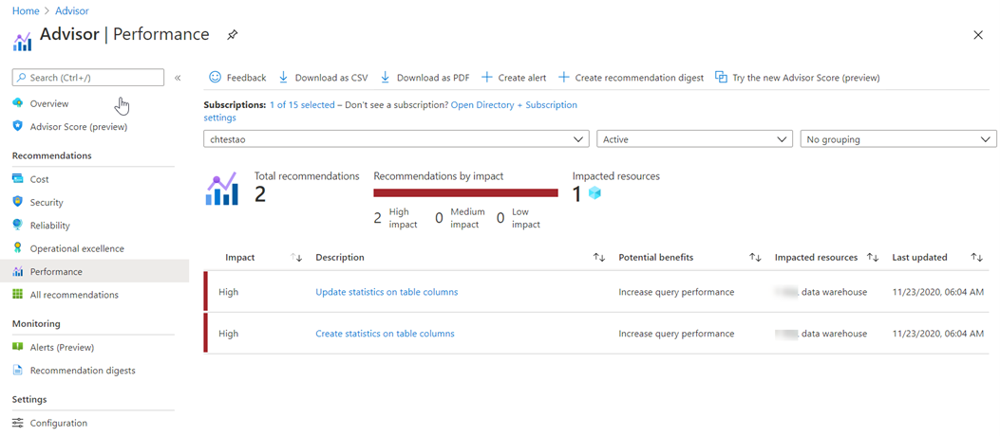

You can also click on each item to get even more information that can help you resolve the issue. In the following example, this is the information that is shown when clicking on the **Create statistics on table columns** recommendation.

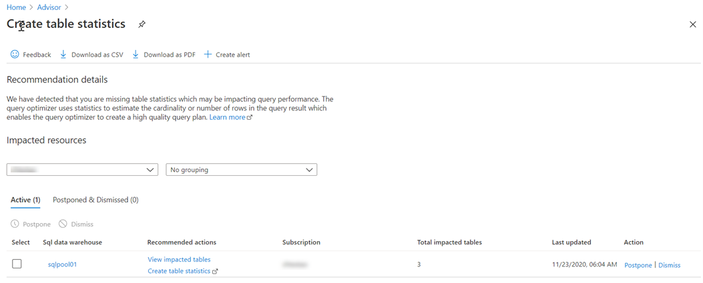

In this screen, you can click on the **view impacted tables** to see which tables are being impacted specifically, and there are also links to the help in the Azure documentation that you can use to get more understanding of the issue.

#### How Azure Synapse Analytics works with Azure Advisor

Azure Advisor recommendations are free, and the recommendations are based on telemetry data that is generated by Azure Synapse Analytics. The telemetry data that is captured by Azure Synapse Analytics include

- Data Skew and replicated table information.
- Column statistics data.
- TempDB utilization data.
- Adaptive Cache.

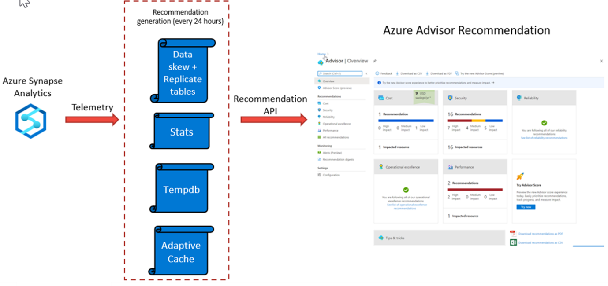

Azure Advisor recommendations are checked every 24 hours, as the recommendation API is queried against the telemetry generated from with Azure Synapse Analytics, and the recommendation dashboards are then updated to reflect the information that the telemetry has generated. This can then be viewed in the Azure Advisor dashboard.

### Next unit: Use dynamic management views to identify and troubleshoot query performance

## Unit 6 of 8

### Use dynamic management views to identify and troubleshoot query performance

Dynamic Management Views provide a programmatic experience for monitoring the Azure Synapse Analytics SQL pool activity by using the Transact-SQL language. The views that are provided, not only enable you to troubleshoot and identify performance bottlenecks with the workloads working on your system, but they are also used by other services such as Azure Advisor to provide recommendations about Azure Synapse Analytics.

There are over 90 Dynamic Management Views that can queried against dedicated SQL pools to retrieve information about the following areas of the service:

- Connection information and activity
- SQL execution requests and queries
- Index and statistics information
- Resource blocking and locking activity
- Data movement service activity
- Errors

The following is an example of monitoring query execution of the Azure Synapse Analytics SQL pools. The first step involves checking the connections against the server first, before checking the query execution activity.

#### Monitoring connections

All logins to your data warehouse are logged to sys.dm_pdw_exec_sessions. The session_id is the primary key and is assigned sequentially for each new logon.

```sql
-- Other Active Connections
SELECT * FROM sys.dm_pdw_exec_sessions where status <> 'Closed' and session_id <> session_id();
```

#### Monitor query execution

All queries executed on SQL pool are logged to sys.dm_pdw_exec_requests. The request_id uniquely identifies each query and is the primary key for this DMV. The request_id is assigned sequentially for each new query and is prefixed with QID, which stands for query ID. Querying this DMV for a given session_id shows all queries for a given logon.

#### Step 1

The first step is to identify the query you want to investigate

```sql
-- Monitor active queries
SELECT *
FROM sys.dm_pdw_exec_requests
WHERE status not in ('Completed','Failed','Cancelled')
  AND session_id <> session_id()
ORDER BY submit_time DESC;

-- Find top 10 queries longest running queries
SELECT TOP 10 *
FROM sys.dm_pdw_exec_requests
ORDER BY total_elapsed_time DESC;
```

From the preceding query results, **note the Request ID** of the query that you would like to investigate.

Queries in the **Suspended** state can be queued due to a large number of active running queries. These queries also appear in the sys.dm_pdw_waits waits query with a type of UserConcurrencyResourceType. For information on concurrency limits, see Memory and concurrency limits or Resource classes for workload management. Queries can also wait for other reasons such as for object locks. If your query is waiting for a resource, see Investigating queries waiting for resources further down in this article.

To simplify the lookup of a query in the sys.dm_pdw_exec_requests table, use LABEL to assign a comment to your query, which can be looked up in the sys.dm_pdw_exec_requests view.

```sql
-- Query with Label
SELECT *
FROM sys.tables
OPTION (LABEL = 'My Query')
;

-- Find a query with the Label 'My Query'
-- Use brackets when querying the label column, as it it a key word
SELECT  *
FROM    sys.dm_pdw_exec_requests
WHERE   [label] = 'My Query';
```

#### Step 2

Use the Request ID to retrieve the queries distributed SQL (DSQL) plan from sys.dm_pdw_request_steps

```sql
-- Find the distributed query plan steps for a specific query.
-- Replace request_id with value from Step 1.

SELECT * FROM sys.dm_pdw_request_steps
WHERE request_id = 'QID####'
ORDER BY step_index;
```

When a DSQL plan is taking longer than expected, the cause can be a complex plan with many DSQL steps or just one step taking a long time. If the plan is many steps with several move operations, consider optimizing your table distributions to reduce data movement.

The [Table distribution](https://learn.microsoft.com/en-us/azure/synapse-analytics/sql-data-warehouse/sql-data-warehouse-tables-distribute) article explains why data must be moved to solve a query. The article also explains some distribution strategies to minimize data movement.

To investigate further details about a single step, the operation_type column of the long-running query step and note the **Step Index**:

- Proceed with Step 3 for **SQL operations**: OnOperation, RemoteOperation, ReturnOperation.
- Proceed with Step 4 for **Data Movement operations**: ShuffleMoveOperation, BroadcastMoveOperation, TrimMoveOperation, PartitionMoveOperation, MoveOperation, CopyOperation.

#### Step 3

Use the Request ID and the Step Index to retrieve details from sys.dm_pdw_sql_requests, which contains execution information of the query step on all of the distributed databases.

```sql
-- Find the distribution run times for a SQL step.
-- Replace request_id and step_index with values from Step 1 and 3.

SELECT * FROM sys.dm_pdw_sql_requests
WHERE request_id = 'QID####' AND step_index = 2;
```

When the query step is running, DBCC PDW_SHOWEXECUTIONPLAN can be used to retrieve the SQL Server estimated plan from the SQL Server plan cache for the step running on a particular distribution.

```sql
-- Find the SQL Server execution plan for a query running on a specific SQL pool or control node.
-- Replace distribution_id and spid with values from previous query.

DBCC PDW_SHOWEXECUTIONPLAN(1, 78);
```

#### Step 4

Use the Request ID and the Step Index to retrieve information about a data movement step running on each distribution from sys.dm_pdw_dms_workers.

```sql
-- Find information about all the workers completing a Data Movement Step.
-- Replace request_id and step_index with values from Step 1 and 3.

SELECT * FROM sys.dm_pdw_dms_workers
WHERE request_id = 'QID####' AND step_index = 2;
```

- Check the total_elapsed_time column to see if a particular distribution is taking longer than others for data movement.
- For the long-running distribution, check the rows_processed column to see if the number of rows being moved from that distribution is larger than others. If so, this finding might indicate skew of your underlying data. One cause for data skew is distributing on a column with many NULL values (whose rows will all land in the same distribution). Prevent slow queries by avoiding distribution on these types of columns or filtering your query to eliminate NULLs when possible.

If the query is running, you can use DBCC PDW_SHOWEXECUTIONPLAN to retrieve the SQL Server estimated plan from the SQL Server plan cache for the currently running SQL Step within a particular distribution.

```sql
-- Find the SQL Server estimated plan for a query running on a specific SQL pool Compute or control node.
-- Replace distribution_id and spid with values from previous query.

DBCC PDW_SHOWEXECUTIONPLAN(55, 238);
```

Dynamic Management Views (DMV) only contains 10,000 rows of data. On heavily utilized systems this means that data held in this table may be lost with hours, or even minutes as data is managed in a first in, first out system. As a result you can potentially lose meaningful information that can help you diagnose query performance issues on your system. In this situation, you should use the Query Store.

You can also monitor additional aspects of Azure Synapse SQL pools including:

- Monitoring waits
- Monitoring tempdb
- Monitoring memory
- Monitoring transaction log
- Monitoring PolyBase

You can view information about [monitoring these areas here](https://learn.microsoft.com/en-us/azure/synapse-analytics/sql-data-warehouse/sql-data-warehouse-manage-monitor#monitor-waiting-queries)

### Next unit: Knowledge check

## unit 7 of 8

### Knowledge check

1. Which ALTER DATABASE statement parameter allows a dedicated SQL pool to scale?

    - ☑ SCALE.
    - ☐ MODIFY
    - ☐ CHANGE.

2. Which workload management feature influences the order in which a request gets access to resources?

    - ☑ Workload classification.
    - ☐ Workload importance.
    - ☐ Workload isolation.

3. Which Dynamic Management View enables the view of the active connections against a dedicated SQL pool?

    - ☑ sys.dm_pdw_exec_requests.
    - ☐ sys.dm_pdw_dms_workers.
    - ☐ DBCC PDW_SHOWEXECUTIONPLAN.

### Next unit: Summary

## Unit 8 of 8
