# M06.04 Secure a data warehouse in Azure Synapse Analytics

## Unit 1 of 10

### Introduction

In this module, you will learn how to approach and implement security to protect your data with Azure Synapse Analytics.

In this module, you will:

- Understand network security options for Azure Synapse Analytics
- Configure Conditional Access
- Configure Authentication
- Manage authorization through column and row level security
- Manage sensitive data with Dynamic Data masking
- Implement encryption in Azure Synapse Analytics
- Understand advanced data security options for Azure Synapse Analytics

#### Prerequisites

Before taking this module, it is recommended that the student is able to:

- Log into the Azure portal
- Create a Synapse Analytics Workspace
- Create an Azure Synapse Analytics SQL Pool

### Next unit: Understand network security options for Azure Synapse Analytics

## Unit 2 of 10

### Understand network security options for Azure Synapse Analytics

There are a range of network security steps that you should consider to secure Azure Synapse Analytics. One of the first aspects that you will consider is securing access to the service itself. This can be achieved by creating the following network objects including:

- Firewall rules
- Virtual networks
- Private endpoints

#### Firewall rules

Firewall rules enable you to define the type of traffic that is allowed or denied access to an Azure Synapse workspace using the originating IP address of the client that is trying to access the Azure Synapse Workspace. IP firewall rules configured at the workspace level apply to all public endpoints of the workspace including dedicated SQL pools, serverless SQL pool, and the development endpoint.

You can choose to allow connections from all IP addresses as you are creating the Azure Synapse Workspaces, although this is not recommended as it does not allow for control access to the workspace. Instead, within the Azure portal, you can configure specific IP address ranges and associate them with a rule name so that you have greater control.

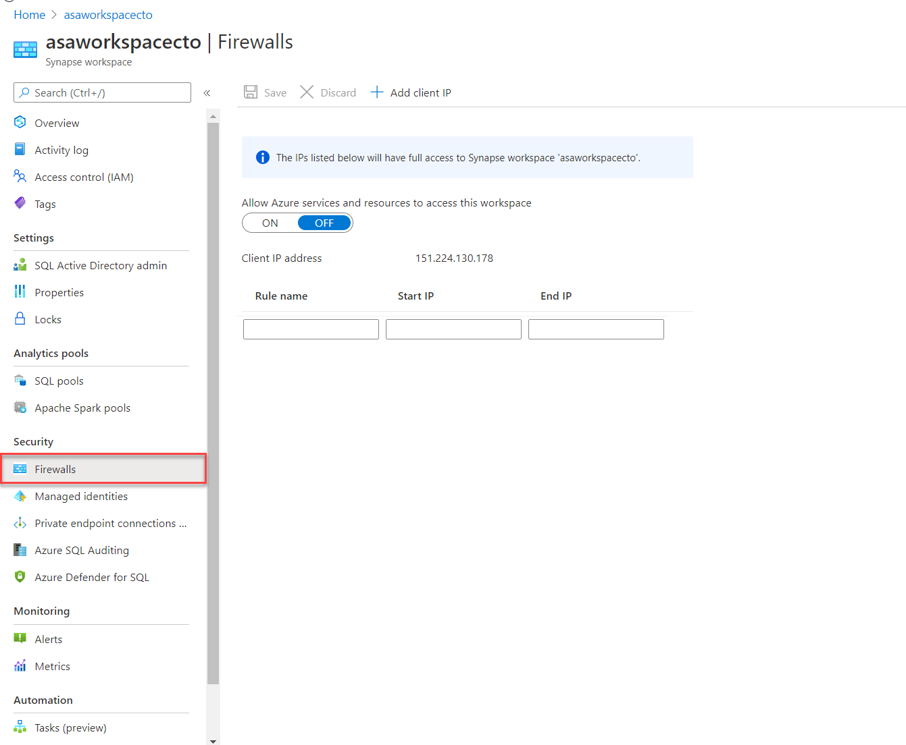

Make sure that the firewall on your network and local computer allows outgoing communication on TCP ports 80, 443 and 1443 for Synapse Studio.

Also, you need to allow outgoing communication on UDP port 53 for Synapse Studio. To connect using tools such as SSMS and Power BI, you must allow outgoing communication on TCP port 1433.

#### Virtual networks

Azure Virtual Network (VNet) enables private networks in Azure. VNet enables many types of Azure resources, such as Azure Synapse Analytics, to securely communicate with other virtual networks, the internet, and on-premises networks. When you create your Azure Synapse workspace, you can choose to associate it to a Microsoft Azure Virtual Network. The Virtual Network associated with your workspace is managed by Azure Synapse. This Virtual Network is called a Managed workspace Virtual Network.

Using a managed workspace virtual network provides the following benefits:

- With a Managed workspace Virtual Network, you can offload the burden of managing the Virtual Network to Azure Synapse.
- You don't have to configure inbound NSG rules on your own Virtual Networks to allow Azure Synapse management traffic to enter your Virtual Network. Misconfiguration of these NSG rules causes service disruption for customers.
- You don't need to create a subnet for your Spark clusters based on peak load.
- Managed workspace Virtual Network along with Managed private endpoints protects against data exfiltration. You can only create Managed private endpoints in a workspace that has a Managed workspace Virtual Network associated with it.
- it ensures that your workspace is network isolated from other workspaces.

If your workspace has a Managed workspace Virtual Network, Data integration and Spark resources are deployed in it. A Managed workspace Virtual Network also provides user-level isolation for Spark activities because each Spark cluster is in its own subnet.

Dedicated SQL pool and serverless SQL pool are multi-tenant capabilities and therefore reside outside of the Managed workspace Virtual Network. Intra-workspace communication to dedicated SQL pool and serverless SQL pool use Azure private links. These private links are automatically created for you when you create a workspace with a Managed workspace Virtual Network associated to it.

You can only choose to enable managed virtual networks as you are creating the Azure Synapse Workspaces.

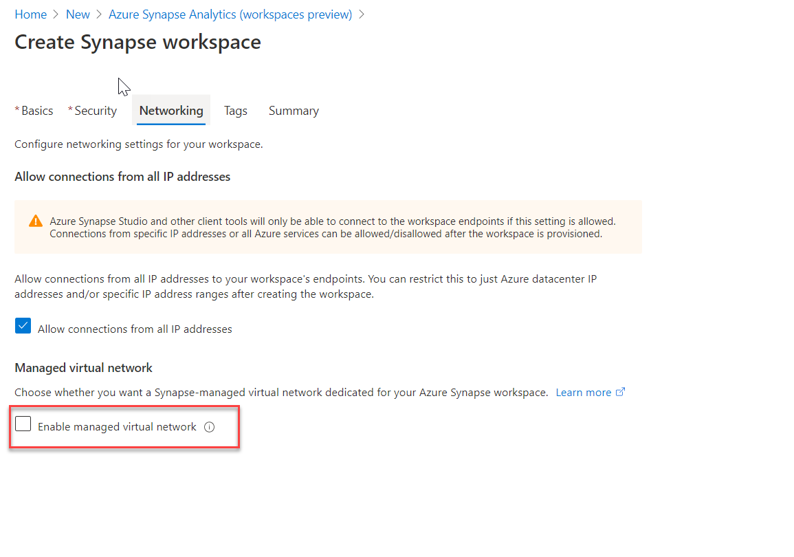

#### Private endpoints

Azure Synapse Analytics enables you to connect up its various components through endpoints. You can set up managed private endpoints to access these components in a secure manner known as private links. This can only be achieved in an Azure Synapse workspace with a Managed workspace Virtual Network. Private link enables you to access Azure services (such as Azure Storage and Azure Cosmos DB) and Azure hosted customer/partner services from your Azure Virtual Network securely.

When you use a private link, traffic between your Virtual Network and workspace traverses entirely over the Microsoft backbone network. Private Link protects against data exfiltration risks. You establish a private link to a resource by creating a private endpoint.

Private endpoint uses a private IP address from your Virtual Network to effectively bring the service into your Virtual Network. Private endpoints are mapped to a specific resource in Azure and not the entire service. Customers can limit connectivity to a specific resource approved by their organization. You can manage the private endpoints in the Azure Synapse Studio manage hub.

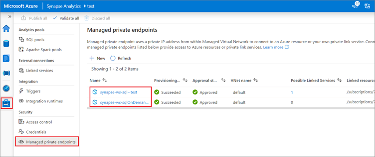

### Next unit: Configure Conditional Access

## Unit 3 of 10

### Configure Conditional Access

Conditional Access is a feature that enables you to define the conditions under which a user can connect to your Azure subscription and access services. Conditional Access provides an additional layer of security that can be used in combination with authentication to strengthen the security access to your network.

```python
from IPython.display import HTML

# Embedding the video link using HTML iframe
video_url = 'https://learn.microsoft.com/_themes/docs.theme/master/en-us/_themes/global/video-embed-one-stream.html?show=docs-azure&ep=azure-ad-conditional-access'
embed_code = f'<iframe width="560" height="315" src="{video_url}" frameborder="0" allowfullscreen></iframe>'
HTML(embed_code)
```

Conditional Access policies at their simplest are if-then statements, if a user wants to access a resource, then they must complete an action. As an example, if a Data Engineer wishes to access services in Azure Synapse Analytics, they may be requested by the Conditional Access policy to perform an additional step of multifactor authentication (MFA) to complete the authentication to get onto the service

Conditional Access policies use signals as a basis to determine if Conditional Access should first be applied. Common signals include:

- User or group membership names
- IP address information
- Device platforms or type
- Application access requests
- Real-time and calculated risk detection
- Microsoft Cloud App Security (MCAS)

Based on these signals, you can then choose to block access. The alternative is you can grant access, and at the same time request that the user perform an additional action including:

- Perform multifactor authentication
- Use a specific device to connect

Given the amount of data that could potentially be stored, Azure Synapse Analytics dedicated SQL pools supports Conditional Access to provide protection for your data. It does require that Azure Synapse Analytics is configured to support Microsoft Entra ID, and that if you chose multifactor authentication, that the tool you are using support it.

To configure Conditional Access, you can perform the following steps:

1. Sign in to the Azure portal, select **Microsoft Entra ID**, and then select **Conditional Access**.

    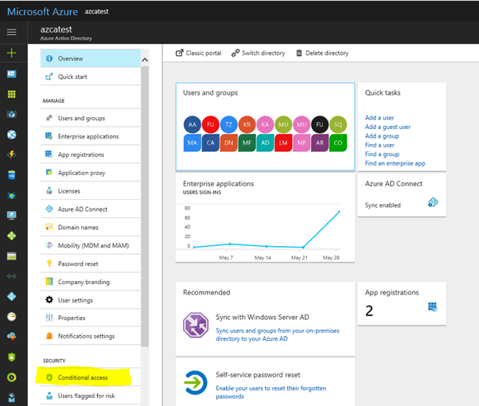

2. In the **Conditional Access-Policies** blade, click **New policy**, provide a name, and then click **Configure rules**.

3. Under **Assignments**, select **Users and groups**, check **Select users and groups**, and then select the user or group for Conditional Access. Click **Select**, and then click **Done** to accept your selection.

    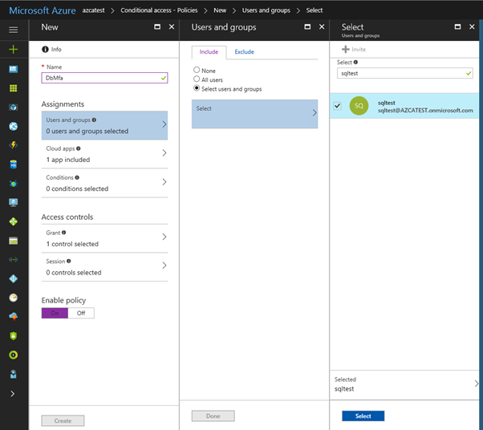

4. Select **Cloud apps**, click **Select apps**. You see all apps available for Conditional Access. Select **Azure SQL Database**, at the bottom click **Select**, and then click **Done**.

    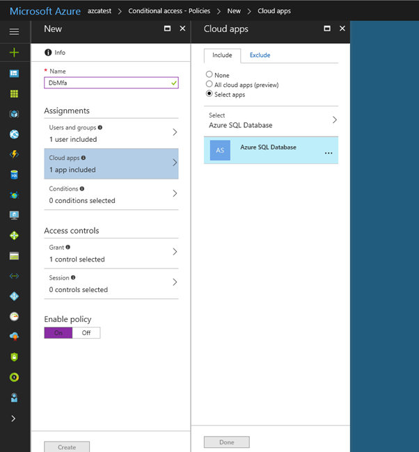

5. If you can't find **Azure SQL Database** listed in the following third screenshot, complete the following steps:

    - Connect to your database in Azure SQL Database by using SSMS with a Microsoft Entra admin account.
    - Execute CREATE USER [user@yourtenant.com] FROM EXTERNAL PROVIDER.
    - Sign into Microsoft Entra ID and verify that Azure SQL Database, SQL Managed Instance, or Azure Synapse are listed in the applications in your Microsoft Entra instance.

6. Select **Access controls**, select **Grant**, and then check the policy you want to apply. For this example, we select **Require multifactor authentication**.

    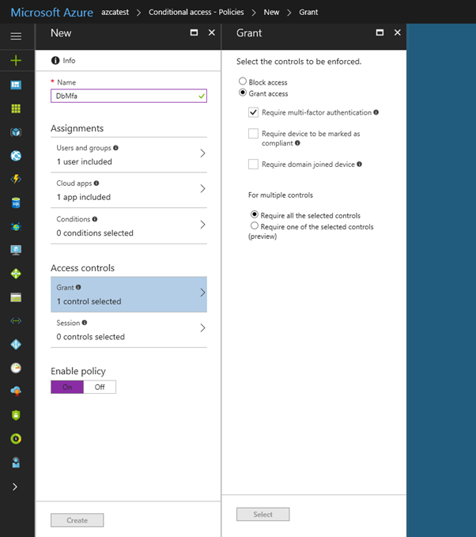

### Next unit: Configure authentication

## Unit 4 of 10

### Configure authentication

Authentication is the process of validating credentials as you access resources in a digital infrastructure. This ensures that you can validate that an individual, or a service that wants to access a service in your environment can prove who they are. Azure Synapse Analytics provides several different methods for authentication.

#### What needs to be authenticated

There are a variety of scenarios that means that authentication must take place to protect the data that is stored in your Azure Synapse Analytics estate.

The common form of authentication is that of individuals who want to access the data in the service. This is typically seen as an individual providing a username and password to authenticate against a service. However, this is also becoming more sophisticated with authentication requests working in combination with Conditional Access policies to further secure the authentication process with additional security steps.

What is less obvious is the fact that services must authenticate with other services so that they can operate seamlessly. An example of this is using an Azure Synapse Spark or serverless SQL pool to access data in an Azure Data Lake store. An authentication mechanism must take place in the background to ensure that Azure Synapse Analytics can access the data in the data lake in an authenticated manner.

Finally, there are situations where users and services operate together at the same time. Here you have a combination of both user and service authentication taking place under the hood to ensure that the user is getting access to the data seamlessly. An example of this is using Power BI to view reports in a dashboard that is being serviced by a dedicated SQL pool. Here you have multiple levels of authentication taking place that needs to be managed.

#### Types of security

The following are the types of authentication that you should be aware of when working with Azure Synapse Analytics.

##### Microsoft Entra ID

Microsoft Entra ID is a directory service that allows you to centrally maintain objects that can be secured. The objects can include user accounts and computer accounts. An employee of an organization will typically have a user account that represents them in the organizations Microsoft Entra tenant, and they then use the user account with a password to authenticate against other resources that are stored within the directory using a process known as single sign-on.

The power of Microsoft Entra ID is that they only have to log in once, and Microsoft Entra ID will manage access to other resources based on the information held within it using pass through authentication. If a user and an instance of Azure Synapse Analytics are part of the same Microsoft Entra ID, it is possible for the user to access Azure Synapse Analytics without an apparent login. If managed correctly, this process is seamless as the administrator would have given the user authorization to access Azure Synapse Analytics dedicated SQL pool as an example.

In this situation, it is normal for an Azure Administrator to create the user accounts and assign them to the appropriate roles and groups in Microsoft Entra ID. The Data Engineer will then add the user, or a group to which the user belongs to access a dedicated SQL pool.

##### Managed identities

Managed identity for Azure resources is a feature of Microsoft Entra ID. The feature provides Azure services with an automatically managed identity in Microsoft Entra ID. You can use the Managed Identity capability to authenticate to any service that supports Microsoft Entra authentication.

Managed identities for Azure resources are the new name for the service formerly known as Managed Service Identity (MSI). A system-assigned managed identity is created for your Azure Synapse workspace when you create the workspace.

Azure Synapse also uses the managed identity to integrate pipelines. The managed identity lifecycle is directly tied to the Azure Synapse workspace. If you delete the Azure Synapse workspace, then the managed identity is also cleaned up.

The workspace managed identity needs permissions to perform operations in the pipelines. You can use the object ID or your Azure Synapse workspace name to find the managed identity when granting permissions.

You can retrieve the managed identity in the Azure portal. Open your Azure Synapse workspace in Azure portal and select **Overview** from the left navigation. The managed identity's object ID is displayed to in the main screen.

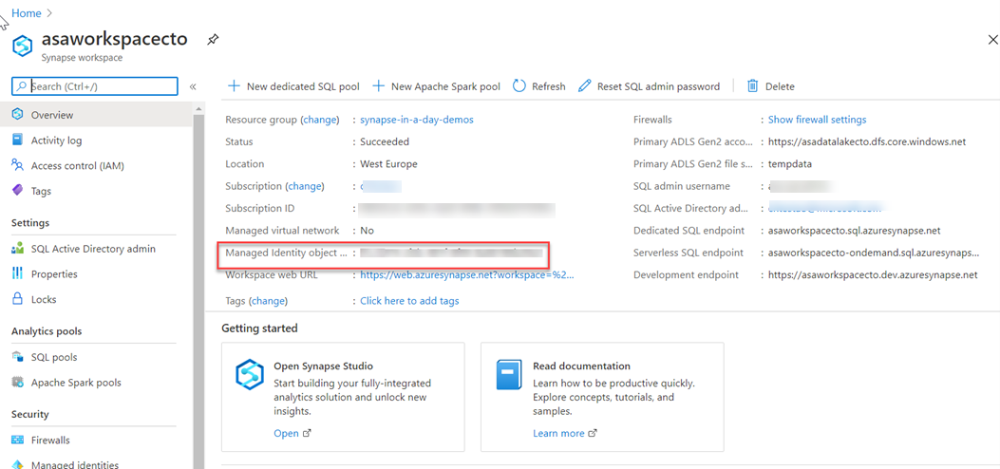

The managed identity information will also show up when you create a linked service that supports managed identity authentication from Azure Synapse Studio.

Launch **Azure Synapse Studio** and select the **Manage** tab from the left navigation. Then select **Linked services** and choose the **+ New** option to create a new linked service.

In the **New linked service** window, type Azure Data Lake Storage Gen2. Select the **Azure Data Lake Storage Gen2** resource type from the list below and choose **Continue**.

In the next window, choose **Managed Identity** for **Authentication method**. You'll see the managed identity's **Name** and **Object ID**.

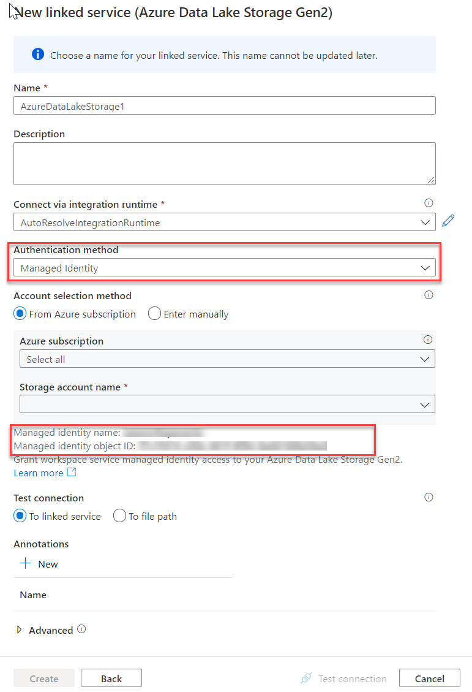

##### SQL Authentication

For user accounts that are not part of a Microsoft Entra ID, then using SQL Authentication will be an alternative. In this instance, a user is created in the instance of a dedicated SQL pool. If the user in question requires administrator access, then the details of the user are held in the master database. If administrator access is not required, you can create a user in a specific database. A user then connects directly to the Azure Synapse Analytics dedicated SQL pool where they are prompted to use a username and password to access the service.

This approach is typically useful for external users who need to access the data, or if you are using third party or legacy applications against the Azure Synapse Analytics dedicated SQL pool

##### Multifactor authentication

Synapse SQL support connections from SQL Server Management Studio (SSMS) using Active Directory Universal Authentication.

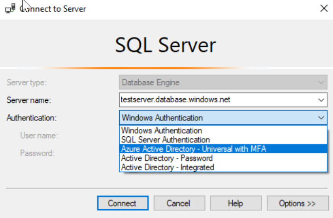

This enables you to operate in environments that use Conditional Access policies that enforce multifactor authentication as part of the policy.

##### Keys

If you are unable to use a managed identity to access resources such as Azure Data Lake then you can use storage account keys and shared access signatures.

With a storage account key. Azure creates two of these keys (primary and secondary) for each storage account you create. The keys give access to everything in the account. You'll find the storage account keys in the Azure portal view of the storage account. Just select **Settings**, and then click **Access keys**.

As a best practice, you shouldn't share storage account keys, and you can use Azure Key Vault to manage and secure the keys.

```python
from IPython.display import HTML

# Embedding the video link using HTML iframe
video_url = 'https://learn.microsoft.com/_themes/docs.theme/master/en-us/_themes/global/video-embed-one-stream.html?show=learn-azure&ep=azure-key-vault-overview'
embed_code = f'<iframe width="560" height="315" src="{video_url}" frameborder="0" allowfullscreen></iframe>'
HTML(embed_code)
```

Azure Key Vault is a secret store: a centralized cloud service for storing app secrets - configuration values like passwords and connection strings that must remain secure at all times. Key Vault helps you control your apps' secrets by keeping them in a single central location and providing secure access, permissions control, and access logging.

The main benefits of using Key Vault are:

- Separation of sensitive app information from other configuration and code, reducing risk of accidental leaks
- Restricted secret access with access policies tailored to the apps and individuals that need them
- Centralized secret storage, allowing required changes to happen in only one place
- Access logging and monitoring to help you understand how and when secrets are accessed

Secrets are stored in individual vaults, which are Azure resources used to group secrets together. Secret access and vault management is accomplished via a REST API, which is also supported by all of the Azure management tools as well as client libraries available for many popular languages. Every vault has a unique URL where its API is hosted.

##### Shared access signatures

If an external third-party application needs access to your data, you'll need to secure their connections without using storage account keys. For untrusted clients, use a shared access signature (SAS). A shared access signature is a string that contains a security token that can be attached to a URI. Use a shared access signature to delegate access to storage objects and specify constraints, such as the permissions and the time range of access. You can give a customer a shared access signature token.

##### Types of shared access signatures

You can use a service-level shared access signature to allow access to specific resources in a storage account. You'd use this type of shared access signature, for example, to allow an app to retrieve a list of files in a file system or to download a file.

Use an account-level shared access signature to allow access to anything that a service-level shared access signature can allow, plus additional resources and abilities. For example, you can use an account-level shared access signature to allow the ability to create file systems.

### Next unit: Manage authorization through column and row level security

## Unit 5 of 10

### Manage authorization through column and row level security

In this topic, we'll go through how you can manage authorization through column and row level security within Azure Synapse Analytics. We'll start off by talking about column level security in Azure Synapse Analytics, and finish with row level security.

#### Column level security in Azure Synapse Analytics

Generally speaking, column level security is simplifying a design and coding for the security in your application. It allows you to restrict column access in order to protect sensitive data. For example, if you want to ensure that a specific user 'Leo' can only access certain columns of a table because he's in a specific department. The logic for 'Leo' only to access the columns specified for the department he works in, is a logic that is located in the database tier, rather than on the application level data tier. If he needs to access data from any tier, the database should apply the access restriction every time he tries to access data from another tier. The reason for doing so is to make sure that your security is reliable and robust since we're reducing the surface area of the overall security system. Column level security will also eliminate the necessity for the introduction of view, where you would filter out columns, to impose access restrictions on 'Leo'

The way to implement column level security is by using the GRANT T-SQL statement. Using this statement, SQL and Microsoft Entra ID support the authentication.


##### Syntax

The syntax to use for implementing column level security looks as follows:

```sql
GRANT <permission> [ ,...n ] ON
    [ OBJECT :: ][ schema_name ]. object_name [ ( column [ ,...n ] ) ] // specifying the column access
    TO <database_principal> [ ,...n ]
    [ WITH GRANT OPTION ]
    [ AS <database_principal> ]
<permission> ::=
    SELECT
  | UPDATE
<database_principal> ::=
      Database_user // specifying the database user
    | Database_role // specifying the database role 
    | Database_user_mapped_to_Windows_User
    | Database_user_mapped_to_Windows_Group
```

So when would you use column-level security? Let's say that you are a financial services firm, and can only have an account manager allowed to have access to a customer's social security number, phone number, or other personally identifiable information. It is imperative to distinguish the role of an account manager versus the manager of the account managers.

Another use case might be related to the Healthcare Industry. Let's say you have a specific health care provider. This healthcare provider only wants doctors and nurses to be able to access medical records. The billing department should not have access to view this data. Column-level security might be the option to use.

So how does column level security distinguishes from row-level security? Let's look into that.

#### Row level security in Azure Synapse Analytics

Row-level security (RLS) can help you to create a group membership or execution context in order to control not just columns in a database table, but actually, the rows. RLS, just like column-level security, can simply help and enable your design and coding of your application security. However, compared to column-level security where it's focused on the columns (parameters), RLS helps you implement restrictions on data row access. Let's say that your employee can only access rows of data that are important to the department, you should implement RLS. If you want to restrict, for example, customer data access that is only relevant to the company, you can implement RLS. The restriction on the access of the rows is a logic that is located in the database tier, rather than on the application level data tier. If 'Leo' needs to access data from any tier, the database should apply the access restriction every time he tries to access data from another tier. The reason for doing so is to make sure that your security is reliable and robust since we're reducing the surface area of the overall security system.

The way to implement RLS is by using the CREATE SECURITY POLICY[!INCLUDEtsql] statement. The predicates are created as inline table-valued functions. It is imperative to understand that within Azure Synapse, only supports filter predicates. If you need to use a block predicate, you won't be able to find support at this moment within Azure synapse.


##### Description of row level security in relation to filter predicates

RLS within Azure Synapse supports one type of security predicates, which are Filter predicates, not block predicates.
What filter predicates do, is silently filtering the rows that are available for reading operations such as SELECT, UPDATE, DELETE.

The access to row-level data in a table is restricted as an inline table-valued function, which is a security predicate. This table-valued function will then be invoked and enforced by the security policy that you need. An application is not aware of rows that are filtered from the result set for filter predicates. So what will happen is that if all rows are filtered, a null set is returned.

When you are using filter predicates, it will be applied when data is read from the base table. The filter predicate affects all get operations such as SELECT, DELETE, UPDATE. You are unable to select or delete rows that have been filtered. It is not possible for you to update a row that has been filtered. What you can do, is update rows in a way that they will be filtered afterward.

##### Use cases

We've already mentioned some use cases for RLS. Another use case might where you have created a multi-tenant application where you create a policy where logical separations of a tenant's data rows from another tenant's data rows are enforced. In order to implement this efficiently, it is highly recommended to store data for many tenants in a single table.

When we look at RLS filter predicates, they are functionally equivalent to appending a **WHERE** clause. The predicate can be as sophisticated as business practices dictate, or the clause can be as simple as `WHERE TenantId = 42`.

When we look at RLS more formally, RLS introduces predicate based access control. The reason why RLS can be used for predicate access control is that it is a flexible, centralized, predicate-based evaluation. The filter predicate can be based on metadata or any other criteria you would determine as appropriate. The predicate is used as a criterion to determine if the user has the appropriate access to the data based on user attributes. Label-based access control can be implemented by using predicate-based access control.

##### Permissions

If you want to create, alter or drop the security policies, you would have to use the **ALTER ANY SECURITY POLICY** permission. The reason for that is when you are creating or dropping a security policy it requires **ALTER** permissions on the schema.

In addition to that, there are other permissions required for each predicate that you would add:

- **SELECT** and **REFERENCES** permissions on the inline table-valued function being used as a predicate.

- **REFERENCES** permission on the table that you target to be bound to the policy.

- **REFERENCES** permission on every column from the target table used as arguments.

Once you've set up the security policies, they will apply to all the users (including dbo users in the database) Even though DBO users can alter or drop security policies, their changes to the security policies can be audited. If you have special circumstances where highly privileged users, like a sysadmin or db_owner, need to see all rows to troubleshoot or validate data, you would still have to write the security policy in order to allow that.

If you have created a security policy where `SCHEMABINDING = OFF`, in order to query the target table, the user must have the **SELECT** or **EXECUTE** permission on the predicate function. They also need permissions to any additional tables, views, or functions used within the predicate function. If a security policy is created with `SCHEMABINDING = ON` (the default), then these permission checks are bypassed when users query the target table.

#### Best practices

There are some best practices to take in mind when you want to implement RLS. We recommended creating a separate schema for the RLS objects. RLS objects in this context would be the predicate functions, and security policies. Why is that a best practice? It helps to separate the permissions that are required on these special objects from the target tables. In addition to that, separation for different policies and predicate functions may be needed in multi-tenant-databases. However, it is not a standard for every case.

Another best practice to bear in mind is that the **ALTER ANY SECURITY POLICY** permission should only be intended for highly privileged users (such as a security policy manager). The security policy manager should not require **SELECT** permission on the tables they protect.

In order to avoid potential runtime errors, you should take into mind type conversions in predicate functions that you write. Also, you should try to avoid recursion in predicate functions. The reason for this is to avoid performance degradation. Even though the query optimizer will try to detect the direct recursions, there is no guarantee to find the indirect recursions. With indirect recursion, we mean where a second function calls the predicate function.

It would also be recommended to avoid the use of excessive table joins in predicate functions. This would maximize performance.

Generally speaking when it comes to the logic of predicates, you should try to avoid logic that depends on session-specific SET options. Even though this is highly unlikely to be used in practical applications, predicate functions whose logic depends on certain session-specific **SET** options can leak information if users are able to execute arbitrary queries. For example, a predicate function that implicitly converts a string to **datetime** could filter different rows based on the **SET DATEFORMAT** option for the current session.

### Next unit: Exercise - Manage authorization through column and row level security

## Unit 6 of 10

### Exercise - Manage authorization through column and row level security

In this exercise, examples are shown how you can manage authorization through column and row level security.

#### An example of column level security

The following example shows how to restrict `TestUser` from accessing the `SSN` column of the `Membership` table:

Create `Membership` table with SSN column used to store social security numbers:

```sql
CREATE TABLE Membership
  (MemberID int IDENTITY,
   FirstName varchar(100) NULL,
   SSN char(9) NOT NULL,
   LastName varchar(100) NOT NULL,
   Phone varchar(12) NULL,
   Email varchar(100) NULL);
```

Allow `TestUser` to access all columns except for the SSN column, which has the sensitive data:

```sql
GRANT SELECT ON Membership(MemberID, FirstName, LastName, Phone, Email) TO TestUser;
```

Queries executed as `TestUser` will fail if they include the SSN column:

```sql
SELECT * FROM Membership;

-- Msg 230, Level 14, State 1, Line 12
-- The SELECT permission was denied on the column 'SSN' of the object 'Membership', database 'CLS_TestDW', schema 'dbo'.
```

#### An example of row level security

This scenario gives you an example for row level security on an Azure Synapse external table.

This short example creates three users and an external table with six rows. It then creates an inline table-valued function and a security policy for the external table. The example shows how select statements are filtered for the various users.

##### prerequisites

- You must have a SQL pool. See [Create a Synapse SQL pool](https://learn.microsoft.com/en-us/azure/synapse-analytics/sql-data-warehouse/create-data-warehouse-portal)
- The server hosting your SQL pool must be registered with AAD and you must have an Azure storage account with Storage Blog Contributor permissions. Follow the steps [here](https://learn.microsoft.com/en-us/azure/azure-sql/database/vnet-service-endpoint-rule-overview#steps).
- Create a file system for your Azure Storage account. Use Storage Explorer to view your storage account. Right click on containers and select Create file system.

Once you have the prerequisites in place, create three user accounts that will demonstrate different access capabilities.

```sql
--run in master
CREATE LOGIN Manager WITH PASSWORD = '<user_password>'
GO
CREATE LOGIN Sales1 WITH PASSWORD = '<user_password>'
GO
CREATE LOGIN Sales2 WITH PASSWORD = '<user_password>'
GO

--run in master and your SQL pool database
CREATE USER Manager FOR LOGIN Manager;  
CREATE USER Sales1  FOR LOGIN Sales1;  
CREATE USER Sales2  FOR LOGIN Sales2 ;
```

Create a table to hold data.

```sql
CREATE TABLE Sales  
    (  
    OrderID int,  
    SalesRep sysname,  
    Product varchar(10),  
    Qty int  
    );
```

Populate the table with six rows of data, showing three orders for each sales representative.

```sql
INSERT INTO Sales VALUES (1, 'Sales1', 'Valve', 5);
INSERT INTO Sales VALUES (2, 'Sales1', 'Wheel', 2);
INSERT INTO Sales VALUES (3, 'Sales1', 'Valve', 4);
INSERT INTO Sales VALUES (4, 'Sales2', 'Bracket', 2);
INSERT INTO Sales VALUES (5, 'Sales2', 'Wheel', 5);
INSERT INTO Sales VALUES (6, 'Sales2', 'Seat', 5);
-- View the 6 rows in the table  
SELECT * FROM Sales;
```

Create an Azure Synapse external table from the Sales table you just created.

```sql
CREATE MASTER KEY ENCRYPTION BY PASSWORD = '<user_password>';

CREATE DATABASE SCOPED CREDENTIAL msi_cred WITH IDENTITY = 'Managed Service Identity';

CREATE EXTERNAL DATA SOURCE ext_datasource_with_abfss WITH (TYPE = hadoop, LOCATION = 'abfss://<file_system_name@storage_account>.dfs.core.windows.net', CREDENTIAL = msi_cred);

CREATE EXTERNAL FILE FORMAT MSIFormat  WITH (FORMAT_TYPE=DELIMITEDTEXT);
  
CREATE EXTERNAL TABLE Sales_ext WITH (LOCATION='<your_table_name>', DATA_SOURCE=ext_datasource_with_abfss, FILE_FORMAT=MSIFormat, REJECT_TYPE=Percentage, REJECT_SAMPLE_VALUE=100, REJECT_VALUE=100)
AS SELECT * FROM sales;
```

Grant SELECT for the three users on the external table Sales_ext that you created.

```sql
GRANT SELECT ON Sales_ext TO Sales1;  
GRANT SELECT ON Sales_ext TO Sales2;  
GRANT SELECT ON Sales_ext TO Manager;
```

Create a new schema, and an inline table-valued function, you may have completed this in example A. The function returns 1 when a row in the SalesRep column is the same as the user executing the query (`@SalesRep = USER_NAME()`) or if the user executing the query is the Manager user (`USER_NAME() = 'Manager'`).

```sql
CREATE SCHEMA Security;  
GO  
  
CREATE FUNCTION Security.fn_securitypredicate(@SalesRep AS sysname)  
    RETURNS TABLE  
WITH SCHEMABINDING  
AS  
    RETURN SELECT 1 AS fn_securitypredicate_result
WHERE @SalesRep = USER_NAME() OR USER_NAME() = 'Manager';
```

Create a security policy on your external table using the inline table-valued function as a filter predicate. The state must be set to ON to enable the policy.

```sql
CREATE SECURITY POLICY SalesFilter_ext
ADD FILTER PREDICATE Security.fn_securitypredicate(SalesRep)
ON dbo.Sales_ext  
WITH (STATE = ON);
```

Now test the filtering predicate, by selecting from the Sales_ext external table. Sign in as each user, Sales1, Sales2, and manager. Run the following command as each user.

```sql
SELECT * FROM Sales_ext;
```

The Manager should see all six rows. The Sales1 and Sales2 users should only see their sales.

Alter the security policy to disable the policy.

```sql
ALTER SECURITY POLICY SalesFilter_ext  
WITH (STATE = OFF);
```

Now the Sales1 and Sales2 users can see all six rows.

Connect to the Azure Synapse database to clean up resources

```sql
DROP USER Sales1;
DROP USER Sales2;
DROP USER Manager;

DROP SECURITY POLICY SalesFilter_ext;
DROP TABLE Sales;
DROP EXTERNAL TABLE Sales_ext;
DROP EXTERNAL DATA SOURCE ext_datasource_with_abfss ;
DROP EXTERNAL FILE FORMAT MSIFormat;
DROP DATABASE SCOPED CREDENTIAL msi_cred; 
DROP MASTER KEY;
```

Connect to logical master to clean up resources.

```sql
DROP LOGIN Sales1;
DROP LOGIN Sales2;
DROP LOGIN Manager;
```

### Next unit: Manage sensitive data with Dynamic Data Masking

## Unit 7 of 10

### Manage sensitive data with Dynamic Data Masking

Azure SQL Database, Azure SQL Managed Instance, and Azure Synapse Analytics support Dynamic Data Masking.
Dynamic Data Masking ensures limited data exposure to non-privileged users, such that they can't see the data that is being masked. It also helps you in preventing unauthorized access to sensitive information that has minimal impact on the application layer.
Dynamic Data Masking is a policy-based security feature. It will hide the sensitive data in a result set of a query that runs over designated database fields.

Let's give you an example how it works. Let's say you work at a bank as a service representative in a call center. Due to compliance, any caller must identify themselves by providing several digits of their credit card number. In this scenario, the full credit card number shouldn't be fully exposed to the service representative in the call center. You can define a masking rule that masks all but the last four digits of a credit card number so that you would get a query that only gives as a result the last four digits of the credit card number.
This is just one example that could be equally applied to a variety of personal data such that compliance isn't violated.
For Azure Synapse Analytics, the way to set up a Dynamic Data Masking policy is using PowerShell or the REST API.
The configuration of the Dynamic Data Masking policy can be done by the Azure SQL Database admin, server admin, or SQL Security Manager roles.

In Azure Synapse Analytics, you can find Dynamic Data Masking here;

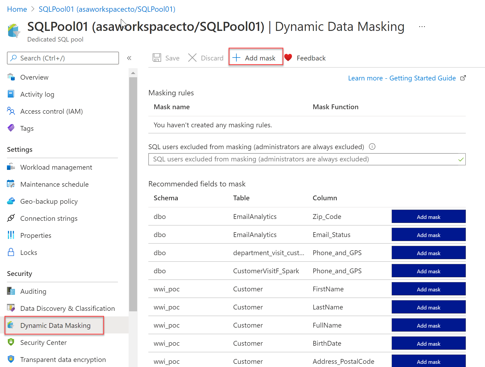

#### Looking into Dynamic Data Masking Policies

- **SQL users excluded from Dynamic Data Masking Policies**

    The following SQL users or Microsoft Entra identities can get unmasked data in the SQL query results.
    Users with administrator privileges are always excluded from masking, and will see the original data without any mask.

- **Masking rules** - Masking rules are a set of rules that define the designated fields to be masked including the masking function that is used. The designated fields can be defined using a database schema name, table name, and column name.

- **Masking functions** - Masking functions are a set of methods that control the exposure of data for different scenarios.

#### Set up Dynamic Data Masking for your database in Azure Synapse Analytics using PowerShell cmdlets

In this part, we're going to look into Dynamic Data Masking for a database in Azure Synapse Analytics using PowerShell cmdlets.

##### Data masking policies

###### `Get-AzSqlDatabaseDataMaskingPolicy`

The `Get-AzSqlDatabaseDataMaskingPolicy` gets the data masking policy for a database.

The syntax for the `Get-AzSqlDatabaseDataMaskingPolicy` in PowerShell is as follows:

```PowerShell
Get-AzSqlDatabaseDataMaskingPolicy [-ServerName] <String> [-DatabaseName] <String>
 [-ResourceGroupName] <String> [-DefaultProfile <IAzureContextContainer>] [-WhatIf] [-Confirm]
 [<CommonParameters>]
```

What the `Get-AzSqlDatabaseDataMaskingPolicy` cmdlet does, is getting the data masking policy of an Azure SQL database.

To use this cmdlet in PowerShell, you'd have to specify the following parameters to identify the database:

- `ResourceGroupName`: name of the resource group you deployed the database in
- `ServerName`: sql server name
- `DatabaseName` : name of the database

This cmdlet is also supported by the SQL Server Stretch Database service on Azure.

###### Set-AzSqlDatabaseDataMaskingPolicy

The `Set-AzSqlDatabaseDataMaskingPolicy` sets data masking for a database.

The syntax for the `Set-AzSqlDatabaseDataMaskingPolicy` in PowerShell is as follows:

```PowerShell
Set-AzSqlDatabaseDataMaskingPolicy [-PassThru] [-PrivilegedUsers <String>] [-DataMaskingState <String>]
 [-ServerName] <String> [-DatabaseName] <String> [-ResourceGroupName] <String>
 [-DefaultProfile <IAzureContextContainer>] [-WhatIf] [-Confirm] [<CommonParameters>]
```

What the `Set-AzSqlDatabaseDataMaskingPolicy` cmdlet does is setting the data masking policy for an Azure SQL database.

To use this cmdlet in PowerShell, you'd have to specify the following parameters to identify the database:

- `ResourceGroupName`: name of the resource group that you deployed the database in
- `ServerName` : sql server name
- `DatabaseName` : name of the database

In addition, you'll need to set the `DataMaskingState` parameter to specify whether data masking operations are enabled or disabled.

If the cmdlet succeeds and the `PassThru` parameter is used, it will return an object describing the current data masking policy in addition to the database identifiers.

Database identifiers can include, `ResourceGroupName`, `ServerName`, and `DatabaseName`.

This cmdlet is also supported by the SQL Server Stretch Database service on Azure.

##### Data masking rules

###### Get-AzSqlDatabaseDataMaskingRule

The `Get-AzSqlDatabaseDataMaskingRule` Gets the data masking rules from a database.

The syntax for the `Get-AzSqlDatabaseDataMaskingRule` in PowerShell is as follows:

```PowerShell
Get-AzSqlDatabaseDataMaskingRule [-SchemaName <String>] [-TableName <String>] [-ColumnName <String>]
 [-ServerName] <String> [-DatabaseName] <String> [-ResourceGroupName] <String>
 [-DefaultProfile <IAzureContextContainer>] [-WhatIf] [-Confirm] [<CommonParameters>]
```

What the `Get-AzSqlDatabaseDataMaskingRule` cmdlet does it getting either a specific data masking rule or all of the data masking rules for an Azure SQL database.

To use this cmdlet in PowerShell, you'd have to specify the following parameters to identify the database:

- `ResourceGroupName`: name of the resource group that you deployed the database in
- `ServerName` : sql server name
- `DatabaseName` : name of the database

You'd also have to specify the `RuleId` parameter to specify which rule this cmdlet returns.

If you don't provide `RuleId`, all the data masking rules for that Azure SQL database are returned.

This cmdlet is also supported by the SQL Server Stretch Database service on Azure.

###### New-AzSqlDatabaseDataMaskingRule

The `New-AzSqlDatabaseDataMaskingRule` creates a data masking rule for a database.

The syntax for the `New-AzSqlDatabaseDataMaskingRule` in PowerShell is as follows:

```PowerShell
New-AzSqlDatabaseDataMaskingRule -MaskingFunction <String> [-PrefixSize <UInt32>] [-ReplacementString <String>]
 [-SuffixSize <UInt32>] [-NumberFrom <Double>] [-NumberTo <Double>] [-PassThru] -SchemaName <String>
 -TableName <String> -ColumnName <String> [-ServerName] <String> [-DatabaseName] <String>
 [-ResourceGroupName] <String> [-DefaultProfile <IAzureContextContainer>] [-WhatIf] [-Confirm]
 [<CommonParameters>]
```

What the `New-AzSqlDatabaseDataMaskingRule` cmdlet does is creating a data masking rule for an Azure SQL database.

To use this cmdlet in PowerShell, you'd have to specify the following parameters to identify the rule:

- `ResourceGroupName`: name of the resource group that you deployed the database in
- `ServerName` : sql server name
- `DatabaseName` : name of the database

Providing the `TableName` and `ColumnName` is necessary in order to specify the target of the rule.

The `MaskingFunction` parameter is necessary to define how the data is masked.

If `MaskingFunction` has a value of Number or Text, you can specify the `NumberFrom` and `NumberTo` parameters, for number masking, or the `PrefixSize`, `ReplacementString`, and `SuffixSize` for text masking.

If the command succeeds and the `PassThru` parameter is used, the cmdlet returns an object describing the data masking rule properties in addition to the rule identifiers.

Rule identifiers can be, for example, `ResourceGroupName`, `ServerName`, `DatabaseName`, and `RuleID`.

This cmdlet is also supported by the SQL Server Stretch Database service on Azure.

###### Remove-AzSqlDatabaseDataMaskingRule

The `Remove-AzSqlDatabaseDataMaskingRule` removes a data masking rule from a database.

The syntax for the `Remove-AzSqlDatabaseDataMaskingRule` in PowerShell is as follows:

```PowerShell
Remove-AzSqlDatabaseDataMaskingRule [-PassThru] [-Force] -SchemaName <String> -TableName <String>
 -ColumnName <String> [-ServerName] <String> [-DatabaseName] <String> [-ResourceGroupName] <String>
 [-DefaultProfile <IAzureContextContainer>] [-WhatIf] [-Confirm] [<CommonParameters>]
```

What the `Remove-AzSqlDatabaseDataMaskingRule` cmdlet does, is it removes a specific data masking rule from an Azure SQL database.

To use this cmdlet in PowerShell, you'd have to specify the following parameters to identify the rule that needs to be removed:

- `ResourceGroupName`: name of the resource group that you deployed the database in
- `ServerName` : sql server name
- `DatabaseName` : name of the database
- `RuleId` : identifier of the rule

This cmdlet is also supported by the SQL Server Stretch Database service on Azure.

###### Set-AzSqlDatabaseDataMaskingRule

The `Set-AzSqlDatabaseDataMaskingRule` Sets the properties of a data masking rule for a database.

The syntax for the `Set-AzSqlDatabaseDataMaskingRule` in PowerShell is as follows:

```PowerShell
Set-AzSqlDatabaseDataMaskingRule [-MaskingFunction <String>] [-PrefixSize <UInt32>]
 [-ReplacementString <String>] [-SuffixSize <UInt32>] [-NumberFrom <Double>] [-NumberTo <Double>] [-PassThru]
 -SchemaName <String> -TableName <String> -ColumnName <String> [-ServerName] <String> [-DatabaseName] <String>
 [-ResourceGroupName] <String> [-DefaultProfile <IAzureContextContainer>] [-WhatIf] [-Confirm]
 [<CommonParameters>]
```

What the `Set-AzSqlDatabaseDataMaskingRule` cmdlet does is setting a data masking rule for an Azure SQL database.

To use this cmdlet in PowerShell, you'd have to specify the following parameters to identify the rule:

- `ResourceGroupName`: name of the resource group that you deployed the database in
- `ServerName` : sql server name
- `DatabaseName` : name of the database
- `RuleId` : identifier of the rule

You can provide any of the parameters of `SchemaName`, `TableName`, and `ColumnName` to re-target the rule.

Specify the `MaskingFunction` parameter to modify how the data is masked.

If you specify a value of Number or Text for `MaskingFunction`, you can specify the `NumberFrom` and `NumberTo` parameters for number masking or the `PrefixSize`, `ReplacementString`, and `SuffixSize` parameters for text masking.

If the command succeeds, and if you specify the `PassThru` parameter, the cmdlet returns an object that describes the data masking rule properties and the rule identifiers.

Rule identifiers can be, `ResourceGroupName`, `ServerName`, `DatabaseName`, and `RuleId`.

This cmdlet is also supported by the SQL Server Stretch Database service on Azure.

#### Set up Dynamic Data Masking for your database in Azure Synapse Analytics using the REST API

For setting up Dynamic Data Masking in Azure Synapse Analytics, you can also make use of the REST API. It will enable you to programmatically manage data masking policy and rules.

The REST API will support the following operations:

##### Data Masking policies

###### `Create` Or `Update` masking policy

The Create Or Update masking policy using the REST API will create or update a database data masking policy.

In HTTP the following request can be made:

```HTTP
GET https://management.azure.com/subscriptions/{subscriptionId}/resourceGroups/{resourceGroupName}/providers/Microsoft.Sql/servers/{serverName}/databases/{databaseName}/dataMaskingPolicies/Default?api-version=2021-06-01
```

> Note: The date of the API will change over time and the version you use will be determined by your needs and the functionality required.

The following parameters need to be passed through:

- `SubscriptionID`: the ID of the subscription
- `ResourceGroupName`: name of the resource group that you deployed the database in
- `ServerName` : sql server name
- `DatabaseName` : name of the database
- `dataMaskingPolicyName`: the name of the data masking policy
- `api version`: version of the api that is used.

###### `Get` masking policy

The Get policy, gets a database data masking policy.

In HTTP the following request can be made:

```HTTP
GET https://management.azure.com/subscriptions/{subscriptionId}/resourceGroups/{resourceGroupName}/providers/Microsoft.Sql/servers/{serverName}/databases/{databaseName}/dataMaskingPolicies/Default?api-version=2021-06-01
```

The following parameters need to be passed through:

- `SubscriptionID`: the ID of the subscription
- `ResourceGroupName`: name of the resource group that you deployed the database in
- `ServerName` : sql server name
- `DatabaseName` : name of the database
- `dataMaskingPolicyName`: the name of the data masking policy
- `api version`: version of the api that is used.

##### Data Masking rules

###### Create Or Update

The Create or Update masking rule creates or updates a database data masking rule.

In HTTP the following request can be made:

```HTTP
PUT https://management.azure.com/subscriptions/{subscriptionId}/resourceGroups/{resourceGroupName}/providers/Microsoft.Sql/servers/{serverName}/databases/{databaseName}/dataMaskingPolicies/Default/rules/{dataMaskingRuleName}?api-version=2021-06-01
```

The following parameters need to be passed through:

- `Subscription`ID: the ID of the subscription
- `ResourceGroupName`: name of the resource group that you deployed the database in
- `ServerName` : sql server name
- `DatabaseName` : name of the database
- `dataMaskingPolicyName`: the name of the data masking policy
- `dataMaskingRuleName`: the name of the rule for data masking
- `api version`: version of the api that is used.

###### List By Database

The List By Database request gets a list of database data masking rules.

In HTTP the following request can be made:

```HTTP
GET https://management.azure.com/subscriptions/{subscriptionId}/resourceGroups/{resourceGroupName}/providers/Microsoft.Sql/servers/{serverName}/databases/{databaseName}/dataMaskingPolicies/Default/rules?api-version=2021-06-01
```

The following parameters need to be passed through:

- SubscriptionID: the ID of the subscription
- ResourceGroupName: name of the resource group that you deployed the database in
- ServerName : sql server name
- DatabaseName : name of the database
- dataMaskingPolicyName: the name of the data masking policy
- api version: version of the api that is used.

### Next unit: Implement encryption in Azure Synapse Analytics

## Unit 8 of 10

### Implement encryption in Azure Synapse Analytics

In this section, we will go through Transparent Data Encryption and TokenLibrary for Apache Spark.

#### What is transparent data encryption

Transparent data encryption (TDE) is an encryption mechanism to help you protect Azure Synapse Analytics. It will protect Azure Synapse Analytics against threats of malicious offline activity. The way TDE will do so is by encrypting data at rest. TDE performs real-time encryption as well as decryption of the database, associated backups, and transaction log files at rest without you having to make changes to the application. In order to use TDE for Azure Synapse Analytics, you will have to manually enable it.

What TDE does is performing I/O encryption and decryption of data at the page level in real time. When a page is read into memory, it is decrypted. It is encrypted before writing it to disk. TDE encrypts the entire database storage using a symmetric key called a Database Encryption Key (DEK). When you start up a database, the encrypted Database Encryption Key is decrypted. The DEK will then be used for decryption and re-encryption of the database files in the SQL Server database engine. The DEK is protected by the Transparent Data Encryption Protector. This protector can be either a service-managed certificated, which is referred to as service-managed transparent data encryption, or an asymmetric key that is stored in Azure Key Vault (customer-managed transparent data encryption).

What is important to understand is that for Azure Synapse Analytics, this TDE protector is set on the server level. There it is inherited by all the databases that are attached or aligned to that server. The term server refers both to server and instance.

#### Service-managed transparent data encryption

As stated above, the DEK that is protected by the Transparent Encryption protector can be service-managed certificates which we call service-managed TDE. When you look in Azure, that default setting means that the DEK is protected by a built-in certificate unique for each server with encryption algorithm AES256. When a database is in a geo-replicated relationship then primary and the geo-secondary database are protected by the primary database's parent server key. If the databases are connected to the same server, they will also have the same built-in AES 256 certificate. As Microsoft we automatically rotate the certificates in compliance with the internal security policy. The root key is protected by a Microsoft internal secret store. Microsoft also seamlessly moves and manages the keys as needed for geo-replication and restores.

#### Transparent data encryption with bring your own key for customer-managed transparent data encryption

As stated above, the DEK that is protected by the Transparent Data Encryption Protector can also be customer managed by bringing an asymmetric key that is stored in Azure Key Vault (customer-managed transparent data encryption). This is also referred to as Bring Your Own Key (BYOK) support for TDE. When this is the scenario that is applicable to you, the TDE Protector that encrypts the DEK is a customer-managed asymmetric key. It is stored in your own and managed Azure Key Vault. Azure Key Vault is Azure's cloud-based external key management system. This managed key never leaves the key vault. The TDE Protector can be generated by the key vault. Another option is to transfer the TDE Protector to the key vault from, for example, an on-premise hardware security module (HSM) device. Azure Synapse Analytics needs to be granted permissions to the customer-owned key vault in order to decrypt and encrypt the DEK. If permissions of the server to the key vault are revoked, a database will be inaccessible, and all data is encrypted.

By using Azure Key Vault integration for TDE, you have control over the key management tasks such as key rotations, key backups, and key permissions. It also enables you to audit and report on all the TDE protectors when using the Azure Key Vault functionality. The reason for using Key Vault is that it provides you with a central key management system where tightly monitored HSMs are leveraged. It also enables you to separate duties of management of keys and data in order to meet compliance with security policies.

#### Manage transparent data encryption in the Azure portal

For Azure Synapse Analytics, you can manage TDE for the database in the Azure portal after you've signed in with the Azure Administrator or Contributor account.
The TDE settings can be found under your user database.

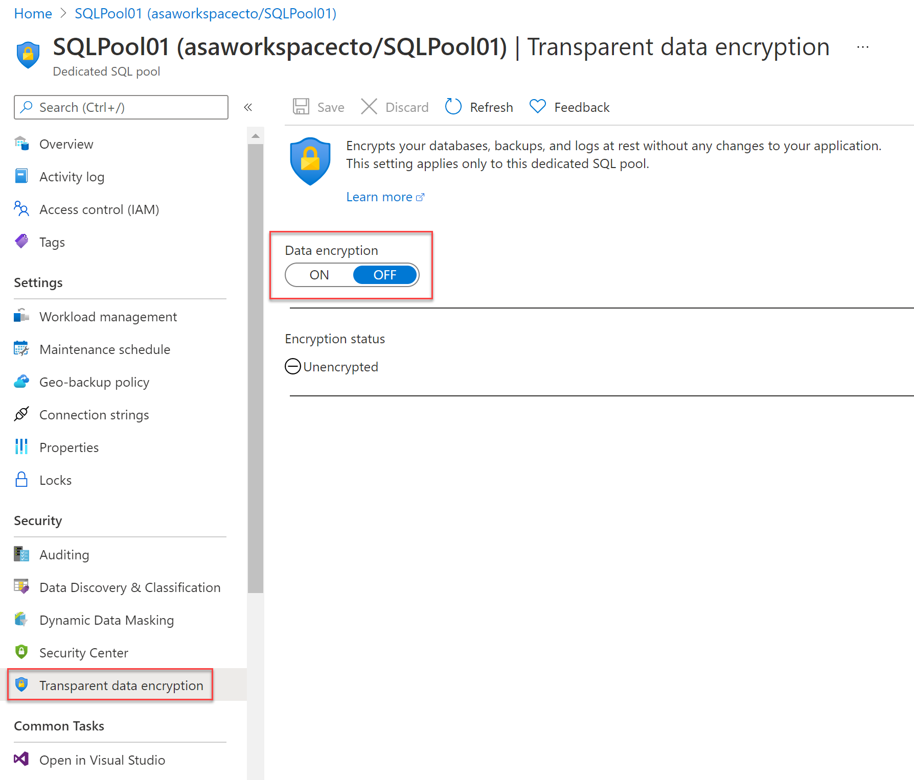

It is by default that the service-managed TDE is used and therefore a TDE certificate is automatically generated for the server that contains that database.

#### Moving a transparent data encryption protected database

In some use cases you need to move a database that is protected with TDE. Within Azure, there is no need to decrypt the databases. The TDE settings on the source database or primary database, will be inherited on the target. Some of the operations within Azure that inherited the TDE are:

- Geo-restore
- Self-service point-in-time restore
- Restoration of a deleted database
- Active geo-replication
- Creation of a database copy
- Restore of backup file to Azure SQL Managed Instance

If you export a TDE-protected database, the exported content is not encrypted. This will be stored in an unencrypted BACPAC file. You need to make sure that you protect this BACPAC file and enable TDE as soon as the import of the bacpac file in the new database is finished.

#### Securing your credentials through linked services with TokenLibrary for Apache Spark

It is quite a common pattern to access data from external sources.
Unless the external data source allows anonymous access, it is highly likely that you need to secure your connection with a credential, secret, or connection string.

Within Azure Synapse Analytics, the integration process is simplified by providing linked services. Doing so, the connection details can be stored in the linked service or an Azure Key Vault. If the Linked Service is created, Apache spark can reference the linked service to apply the connection information in your code. When you want to access files from the Azure Data Lake Storage Gen 2 within your Azure Synapse Analytics Workspace, it uses AAD passthrough for the authentication. Therefore, there is no need to use TokenLibrary. However, to connect to other linked services, you are enabled to make a direct call to the TokenLibrary.

An example can be found below: In order to connect to other linked services, you are enabled to make a direct call to TokenLibrary by retrieving the connection string. In order to retrieve the connection string, use the **getConnectionString** function and pass in the **linked service name**.

```scala
// Scala
// retrieve connectionstring from TokenLibrary

import com.microsoft.azure.synapse.tokenlibrary.TokenLibrary

val connectionString: String = TokenLibrary.getConnectionString("<LINKED SERVICE NAME>")
println(connectionString)
```

```python
# Python
# retrieve connectionstring from TokenLibrary

from pyspark.sql import SparkSession

sc = SparkSession.builder.getOrCreate()
token_library = sc._jvm.com.microsoft.azure.synapse.tokenlibrary.TokenLibrary
connection_string = token_library.getConnectionString("<LINKED SERVICE NAME>")
print(connection_string)
```

If you want to Get the connection string as map and parse specific values from a key in the connection string, you can find an example below:

To parse specific values from a *key=value* pair in the connection string such as

`DefaultEndpointsProtocol=https;AccountName=<AccountName>;AccountKey=<AccountKey>`

use the **getConnectionStringAsMap** function and pass the key to return the value.

```scala
// Linked services can be used for storing and retreiving credentials (e.g, account key)
// Example connection string (for storage): "DefaultEndpointsProtocol=https;AccountName=<accountname>;AccountKey=<accountkey>"
import com.microsoft.azure.synapse.tokenlibrary.TokenLibrary

val accountKey: String = TokenLibrary.getConnectionStringAsMap("<LINKED SERVICE NAME">).get("<KEY NAME>")
println(accountKey)
```

```python
# Linked services can be used for storing and retrieving credentials (e.g, account key)
# Example connection string (for storage): "DefaultEndpointsProtocol=https;AccountName=<accountname>;AccountKey=<accountkey>"
from pyspark.sql import SparkSession

sc = SparkSession.builder.getOrCreate()
token_library = sc._jvm.com.microsoft.azure.synapse.tokenlibrary.TokenLibrary
accountKey = token_library.getConnectionStringAsMap("<LINKED SERVICE NAME>").get("<KEY NAME>")
print(accountKey)
```

### Next unit: Knowledge check

## Unit 9 of 10

### Knowledge check

1. You want to configure a private endpoint. You open up Azure Synapse Studio, go to the manage hub, and see that the private endpoints are greyed out. Why is the option not available?

    - ☑ Azure Synapse Studio doesn't support the creation of private endpoints.
    - ☐ A Conditional Access policy has to be defined first.
    - ☐ A managed virtual network hasn't been created.

2. You require an Azure Synapse Analytics Workspace to access an Azure Data Lake Store using the benefits of the security provided by Microsoft Entra ID. What is the best authentication method to use?

    - ☑ Storage account keys.
    - ☐ Shared access signatures.
    - ☐ Managed identities.

### Next unit: Summary

## Unit 10 of 10
