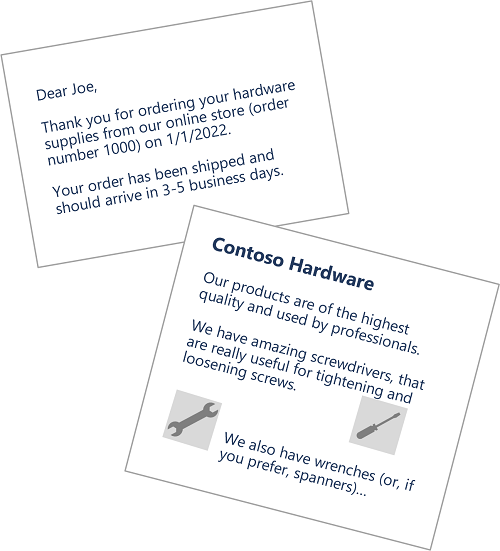
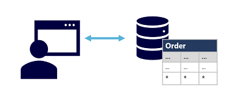

# M01.01 Explore core data concepts

## Unit 1 of 8

### Introduction

Over the last few decades, the amount of data generated by systems, applications, and devices has increased significantly. Data is everywhere, in a multitude of structures and formats.

Data is now easier to collect and cheaper to store, making it accessible to nearly every business. Data solutions include software technologies and platforms that can help facilitate the collection, analysis, and storage of valuable information. Every business would like to grow their revenues and make larger profits. In this competitive market, data is a valuable asset. When analyzed properly, data provides a wealth of useful information and informs critical business decisions.

The capability to capture, store, and analyze data is a core requirement for every organization in the world. In this module, you'll learn about options for representing and storing data, and about typical data workloads. By completing this module, you'll build the foundation for learning about the techniques and services used to work with data.

### Learning Objectives

In this module you will learn how to:

- Identify common data formats
- Describe options for storing data in files
- Describe options for storing data in databases
- Describe characteristics of transactional data processing solutions
- Describe characteristics of analytical data processing solutions

### Next unit: Identify data formats

## Unit 2 of 8

### Identify data formats

Data is a collection of facts such as numbers, descriptions, and observations used to record information. Data structures in which this data is organized often represents entities that are important to an organization (such as customers, products, sales orders, and so on). Each entity typically has one or more attributes, or characteristics (for example, a customer might have a name, an address, a phone number, and so on).

You can classify data as *structured*, *semi-structured*, or *unstructured*.

### Structured data

Structured data is data that adheres to a fixed schema, so all of the data has the same fields or properties. Most commonly, the schema for structured data entities is tabular - in other words, the data is represented in one or more tables that consist of rows to represent each instance of a data entity, and columns to represent attributes of the entity. For example, the following image shows tabular data representations for Customer and Product entities.


Structured data is often stored in a database in which multiple tables can reference one another by using key values in a *relational* model; which we'll explore in more depth later.

### Semi-structured data

*Semi-structured* data is information that has some structure, but which allows for some variation between entity instances. For example, while most customers may have an email address, some might have multiple email addresses, and some might have none at all.

One common format for semi-structured data is *JavaScript Object Notation* (JSON). The example below shows a pair of JSON documents that represent customer information. Each customer document includes address and contact information, but the specific fields vary between customers.

``` JSON
// Customer 1
{
  "firstName": "Joe",
  "lastName": "Jones",
  "address":
  {
    "streetAddress": "1 Main St.",
    "city": "New York",
    "state": "NY",
    "postalCode": "10099"
  },
  "contact":
  [
    {
      "type": "home",
      "number": "555 123-1234"
    },
    {
      "type": "email",
      "address": "joe@litware.com"
    }
  ]
}

// Customer 2
{
  "firstName": "Samir",
  "lastName": "Nadoy",
  "address":
  {
    "streetAddress": "123 Elm Pl.",
    "unit": "500",
    "city": "Seattle",
    "state": "WA",
    "postalCode": "98999"
  },
  "contact":
  [
    {
      "type": "email",
      "address": "samir@northwind.com"
    }
  ]
}
```

> Note: JSON is just one of many ways in which semi-structured data can be represented. The point here is not to provide a detailed examination of JSON syntax, but rather to illustrate the flexible nature of semi-structured data representations.

### Unstructured data

Not all data is structured or even semi-structured. For example, documents, images, audio and video data, and binary files might not have a specific structure. This kind of data is referred to as *unstructured* data.



### Data stores

Organizations typically store data in structured, semi-structured, or unstructured format to record details of entities (for example, customers and products), specific events (such as sales transactions), or other information in documents, images, and other formats. The stored data can then be retrieved for analysis and reporting later.

There are two broad categories of data store in common use:

- File stores
- Databases

We'll explore both of these types of data store in subsequent topics.

### Next unit: Explore file storage

## Unit 3 of 8

### Explore file storage

The ability to store data in files is a core element of any computing system. Files can be stored in local file systems on the hard disk of your personal computer, and on removable media such as USB drives; but in most organizations, important data files are stored centrally in some kind of shared file storage system. Increasingly, that central storage location is hosted in the cloud, enabling cost-effective, secure, and reliable storage for large volumes of data.

The specific file format used to store data depends on a number of factors, including:

- The type of data being stored (structured, semi-structured, or unstructured).
- The applications and services that will need to read, write, and process the data.
- The need for the data files to be readable by humans, or optimized for efficient storage and processing.

Some common file formats are discussed below.

#### Delimited text files

Data is often stored in plain text format with specific field delimiters and row terminators. The most common format for delimited data is comma-separated values (CSV) in which fields are separated by commas, and rows are terminated by a carriage return / new line. Optionally, the first line may include the field names. Other common formats include tab-separated values (TSV) and space-delimited (in which tabs or spaces are used to separate fields), and fixed-width data in which each field is allocated a fixed number of characters. Delimited text is a good choice for structured data that needs to be accessed by a wide range of applications and services in a human-readable format.

The following example shows customer data in comma-delimited format:

``` CSV
FirstName,LastName,Email
Joe,Jones,joe@litware.com
Samir,Nadoy,samir@northwind.com
```

#### JavaScript Object Notation (JSON)

JSON is a ubiquitous format in which a hierarchical document schema is used to define data entities (objects) that have multiple attributes. Each attribute might be an object (or a collection of objects); making JSON a flexible format that's good for both structured and semi-structured data.

The following example shows a JSON document containing a collection of customers. Each customer has three attributes (*firstName*, *lastName*, and *contact*), and the *contact* attribute contains a collection of objects that represent one or more contact methods (email or phone). Note that objects are enclosed in braces ({..}) and collections are enclosed in square brackets ([..]). Attributes are represented by name : value pairs and separated by commas (,).

``` JSON
{
  "customers":
  [
    {
      "firstName": "Joe",
      "lastName": "Jones",
      "contact":
      [
        {
          "type": "home",
          "number": "555 123-1234"
        },
        {
          "type": "email",
          "address": "joe@litware.com"
        }
      ]
    },
    {
      "firstName": "Samir",
      "lastName": "Nadoy",
      "contact":
      [
        {
          "type": "email",
          "address": "samir@northwind.com"
        }
      ]
    }
  ]
}
```

#### Extensible Markup Language (XML)

XML is a human-readable data format that was popular in the 1990s and 2000s. It's largely been superseded by the less verbose JSON format, but there are still some systems that use XML to represent data. XML uses *tags* enclosed in angle-brackets (<../>) to define *elements* and *attributes*, as shown in this example:

``` XML
<Customers>
  <Customer name="Joe" lastName="Jones">
    <ContactDetails>
      <Contact type="home" number="555 123-1234"/>
      <Contact type="email" address="joe@litware.com"/>
    </ContactDetails>
  </Customer>
  <Customer name="Samir" lastName="Nadoy">
    <ContactDetails>
      <Contact type="email" address="samir@northwind.com"/>
    </ContactDetails>
  </Customer>
</Customers>
```

#### Binary Large Object (BLOB)

Ultimately, all files are stored as binary data (1's and 0's), but in the human-readable formats discussed above, the bytes of binary data are mapped to printable characters (typically through a character encoding scheme such as ASCII or Unicode). Some file formats however, particularly for unstructured data, store the data as raw binary that must be interpreted by applications and rendered. Common types of data stored as binary include images, video, audio, and application-specific documents.

When working with data like this, data professionals often refer to the data files as *BLOBs* (Binary Large Objects).

#### Optimized file formats

While human-readable formats for structured and semi-structured data can be useful, they're typically not optimized for storage space or processing. Over time, some specialized file formats that enable compression, indexing, and efficient storage and processing have been developed.

Some common optimized file formats you might see include *Avro*, *ORC*, and *Parquet*:

- **Avro** is a row-based format. It was created by Apache. Each record contains a header that describes the structure of the data in the record. This header is stored as JSON. The data is stored as binary information. An application uses the information in the header to parse the binary data and extract the fields it contains. Avro is a good format for compressing data and minimizing storage and network bandwidth requirements.
- **ORC** (Optimized Row Columnar format) organizes data into columns rather than rows. It was developed by HortonWorks for optimizing read and write operations in Apache Hive (Hive is a data warehouse system that supports fast data summarization and querying over large datasets). An ORC file contains stripes of data. Each stripe holds the data for a column or set of columns. A stripe contains an index into the rows in the stripe, the data for each row, and a footer that holds statistical information (count, sum, max, min, and so on) for each column.
- **Parquet** is another columnar data format. It was created by Cloudera and Twitter. A Parquet file contains row groups. Data for each column is stored together in the same row group. Each row group contains one or more chunks of data. A Parquet file includes metadata that describes the set of rows found in each chunk. An application can use this metadata to quickly locate the correct chunk for a given set of rows, and retrieve the data in the specified columns for these rows. Parquet specializes in storing and processing nested data types efficiently. It supports very efficient compression and encoding schemes.

### Next unit: Explore databases

## Unit 4 of 8

### Explore databases

A database is used to define a central system in which data can be stored and queried. In a simplistic sense, the file system on which files are stored is a kind of database; but when we use the term in a professional data context, we usually mean a dedicated system for managing data records rather than files.

#### Relational databases

Relational databases are commonly used to store and query structured data. The data is stored in tables that represent entities, such as customers, products, or sales orders. Each instance of an entity is assigned a *primary* key that uniquely identifies it; and these keys are used to reference the entity instance in other tables. For example, a customer's primary key can be referenced in a sales order record to indicate which customer placed the order. This use of keys to reference data entities enables a relational database to be *normalized*; which in part means the elimination of duplicate data values so that, for example, the details of an individual customer are stored only once; not for each sales order the customer places. The tables are managed and queried using Structured Query Language (SQL), which is based on an ANSI standard, so it's similar across multiple database systems.


#### Non-relational databases

Non-relational databases are data management systems that don’t apply a relational schema to the data. Non-relational databases are often referred to as NoSQL database, even though some support a variant of the SQL language.

There are four common types of Non-relational database commonly in use.

- **Key-value databases** in which each record consists of a unique key and an associated value, which can be in any format.

  

- **Document databases**, which are a specific form of key-value database in which the value is a JSON document (which the system is optimized to parse and query)

  

- **Column family databases**, which store tabular data comprising rows and columns, but you can divide the columns into groups known as column-families. Each column family holds a set of columns that are logically related together.

  

- **Graph databases**, which store entities as nodes with links to define relationships between them.

  

### Next unit: Explore transactional data processing

## Unit 5 of 8

### Explore transactional data processing

A transactional data processing system is what most people consider the primary function of business computing. A transactional system records transactions that encapsulate specific events that the organization wants to track. A transaction could be financial, such as the movement of money between accounts in a banking system, or it might be part of a retail system, tracking payments for goods and services from customers. Think of a transaction as a small, discrete, unit of work.

Transactional systems are often high-volume, sometimes handling many millions of transactions in a single day. The data being processed has to be accessible very quickly. The work performed by transactional systems is often referred to as Online Transactional Processing (OLTP).



OLTP solutions rely on a database system in which data storage is optimized for both read and write operations in order to support transactional workloads in which data records are created, retrieved, updated, and deleted (often referred to as CRUD operations). These operations are applied transactionally, in a way that ensures the integrity of the data stored in the database. To accomplish this, OLTP systems enforce transactions that support so-called ACID semantics:

- **Atomicity** – each transaction is treated as a single unit, which succeeds completely or fails completely. For example, a transaction that involved debiting funds from one account and crediting the same amount to another account must complete both actions. If either action can't be completed, then the other action must fail.
- **Consistency** – transactions can only take the data in the database from one valid state to another. To continue the debit and credit example above, the completed state of the transaction must reflect the transfer of funds from one account to the other.
- **Isolation** – concurrent transactions cannot interfere with one another, and must result in a consistent database state. For example, while the transaction to transfer funds from one account to another is in-process, another transaction that checks the balance of these accounts must return consistent results - the balance-checking transaction can't retrieve a value for one account that reflects the balance before the transfer, and a value for the other account that reflects the balance after the transfer.
- **Durability** – when a transaction has been committed, it will remain committed. After the account transfer transaction has completed, the revised account balances are persisted so that even if the database system were to be switched off, the committed transaction would be reflected when it is switched on again.

OLTP systems are typically used to support live applications that process business data - often referred to as *line of business* (LOB) applications.

### Next unit: Explore analytical data processing

## Unit 6 of 8

### Explore analytical data processing

Analytical data processing typically uses read-only (or read-mostly) systems that store vast volumes of historical data or business metrics. Analytics can be based on a snapshot of the data at a given point in time, or a series of snapshots.

The specific details for an analytical processing system can vary between solutions, but a common architecture for enterprise-scale analytics looks like this:


1. Operational data is extracted, transformed, and loaded (ETL) into a data lake for analysis.
2. Data is loaded into a schema of tables - typically in a Spark-based *data lakehouse* with tabular abstractions over files in the data lake, or a *data warehouse* with a fully relational SQL engine.
3. Data in the data warehouse may be aggregated and loaded into an online analytical processing (OLAP) model, or *cube*. Aggregated numeric values (*measures*) from fact tables are calculated for intersections of *dimensions* from dimension tables. For example, sales revenue might be totaled by date, customer, and product.
4. The data in the data lake, data warehouse, and analytical model can be queried to produce reports, visualizations, and dashboards.

*Data lakes* are common in large-scale data analytical processing scenarios, where a large volume of file-based data must be collected and analyzed.

*Data warehouses* are an established way to store data in a relational schema that is optimized for read operations – primarily queries to support reporting and data visualization. *Data Lakehouses* are a more recent innovation that combine the flexible and scalable storage of a data lake with the relational querying semantics of a data warehouse. The table schema may require some denormalization of data in an OLTP data source (introducing some duplication to make queries perform faster).

An OLAP model is an aggregated type of data storage that is optimized for analytical workloads. Data aggregations are across dimensions at different levels, enabling you to *drill up/down* to view aggregations at multiple hierarchical levels; for example to find total sales by region, by city, or for an individual address. Because OLAP data is pre-aggregated, queries to return the summaries it contains can be run quickly.

Different types of user might perform data analytical work at different stages of the overall architecture. For example:

- Data scientists might work directly with data files in a data lake to explore and model data.
- Data Analysts might query tables directly in the data warehouse to produce complex reports and visualizations.
- Business users might consume pre-aggregated data in an analytical model in the form of reports or dashboards.

### Next unit: Knowledge check

## Unit 7 of 8

### Knowledge check

Choose the best response for each of the questions below. Then select Check your answers.

### Check your knowledge

1. How is data in a relational table organized?
    - ☑ Rows and Columns
    > That's correct. Structured data is typically tabular data that is represented by rows and columns in a database table.
    - ☐ Header and Footer
    - ☐ Pages and Paragraphs

2. Which of the following is an example of unstructured data?
    - ☐ An Employee table with columns EmployeeID, EmployeeName, and EmployeeDesignation
    - ☑ Audio and Video files
    > That's correct. Audio and video files are unstructured data.
    - ☐ A table within a relational database

3. What is a data warehouse?
    - ☐ A nonrelational database optimized for read and write operations
    - ☑ A relational database optimized for read operations
    > That's correct. A data warehouse is a relational database in which the schema is optimized for queries that read data.
    - ☐ A storage location for unstructured data files

### Next unit: Summary

## Unit 8 of 8

### Summary

Data is at the core of most software applications and solutions. It can be represented in many formats, stored in files and databases, and used to record transactions or to support analysis and reporting.

In this module you've learned how to:

- Identify common data formats
- Describe options for storing data in files
- Describe options for storing data in databases
- Describe characteristics of transactional data processing solutions
- Describe characteristics of analytical data processing solutions

### Next steps

Now that you've learned about some core data concepts, consider learning more about data-related workloads on Microsoft Azure by pursuing a Microsoft certification in [Azure Data Fundamentals](https://learn.microsoft.com/en-us/certifications/azure-data-fundamentals/).

### All units complete
