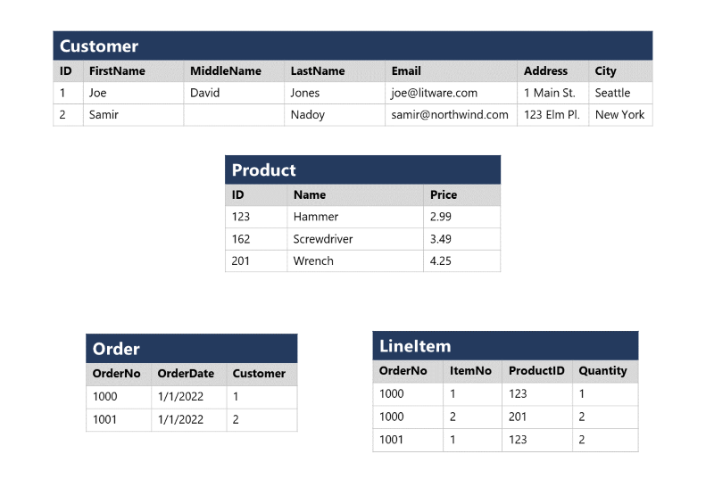

# M02.01 Explore fundamental relational data concepts

## Unit 1 of 7

### Introduction

In the early years of computing systems, every application stored data in its own unique structure. When developers wanted to build applications to use that data, they had to know a lot about the particular data structure to find the data they needed. These data structures were inefficient, hard to maintain, and hard to optimize for good application performance. The *relational* database model was designed to solve the problem of multiple arbitrary data structures. The relational model provides a standard way of representing and querying data that can be used by any application. One of the key advantages of the relational database model is its use of *tables*, which are an intuitive, efficient, and flexible way to store and access structured information.

The simple yet powerful relational model is used by organizations of all types and sizes for a broad variety of information management needs. Relational databases are used to track inventories, process e-commerce transactions, manage huge amounts of mission-critical customer information, and much more. A relational database is useful for storing any information containing related data elements that must be organized in a rules-based, consistent structure.

In this module, you'll learn about the key characteristics of relational databases, and explore relational data structures.

### Learning objectives

In this module you will learn how to:

- Identify characteristics of relational data
- Define normalization
- Identify types of SQL statement
- Identify common relational database objects

### Next unit: Understand relational data

## Unit 2 of 7

### Understand relational data

In a relational database, you model collections of entities from the real world as *tables*. An entity can be anything for which you want to record information; typically important objects and events. For example, in a retail system example, you might create tables for customers, products, orders, and line items within an order. A table contains rows, and each row represents a single instance of an entity. In the retail scenario, each row in the customer table contains the data for a single customer, each row in the product table defines a single product, each row in the order table represents an order made by a customer, and each row in the line item table represents a product that was included in an order.



Relational tables are a format for structured data, and each row in a table has the same columns; though in some cases, not all columns need to have a value – for example, a customer table might include a **MiddleName** column; which can be empty (or *NULL*) for rows that represent customers with no middle name or whose middle name is unknown.

Each column stores data of a specific datatype. For example, an **Email** column in a **Customer** table would likely be defined to store character-based (text) data (which might be fixed or variable in length), a **Price** column in a **Product** table might be defined to store decimal numeric data, while a **Quantity** column in an **Order** table might be constrained to integer numeric values; and an **OrderDate** column in the same **Order** table would be defined to store date/time values. The available data types that you can use when defining a table depend on the database system you are using; though there are standard data types defined by the American National Standards Institute (ANSI) that are supported by most database systems.

### Next unit: Understand normalization

## Unit 3 of 7

### Understand normalization

Normalization is a term used by database professionals for a schema design process that minimizes data duplication and enforces data integrity.

While there are many complex rules that define the process of refactoring data into various levels (or *forms*) of normalization, a simple definition for practical purposes is:

1. Separate each *entity* into its own table.
2. Separate each discrete *attribute* into its own column.
3. Uniquely identify each entity instance (row) using a  *primary key*.
4. Use *foreign key* columns to link related entities.

To understand the core principles of normalization, suppose the following table represents a spreadsheet that a company uses to track its sales.


Notice that the customer and product details are duplicated for each individual item sold; and that the customer name and postal address, and the product name and price are combined in the same spreadsheet cells.

Now let's look at how normalization changes the way the data is stored.


Each entity that is represented in the data (customer, product, sales order, and line item) is stored in its own table, and each discrete attribute of those entities is in its own column.

Recording each instance of an entity as a row in an entity-specific table removes duplication of data. For example, to change a customer's address, you need only modify the value in a single row.

The decomposition of attributes into individual columns ensures that each value is constrained to an appropriate data type - for example, product prices must be decimal values, while line item quantities must be integer numbers. Additionally, the creation of individual columns provides a useful level of granularity in the data for querying - for example, you can easily filter customers to those who live in a specific city.

Instances of each entity are uniquely identified by an ID or other key value, known as a *primary key*; and when one entity references another (for example, an order has an associated customer), the primary key of the related entity is stored as a *foreign key*. You can look up the address of the customer (which is stored only once) for each record in the **Order** table by referencing the corresponding record in the **Customer** table. Typically, a relational database management system (RDBMS) can enforce referential integrity to ensure that a value entered into a foreign key field has an existing corresponding primary key in the related table – for example, preventing orders for non-existent customers.

In some cases, a key (primary or foreign) can be defined as a *composite* key based on a unique combination of multiple columns. For example, the **LineItem** table in the example above uses a unique combination of **OrderNo** and **ItemNo** to identify a line item from an individual order.

### Next unit: Explore SQL

## Unit 4 of 7

### Explore SQL

SQL stands for *Structured Query Language*, and is used to communicate with a relational database. It's the standard language for relational database management systems. SQL statements are used to perform tasks such as update data in a database, or retrieve data from a database. Some common relational database management systems that use SQL include Microsoft SQL Server, MySQL, PostgreSQL, MariaDB, and Oracle.

> **Note:** SQL was originally standardized by the American National Standards Institute (ANSI) in 1986, and by the International Organization for Standardization (ISO) in 1987. Since then, the standard has been extended several times as relational database vendors have added new features to their systems. Additionally, most database vendors include their own proprietary extensions that are not part of the standard, which has resulted in a variety of dialects of SQL.

You can use SQL statements such as **SELECT**, **INSERT**, **UPDATE**, **DELETE**, **CREATE**, and **DROP** to accomplish almost everything that you need to do with a database. Although these SQL statements are part of the SQL standard, many database management systems also have their own additional proprietary extensions to handle the specifics of that database management system. These extensions provide functionality not covered by the SQL standard, and include areas such as security management and programmability. For example, Microsoft SQL Server, and Azure database services that are based on the SQL Server database engine, use Transact-SQL. This implementation includes proprietary extensions for writing stored procedures and triggers (application code that can be stored in the database), and managing user accounts. PostgreSQL and MySQL also have their own versions of these features.

Some popular dialects of SQL include:

- *Transact-SQL (T-SQL)*. This version of SQL is used by Microsoft SQL Server and Azure SQL services.
- *pgSQL*. This is the dialect, with extensions implemented in PostgreSQL.
- *PL/SQL*. This is the dialect used by Oracle. PL/SQL stands for Procedural Language/SQL.

Users who plan to work specifically with a single database system should learn the intricacies of their preferred SQL dialect and platform.

> **Note:** The SQL code examples in this module are based on the Transact-SQL dialect, unless otherwise indicated. The syntax for other dialects is generally similar, but may vary in some details.

#### SQL statement types

SQL statements are grouped into three main logical groups:

- Data Definition Language (DDL)
- Data Control Language (DCL)
- Data Manipulation Language (DML)

##### DDL statements

You use DDL statements to create, modify, and remove tables and other objects in a database (table, stored procedures, views, and so on).

The most common DDL statements are:

| Statement | Description |
|:- | :- |
| CREATE | Create a new object in the database, such as a table or a view. |
| ALTER | Modify the structure of an object. For instance, altering a table to add a new column. |
| DROP | Remove an object from the database. |
| RENAME | Rename an existing object. |

> **Warning:** The **DROP** statement is very powerful. When you drop a table, all the rows in that table are lost. Unless you have a backup, you won't be able to retrieve this data.

The following example creates a new database table. The items between the parentheses specify the details of each column, including the name, the data type, whether the column must always contain a value (NOT NULL), and whether the data in the column is used to uniquely identify a row (PRIMARY KEY). Each table should have a primary key, although SQL doesn't enforce this rule.

> **Note:** Columns marked as **NOT NULL** are referred to as *mandatory* columns. If you omit the *NOT NULL* clause, you can create rows that don't contain a value in the column. An empty column in a row is said to have a *NULL* value.

```SQL
CREATE TABLE Product
(
    ID INT PRIMARY KEY,
    Name VARCHAR(20) NOT NULL,
    Price DECIMAL NULL
);
```

The datatypes available for columns in a table will vary between database management systems. However, most database management systems support numeric types such as INT (an integer, or whole number), DECIMAL (a decimal number), and string types such as VARCHAR (*VARCHAR* stands for variable length character data). For more information, see the documentation for your selected database management system.

##### DCL statements

Database administrators generally use DCL statements to manage access to objects in a database by granting, denying, or revoking permissions to specific users or groups.

The three main DCL statements are:

| Statement | Description |
|:- | :- |
| GRANT | Grant permission to perform specific actions |
| DENY | Deny permission to perform specific actions |
| REVOKE | Remove a previously granted permission |

For example, the following **GRANT** statement permits a user named *user1* to read, insert, and modify data in the **Product** table.

```SQL
GRANT SELECT, INSERT, UPDATE
ON Product
TO user1;
```

##### DML statements

You use DML statements to manipulate the rows in tables. These statements enable you to retrieve (query) data, insert new rows, or modify existing rows. You can also delete rows if you don't need them anymore.

The four main DML statements are:

| Statement | Description |
|:- | :- |
| SELECT | Read rows from a table |
| INSERT | Insert new rows into a table |
| UPDATE | Modify data in existing rows |
| DELETE | Delete existing rows |

The basic form of an **INSERT** statement will insert one row at a time. By default, the **SELECT**, **UPDATE**, and **DELETE** statements are applied to every row in a table. You usually apply a **WHERE** clause with these statements to specify criteria; only rows that match these criteria will be selected, updated, or deleted.

> **Warning:** SQL doesn't provide are you sure? prompts, so be careful when using DELETE or UPDATE without a WHERE clause because you can lose or modify a lot of data.

The following code is an example of a SQL statement that selects all columns (indicated by *) from the **Customer** table where the **City** column value is "Seattle":

```SQL
SELECT *
FROM Customer
WHERE City = 'Seattle';
```

To retrieve only a specific subset of columns from the table, you list them in the **SELECT** clause, like this:

```SQL
SELECT FirstName, LastName, Address, City
FROM Customer
WHERE City = 'Seattle';
```

If a query returns many rows, they don't necessarily appear in any specific sequence. If you want to sort the data, you can add an **ORDER BY** clause. The data will be sorted by the specified column:

```SQL
SELECT FirstName, LastName, Address, City
FROM Customer
WHERE City = 'Seattle'
ORDER BY LastName;
```

You can also run SELECT statements that retrieve data from multiple tables using a **JOIN** clause. Joins indicate how the rows in one table are connected with rows in the other to determine what data to return. A typical join condition matches a foreign key from one table and its associated primary key in the other table.

The following query shows an example that joins **Customer** and **Order** tables. The query makes use of table *aliases* to abbreviate the table names when specifying which columns to retrieve in the **SELECT** clause and which columns to match in the **JOIN** clause.

```SQL
SELECT o.OrderNo, o.OrderDate, c.Address, c.City
FROM Order AS o
JOIN Customer AS c
ON o.Customer = c.ID
```

The next example shows how to modify an existing row using SQL. It changes the value of the **Address** column in the **Customer** table for rows that have the value 1 in the **ID** column. All other rows are left unchanged:

```SQL
UPDATE Customer
SET Address = '123 High St.'
WHERE ID = 1;
```

> **Warning:** If you omit the **WHERE** clause, an **UPDATE** statement will modify **every** row in the table.

Use the **DELETE** statement to remove rows. You specify the table to delete from, and a **WHERE** clause that identifies the rows to be deleted:

```SQL
DELETE FROM Product
WHERE ID = 162;
```

> **Warning:** If you omit the **WHERE** clause, a **DELETE** statement will remove **every** row from the table.

The **INSERT** statement takes a slightly different form. You specify a table and columns in an **INTO** clause, and a list of values to be stored in these columns. Standard SQL only supports inserting one row at a time, as shown in the following example. Some dialects allow you to specify multiple **VALUES** clauses to add several rows at a time:

```SQL
INSERT INTO Product(ID, Name, Price)
VALUES (99, 'Drill', 4.99);
```

> **Note:** This topic describes some basic SQL statements and syntax in order to help you understand how SQL is used to work with objects in a database. If you want to learn more about querying data with SQL, review the [Get Started Querying with Transact-SQL](https://learn.microsoft.com/en-us/training/paths/get-started-querying-with-transact-sql) learning path on Microsoft Learn.

### Next unit: Describe database objects

## Unit 5 of 7

### Describe database objects

In addition to tables, a relational database can contain other structures that help to optimize data organization, encapsulate programmatic actions, and improve the speed of access. In this unit, you'll learn about three of these structures in more detail: views, stored procedures, and indexes.

#### What is a view?

A view is a virtual table based on the results of a **SELECT** query. You can think of a view as a window on specified rows in one or more underlying tables. For example, you could create a view on the **Order** and **Customer** tables that retrieves order and customer data to provide a single object that makes it easy to determine delivery addresses for orders:

```SQL
CREATE VIEW Deliveries
AS
SELECT o.OrderNo, o.OrderDate,
       c.FirstName, c.LastName, c.Address, c.City
FROM Order AS o JOIN Customer AS c
ON o.Customer = c.ID;
```

You can query the view and filter the data in much the same way as a table. The following query finds details of orders for customers who live in Seattle:

```SQL
SELECT OrderNo, OrderDate, LastName, Address
FROM Deliveries
WHERE City = 'Seattle';
```

#### What is a stored procedure?

A stored procedure defines SQL statements that can be run on command. Stored procedures are used to encapsulate programmatic logic in a database for actions that applications need to perform when working with data.

You can define a stored procedure with parameters to create a flexible solution for common actions that might need to be applied to data based on a specific key or criteria. For example, the following stored procedure could be defined to change the name of a product based on the specified product ID.

```SQL
CREATE PROCEDURE RenameProduct
    @ProductID INT,
    @NewName VARCHAR(20)
AS
UPDATE Product
SET Name = @NewName
WHERE ID = @ProductID;
```

When a product must be renamed, you can execute the stored procedure, passing the ID of the product and the new name to be assigned:

```SQL
EXEC RenameProduct 201, 'Spanner';
```

#### What is an index?

An index helps you search for data in a table. Think of an index over a table like an index at the back of a book. A book index contains a sorted set of references, with the pages on which each reference occurs. When you want to find a reference to an item in the book, you look it up through the index. You can use the page numbers in the index to go directly to the correct pages in the book. Without an index, you might have to read through the entire book to find the references you're looking for.

When you create an index in a database, you specify a column from the table, and the index contains a copy of this data in a sorted order, with pointers to the corresponding rows in the table. When the user runs a query that specifies this column in the **WHERE** clause, the database management system can use this index to fetch the data more quickly than if it had to scan through the entire table row by row.

For example, you could use the following code to create an index on the **Name** column of the **Product** table:

```SQL
CREATE INDEX idx_ProductName
ON Product(Name);
```

The index creates a tree-based structure that the database system's query optimizer can use to quickly find rows in the **Product** table based on a specified **Name**.


For a table containing few rows, using the index is probably not any more efficient than simply reading the entire table and finding the rows requested by the query (in which case the query optimizer will ignore the index). However, when a table has many rows, indexes can dramatically improve the performance of queries.

You can create many indexes on a table. So, if you also wanted to find products based on price, creating another index on the **Price** column in the **Product** table might be useful. However, indexes aren't free. An index consumes storage space, and each time you insert, update, or delete data in a table, the indexes for that table must be maintained. This additional work can slow down insert, update, and delete operations. You must strike a balance between having indexes that speed up your queries versus the cost of performing other operations.

### Next unit: Knowledge check

## Unit 6 of 7

### Knowledge check

Choose the best response for each of the questions below. Then select Check your answers.

### Check your knowledge

1. Which one of the following statements is a characteristic of a relational database?

    - ☑ All columns in a table must be of the same data type.
    - ☐ A row in a table represents a single instance of an entity.
    - ☐ Rows in the same table can contain different columns.

2. Which SQL statement is used to query tables and return data?
    - ☐ QUERY
    - ☐ READ
    - ☐ SELECT

3. What is an index?
    - ☐ A structure that enables queries to locate rows in a table quickly
    - ☐ A virtual table based on the results of a query
    - ☐ A predefined SQL statement that modifies data
