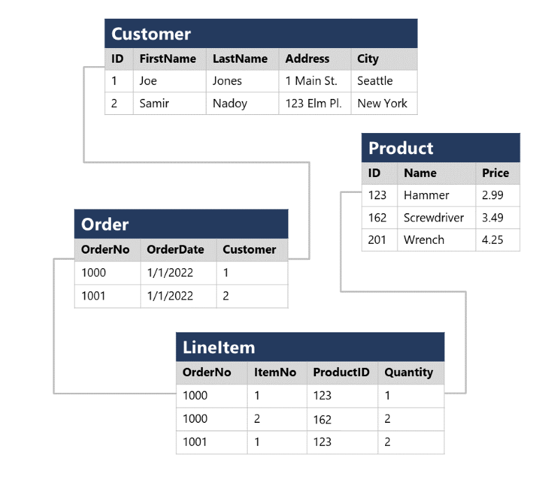

# M02.01 Explore fundamental relational data concepts

## Unit 1 of 7

### Introduction

In the early years of computing systems, every application stored data in its own unique structure. When developers wanted to build applications to use that data, they had to know a lot about the particular data structure to find the data they needed. These data structures were inefficient, hard to maintain, and hard to optimize for good application performance. The *relational* database model was designed to solve the problem of multiple arbitrary data structures. The relational model provides a standard way of representing and querying data that can be used by any application. One of the key advantages of the relational database model is its use of *tables*, which are an intuitive, efficient, and flexible way to store and access structured information.

The simple yet powerful relational model is used by organizations of all types and sizes for a broad variety of information management needs. Relational databases are used to track inventories, process e-commerce transactions, manage huge amounts of mission-critical customer information, and much more. A relational database is useful for storing any information containing related data elements that must be organized in a rules-based, consistent structure.

In this module, you'll learn about the key characteristics of relational databases, and explore relational data structures.

### Learning objectives

In this module you will learn how to:

- Identify characteristics of relational data
- Define normalization
- Identify types of SQL statement
- Identify common relational database objects

### Next unit: Understand relational data

## Unit 2 of 7

### Understand relational data

In a relational database, you model collections of entities from the real world as *tables*. An entity can be anything for which you want to record information; typically important objects and events. For example, in a retail system example, you might create tables for customers, products, orders, and line items within an order. A table contains rows, and each row represents a single instance of an entity. In the retail scenario, each row in the customer table contains the data for a single customer, each row in the product table defines a single product, each row in the order table represents an order made by a customer, and each row in the line item table represents a product that was included in an order.

Relational tables are a format for structured data, and each row in a table has the same columns; though in some cases, not all columns need to have a value – for example, a customer table might include a **MiddleName** column; which can be empty (or *NULL*) for rows that represent customers with no middle name or whose middle name is unknown.

Each column stores data of a specific datatype. For example, an **Email** column in a **Customer** table would likely be defined to store character-based (text) data (which might be fixed or variable in length), a **Price** column in a **Product** table might be defined to store decimal numeric data, while a **Quantity** column in an **Order** table might be constrained to integer numeric values; and an **OrderDate** column in the same **Order** table would be defined to store date/time values. The available data types that you can use when defining a table depend on the database system you are using; though there are standard data types defined by the American National Standards Institute (ANSI) that are supported by most database systems.

### Next unit: Understand normalization

## Unit 3 of 7

### Understand normalization

Normalization is a term used by database professionals for a schema design process that minimizes data duplication and enforces data integrity.

While there are many complex rules that define the process of refactoring data into various levels (or *forms*) of normalization, a simple definition for practical purposes is:

1. Separate each *entity* into its own table.
2. Separate each discrete *attribute* into its own column.
3. Uniquely identify each entity instance (row) using a  *primary key*.
4. Use *foreign key* columns to link related entities.

To understand the core principles of normalization, suppose the following table represents a spreadsheet that a company uses to track its sales.

Notice that the customer and product details are duplicated for each individual item sold; and that the customer name and postal address, and the product name and price are combined in the same spreadsheet cells.

Now let's look at how normalization changes the way the data is stored.

Each entity that is represented in the data (customer, product, sales order, and line item) is stored in its own table, and each discrete attribute of those entities is in its own column.

Recording each instance of an entity as a row in an entity-specific table removes duplication of data. For example, to change a customer's address, you need only modify the value in a single row.

The decomposition of attributes into individual columns ensures that each value is constrained to an appropriate data type - for example, product prices must be decimal values, while line item quantities must be integer numbers. Additionally, the creation of individual columns provides a useful level of granularity in the data for querying - for example, you can easily filter customers to those who live in a specific city.

Instances of each entity are uniquely identified by an ID or other key value, known as a *primary key*; and when one entity references another (for example, an order has an associated customer), the primary key of the related entity is stored as a *foreign key*. You can look up the address of the customer (which is stored only once) for each record in the **Order** table by referencing the corresponding record in the **Customer** table. Typically, a relational database management system (RDBMS) can enforce referential integrity to ensure that a value entered into a foreign key field has an existing corresponding primary key in the related table – for example, preventing orders for non-existent customers.

In some cases, a key (primary or foreign) can be defined as a *composite* key based on a unique combination of multiple columns. For example, the **LineItem** table in the example above uses a unique combination of **OrderNo** and **ItemNo** to identify a line item from an individual order.

### Next unit: Explore SQL

## Unit 4 of 7

### Explore SQL

SQL stands for *Structured Query Language*, and is used to communicate with a relational database. It's the standard language for relational database management systems. SQL statements are used to perform tasks such as update data in a database, or retrieve data from a database. Some common relational database management systems that use SQL include Microsoft SQL Server, MySQL, PostgreSQL, MariaDB, and Oracle.

> **Note:** SQL was originally standardized by the American National Standards Institute (ANSI) in 1986, and by the International Organization for Standardization (ISO) in 1987. Since then, the standard has been extended several times as relational database vendors have added new features to their systems. Additionally, most database vendors include their own proprietary extensions that are not part of the standard, which has resulted in a variety of dialects of SQL.

