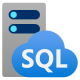

# M02.02 Explore relational database services in Azure

## Unit 1 of 6

### Introduction

Azure supports multiple database services, enabling you to run popular relational database management systems, such as SQL Server, PostgreSQL, and MySQL, in the cloud.

Most Azure database services are fully managed, freeing up valuable time you’d otherwise spend managing your database. Enterprise-grade performance with built-in high availability means you can scale quickly and reach global distribution without worrying about costly downtime. Developers can take advantage of industry-leading innovations such as built-in security with automatic monitoring and threat detection, automatic tuning for improved performance. On top of all of these features, you have guaranteed availability.

In this module, you'll explore the options available for relational database services in Azure.

### Learning objectives

In this module, you'll learn how to:

- Identify options for Azure SQL services
- Identify options for open-source databases in Azure
- Provision a database service on Azure

### Next unit: Describe Azure SQL services and capabilities

## Unit 2 of 6

### Describe Azure SQL services and capabilities

Azure SQL is a collective term for a family of Microsoft SQL Server based database services in Azure. Specific Azure SQL services include:

- **SQL Server on Azure Virtual Machines (VMs)** - A virtual machine running in Azure with an installation of SQL Server. The use of a VM makes this option an infrastructure-as-a-service (IaaS) solution that virtualizes hardware infrastructure for compute, storage, and networking in Azure; making it a great option for "lift and shift" migration of existing on-premises SQL Server installations to the cloud.
- **Azure SQL Managed Instance** - A platform-as-a-service (PaaS) option that provides near-100% compatibility with on-premises SQL Server instances while abstracting the underlying hardware and operating system. The service includes automated software update management, backups, and other maintenance tasks, reducing the administrative burden of supporting a database server instance.
- **Azure SQL Database** - A fully managed, highly scalable PaaS database service that is designed for the cloud. This service includes the core database-level capabilities of on-premises SQL Server, and is a good option when you need to create a new application in the cloud.
- **Azure SQL Edge** - A SQL engine that is optimized for Internet-of-things (IoT) scenarios that need to work with streaming time-series data.

> **Note:** Although Azure SQL Edge is included in this list for completeness, we'll focus on the other options for more general relational database scenarios in this module.

#### Compare Azure SQL services

| -- | **SQL Server on Azure VMs** | **Azure SQL Managed Instance** | **Azure SQL Database** |
|:- | :- | :- | :- |
| |  |  |  |
| Type of cloud service | IaaS | PaaS | PaaS |
| SQL Server compatibility | Fully compatible with on-premises physical and virtualized installations. Applications and databases can easily be "lift and shift" migrated without change. | Near-100% compatibility with SQL Server. Most on-premises databases can be migrated with minimal code changes by using the [Azure Database Migration service](https://learn.microsoft.com/en-us/azure/dms/dms-overview) | Supports most core database-level capabilities of SQL Server. Some features depended on by an on-premises application may not be available. |
| Architecture | SQL Server instances are installed in a virtual machine. Each instance can support multiple databases. | Each managed instance can support multiple databases. Additionally, instance pools can be used to share resources efficiently across smaller instances. | You can provision a single database in a dedicated, managed (logical) server; or you can use an elastic pool to share resources across multiple databases and take advantage of on-demand scalability. |
| Availability | 99.99% | 99.99% | 99.995% |
| Management | You must manage all aspects of the server, including operating system and SQL Server updates, configuration, backups, and other maintenance tasks. | Fully automated updates, backups, and recovery. | Fully automated updates, backups, and recovery. |
| Use cases | Use this option when you need to migrate or extend an on-premises SQL Server solution and retain full control over all aspects of server and database configuration. | Use this option for most cloud migration scenarios, particularly when you need minimal changes to existing applications. | Use this option for new cloud solutions, or to migrate applications that have minimal instance-level dependencies. |

#### SQL Server on Azure Virtual Machines

SQL Server on Virtual Machines enables you to use full versions of SQL Server in the Cloud without having to manage any on-premises hardware. This is an example of the IaaS approach.

SQL Server running on an Azure virtual machine effectively replicates the database running on real on-premises hardware. Migrating from the system running on-premises to an Azure virtual machine is no different than moving the databases from one on-premises server to another.

This approach is suitable for migrations and applications requiring access to operating system features that might be unsupported at the PaaS level. SQL virtual machines are *lift-and-shift* ready for existing applications that require fast migration to the cloud with minimal changes. You can also use SQL Server on Azure VMs to extend existing on-premises applications to the cloud in hybrid deployments.

> **Note:** A *hybrid deployment* is a system where part of the operation runs on-premises, and part in the cloud. Your database might be part of a larger system that runs on-premises, although the database elements might be hosted in the cloud.

You can use SQL Server in a virtual machine to develop and test traditional SQL Server applications. With a virtual machine, you have the full administrative rights over the DBMS and operating system. It's a perfect choice when an organization already has IT resources available to maintain the virtual machines.

These capabilities enable you to:

- Create rapid development and test scenarios when you don't want to buy on-premises non-production SQL Server hardware.
- Become lift-and-shift ready for existing applications that require fast migration to the cloud with minimal changes or no changes.
- Scale up the platform on which SQL Server is running, by allocating more memory, CPU power, and disk space to the virtual machine. You can quickly resize an Azure virtual machine without the requirement that you reinstall the software that is running on it.

##### SQL Server on Azure Virtual Machines: Business Benefits

Running SQL Server on virtual machines allows you to meet unique and diverse business needs through a combination of on-premises and cloud-hosted deployments, while using the same set of server products, development tools, and expertise across these environments.

It's not always easy for businesses to switch their DBMS to a fully managed service. There may be specific requirements that must be satisfied in order to migrate to a managed service that requires making changes to the database and the applications that use it. For this reason, using virtual machines can offer a solution, but using them doesn't eliminate the need to administer your DBMS as carefully as you would on-premises.

#### Azure SQL Database Managed Instance

Azure SQL Managed instance effectively runs a fully controllable instance of SQL Server in the cloud. You can install multiple databases on the same instance. You have complete control over this instance, much as you would for an on-premises server. SQL Managed Instance automates backups, software patching, database monitoring, and other general tasks, but you have full control over security and resource allocation for your databases. You can find detailed information at [What is Azure SQL Managed Instance?](https://learn.microsoft.com/en-us/azure/sql-database/sql-database-managed-instance).

Managed instances depend on other Azure services such as Azure Storage for backups, Azure Event Hubs for telemetry, Microsoft Entra ID for authentication, Azure Key Vault for Transparent Data Encryption (TDE) and a couple of Azure platform services that provide security and supportability features. The managed instances make connections to these services.

All communications are encrypted and signed using certificates. To check the trustworthiness of communicating parties, managed instances constantly verify these certificates through certificate revocation lists. If the certificates are revoked, the managed instance closes the connections to protect the data.

##### Use Cases

Consider Azure SQL Managed Instance if you want to *lift-and-shift* an on-premises SQL Server instance and all its databases to the cloud, without incurring the management overhead of running SQL Server on a virtual machine.

Azure SQL Managed Instance provides features not available in Azure SQL Database (discussed below). If your system uses features such as linked servers, Service Broker (a message processing system that can be used to distribute work across servers), or Database Mail (which enables your database to send email messages to users), then you should use managed instance. To check compatibility with an existing on-premises system, we recommend that you use [Azure Database Migration Service](https://learn.microsoft.com/en-us/azure/dms/dms-overview), which is available as [Azure SQL Migration extension for Azure Data Studio](https://learn.microsoft.com/en-us/azure-data-studio/extensions/azure-sql-migration-extension), or via [Azure Portal](https://aka.ms/dmsazureportal), or through [Azure PowerShell and Azure CLI](https://learn.microsoft.com/en-us/azure/dms/migration-dms-powershell-cli). This tool analyzes your databases on SQL Server and reports any issues that could block migration to a managed instance.

##### Azure SQL Database Managed Instance: Business Benefits

Azure SQL Managed Instance enables a system administrator to spend less time on administrative tasks because the service either performs them for you or greatly simplifies those tasks. Automated tasks include operating system and database management system software installation and patching, dynamic instance resizing and configuration, backups, database replication (including system databases), high availability configuration, and configuration of health and performance monitoring data streams.

Azure SQL Managed Instance has near 100% compatibility with SQL Server Enterprise Edition, running on-premises.

Azure SQL Managed Instance supports SQL Server Database engine logins and logins integrated with Microsoft Entra ID. SQL Server Database engine logins include a username and a password. You must enter your credentials each time you connect to the server. Microsoft Entra logins use the credentials associated with your current computer sign-in, and you don't need to provide them each time you connect to the server.

#### Azure SQL Database

Azure SQL Database is a PaaS offering from Microsoft. You create a managed database server in the cloud, and then deploy your databases on this server.

> **Note:** A SQL Database server is a logical construct that acts as a central administrative point for multiple single or pooled databases, logins, firewall rules, auditing rules, threat detection policies, and failover groups.

Azure SQL Database is available as a *Single Database* or an *Elastic Pool*.

##### Single Database

This option enables you to quickly set up and run a single SQL Server database. You create and run a database server in the cloud, and you access your database through this server. Microsoft manages the server, so all you have to do is configure the database, create your tables, and populate them with your data. You can scale the database if you need more storage space, memory, or processing power. By default, resources are pre-allocated, and you're charged per hour for the resources you've requested. You can also specify a *serverless* configuration. In this configuration, Microsoft creates its own server, which might be shared by databases belonging to other Azure subscribers. Microsoft ensures the privacy of your database. Your database automatically scales and resources are allocated or deallocated as required.

##### Elastic Pool

This option is similar to Single Database, except that by default multiple databases can share the same resources, such as memory, data storage space, and processing power through multiple-tenancy. The resources are referred to as a *pool*. You create the pool, and only your databases can use the pool. This model is useful if you have databases with resource requirements that vary over time, and can help you to reduce costs. For example, your payroll database might require plenty of CPU power at the end of each month as you handle payroll processing, but at other times the database might become much less active. You might have another database that is used for running reports. This database might become active for several days in the middle of the month as management reports are generated, but with a lighter load at other times. Elastic Pool enables you to use the resources available in the pool, and then release the resources once processing has completed.

##### Use cases

Azure SQL Database gives you the best option for low cost with minimal administration. It isn't fully compatible with on-premises SQL Server installations. It's often used in new cloud projects where the application design can accommodate any required changes to your applications.

> **Note:** You can use the Azure SQL Migration extension for Azure Data Studio to detect compatibility issues with your databases that can impact database functionality in Azure SQL Database. For more information, see [Azure SQL Migration extension for Azure Data Studio](https://learn.microsoft.com/en-us/azure-data-studio/extensions/azure-sql-migration-extension).

Azure SQL Database is often used for:

- Modern cloud applications that need to use the latest stable SQL Server features.
- Applications that require high availability.
- Systems with a variable load that need the database server to scale up and down quickly.

##### Azure SQL Database: Business Benefits

Azure SQL Database automatically updates and patches the SQL Server software to ensure that you're always running the latest and most secure version of the service.

The scalability features of Azure SQL Database ensure that you can increase the resources available to store and process data without having to perform a costly manual upgrade.

The service provides high availability guarantees, to ensure that your databases are available at least 99.995% of the time. Azure SQL Database supports point-in-time restore, enabling you to recover a database to the state it was in at any point in the past. Databases can be replicated to different regions to provide more resiliency and disaster recovery.

Advanced threat protection provides advanced security capabilities, such as vulnerability assessments, to help detect and remediate potential security problems with your databases. Threat protection also detects anomalous activities that indicate unusual and potentially harmful attempts to access or exploit your database. It continuously monitors your database for suspicious activities, and provides immediate security alerts on potential vulnerabilities, SQL injection attacks, and anomalous database access patterns. Threat detection alerts provide details of the suspicious activity, and recommend action on how to investigate and mitigate the threat.

Auditing tracks database events and writes them to an audit log in your Azure storage account. Auditing can help you maintain regulatory compliance, understand database activity, and gain insight into discrepancies and anomalies that might indicate business concerns or suspected security violations.

SQL Database helps secure your data by providing encryption that protects data that is stored in the database (*at rest*) and while it is being transferred across the network (*in motion*).

### Next unit: Describe Azure services for open-source databases

## Unit 3 of 6

### Describe Azure services for open-source databases

In addition to Azure SQL services, Azure data services are available for other popular relational database systems, including MySQL, MariaDB, and PostgreSQL. The primary reason for these services is to enable organizations that use them in on-premises apps to move to Azure quickly, without making significant changes to their applications.

#### What are MySQL, MariaDB, and PostgreSQL?

MySQL, MariaDB, and PostgreSQL are relational database management systems that are tailored for different specializations.

MySQL started life as a simple-to-use open-source database management system. It's the leading open source relational database for *Linux, Apache, MySQL, and PHP* (LAMP) stack apps. It's available in several editions; Community, Standard, and Enterprise. The Community edition is available free-of-charge, and has historically been popular as a database management system for web applications, running under Linux. Versions are also available for Windows. Standard edition offers higher performance, and uses a different technology for storing data. Enterprise edition provides a comprehensive set of tools and features, including enhanced security, availability, and scalability. The Standard and Enterprise editions are the versions most frequently used by commercial organizations, although these versions of the software aren't free.

MariaDB is a newer database management system, created by the original developers of MySQL. The database engine has since been rewritten and optimized to improve performance. MariaDB offers compatibility with Oracle Database (another popular commercial database management system). One notable feature of MariaDB is its built-in support for temporal data. A table can hold several versions of data, enabling an application to query the data as it appeared at some point in the past.

PostgreSQL is a hybrid relational-object database. You can store data in relational tables, but a PostgreSQL database also enables you to store custom data types, with their own non-relational properties. The database management system is extensible; you can add code modules to the database, which can be run by queries. Another key feature is the ability to store and manipulate geometric data, such as lines, circles, and polygons.

PostgreSQL has its own query language called *pgsql*. This language is a variant of the standard relational query language, SQL, with features that enable you to write stored procedures that run inside the database.

#### Azure Database for MySQL

Azure Database for MySQL is a PaaS implementation of MySQL in the Azure cloud, based on the MySQL Community Edition.

The Azure Database for MySQL service includes high availability at no additional cost, and scalability as required. You only pay for what you use. Automatic backups are provided, with point-in-time restore.

The server provides connection security to enforce firewall rules and, optionally, require SSL connections. Many server parameters enable you to configure server settings such as lock modes, maximum number of connections, and timeouts.

Azure Database for MySQL provides a global database system that scales up to large databases without the need to manage hardware, network components, virtual servers, software patches, and other underlying components.

Certain operations aren't available with Azure Database for MySQL. These functions are primarily concerned with security and administration. Azure manages these aspects of the database server itself.

##### Benefits of Azure Database for MySQL

You get the following features with Azure Database for MySQL:

- High availability features built-in.
- Predictable performance.
- Easy scaling that responds quickly to demand.
- Secure data, both at rest and in motion.
- Automatic backups and point-in-time restore for the last 35 days.
- Enterprise-level security and compliance with legislation.

The system uses pay-as-you-go pricing so you only pay for what you use.

Azure Database for MySQL servers provides monitoring functionality to add alerts, and to view metrics and logs.

#### Azure Database for MariaDB

Azure Database for MariaDB is an implementation of the MariaDB database management system adapted to run in Azure. It's based on the MariaDB Community Edition.

The database is fully managed and controlled by Azure. Once you've provisioned the service and transferred your data, the system requires almost no additional administration.

##### Benefits of Azure Database for MariaDB

Azure Database for MariaDB delivers:

- Built-in high availability with no additional cost.
- Predictable performance, using inclusive pay-as-you-go pricing.
- Scaling as needed within seconds.
- Secured protection of sensitive data at rest and in motion.
- Automatic backups and point-in-time-restore for up to 35 days.
- Enterprise-grade security and compliance.

#### Azure Database for PostgreSQL

If you prefer PostgreSQL, you can choose Azure Database for PostgreSQL to run a PaaS implementation of PostgreSQL in the Azure Cloud. This service provides the same availability, performance, scaling, security, and administrative benefits as the MySQL service.

Some features of on-premises PostgreSQL databases aren't available in Azure Database for PostgreSQL. These features are mostly concerned with the extensions that users can add to a database to perform specialized tasks, such as writing stored procedures in various programming languages (other than pgsql, which is available), and interacting directly with the operating system. A core set of the most frequently used extensions is supported, and the list of available extensions is under continuous review.

##### Azure Database for PostgreSQL Flexible Server

The flexible-server deployment option for PostgreSQL is a fully managed database service. It provides a high level of control and server configuration customizations, and provides cost optimization controls.

##### Benefits of Azure Database for PostgreSQL

Azure Database for PostgreSQL is a highly available service. It contains built-in failure detection and failover mechanisms.

Users of PostgreSQL will be familiar with the **pgAdmin** tool, which you can use to manage and monitor a PostgreSQL database. You can continue to use this tool to connect to Azure Database for PostgreSQL. However, some server-focused functionality, such as performing server backup and restore, aren't available because the server is managed and maintained by Microsoft.

Azure Database for PostgreSQL records information about queries run against databases on the server, and saves them in a database named *azure_sys*. You query the *query_store.qs_view* view to see this information, and use it to monitor the queries that users are running. This information can prove invaluable if you need to fine-tune the queries performed by your applications.

### Next unit: Exercise: Explore Azure relational database services

## Unit 4 of 6

### Exercise: Explore Azure relational database services

Choose your database

| Azure SQL Database | Azure Database for PostgreSQL | Azure Database for MySQL |
|:- | :- | :- |

Now it's your opportunity to explore relational database services in Azure.

> **Note:** To complete this lab, you will need an [Azure subscription](https://azure.microsoft.com/free) in which you have administrative access.

Launch the exercise and follow the instructions to explore Azure SQL Database.

[Launch Exercise](https://aka.ms/dp900-sql-lab)

```SQL
SELECT * FROM [SalesLT].[Product];
```

```SQL
SELECT ProductID, Name, ListPrice, ProductCategoryID
FROM [SalesLT].[Product];
```

```SQL
SELECT p.ProductID, p.Name AS ProductName,
  c.Name AS Category, p.ListPrice
FROM SalesLT.Product as p
JOIN SalesLT.ProductCategory as c
  ON p.ProductCategoryID = c.ProductCategoryID;
```

### Next unit: Knowledge check

## Unit 5 of 6

### Knowledge check

Choose the best response for each of the questions below. Then select Check your answers.

### Check your knowledge

1. Which deployment option offers the best compatibility when migrating an existing SQL Server on-premises solution?

    - ☐ Azure SQL Database (single database)
    - ☐ Azure SQL Database (elastic pool)
    - ☑ Azure SQL Managed Instance
    > Correct. Azure SQL Managed Instance offers near 100% compatibility with SQL Server.

2. Which of the following statements is true about Azure SQL Database?

    - ☑ Most database maintenance tasks are automated
    > Correct. Azure SQL Database automates most maintenance tasks.
    - ☐ You must purchase a SQL Server license
    - ☐ It can only support one database

3. Which database service is the simplest option for migrating a LAMP application to Azure?

    - ☐ Azure SQL Managed Instance
    - ☑ Azure Database for MySQL
    > Correct. LAMP standard for Linux, Apache, MySQL, and PHP.
    - ☐ Azure Database for PostgreSQL

### Next unit: Summary

## Unit 6 of 6

### Summary

Azure supports a range of database services that you can use to support new cloud applications or migrate existing applications to the cloud.

In this module, you learned how to:

- Identify options for Azure SQL services
- Identify options for open-source databases in Azure
- Provision a database service on Azure

### Next steps

Now that you've learned about Azure relational database services, consider learning more about data-related workloads on Azure by pursuing a Microsoft certification in [Azure Data Fundamentals](https://learn.microsoft.com/en-us/certifications/azure-data-fundamentals/).

### All units complete
