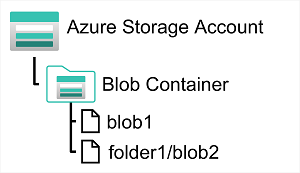

# M03.01 Explore Azure Storage for non-relational data

## Unit 1 of 8

### Introduction

Most software applications need to store data. Often this takes the form of a relational database, in which the data is organized in related tables and managed by using Structured Query Language (SQL). However, many applications don't need the rigid structure of a relational database and rely on non-relational (often referred to as NoSQL) storage.

Azure Storage is one of the core services in Microsoft Azure, and offers a range of options for storing data in the cloud. In this module, you explore the fundamental capabilities of Azure storage and learn how it's used to support applications that require non-relational data stores.

### Learning Objectives

In this module, you learn how to:

- Describe features and capabilities of Azure blob storage
- Describe features and capabilities of Azure Data Lake Gen2
- Describe features and capabilities of Azure file storage
- Describe features and capabilities of Azure table storage
- Provision and use an Azure Storage account

### Next unit: Explore Azure blob storage

## Unit 2 of 8

### Explore Azure blob storage

Azure Blob Storage is a service that enables you to store massive amounts of unstructured data as binary large objects, or blobs, in the cloud. Blobs are an efficient way to store data files in a format that is optimized for cloud-based storage, and applications can read and write them by using the Azure blob storage API.

In an Azure storage account, you store blobs in *containers*. A container provides a convenient way of grouping related blobs together. You control who can read and write blobs inside a container at the container level.

Within a container, you can organize blobs in a hierarchy of virtual folders, similar to files in a file system on disk. However, by default, these folders are simply a way of using a "/" character in a blob name to organize the blobs into namespaces. The folders are purely virtual, and you can't perform folder-level operations to control access or perform bulk operations.

Azure Blob Storage supports three different types of blob:

- **Block blobs**. A block blob is handled as a set of blocks. Each block can vary in size, up to 4000 MiB. A block blob can contain up to 190.7 TiB (4000 MiB X 50,000 blocks), giving a maximum size of over 5000 MiB. The block is the smallest amount of data that can be read or written as an individual unit. Block blobs are best used to store discrete, large, binary objects that change infrequently.
- **Page blobs**. A page blob is organized as a collection of fixed size 512-byte pages. A page blob is optimized to support random read and write operations; you can fetch and store data for a single page if necessary. A page blob can hold up to 8 TB of data. Azure uses page blobs to implement virtual disk storage for virtual machines.
- **Append blobs**. An append blob is a block blob optimized to support append operations. You can only add blocks to the end of an append blob; updating or deleting existing blocks isn't supported. Each block can vary in size, up to 4 MB. The maximum size of an append blob is just over 195 GB.

Blob storage provides three access tiers, which help to balance access latency and storage cost:

- The *Hot* tier is the default. You use this tier for blobs that are accessed frequently. The blob data is stored on high-performance media.
- The *Cool* tier has lower performance and incurs reduced storage charges compared to the Hot tier. Use the Cool tier for data that is accessed infrequently. It's common for newly created blobs to be accessed frequently initially, but less so as time passes. In these situations, you can create the blob in the Hot tier, but migrate it to the Cool tier later. You can migrate a blob from the Cool tier back to the Hot tier.
- The *Archive* tier provides the lowest storage cost, but with increased latency. The Archive tier is intended for historical data that mustn't be lost, but is required only rarely. Blobs in the Archive tier are effectively stored in an offline state. Typical reading latency for the Hot and Cool tiers is a few milliseconds, but for the Archive tier, it can take hours for the data to become available. To retrieve a blob from the Archive tier, you must change the access tier to Hot or Cool. The blob will then be rehydrated. You can read the blob only when the rehydration process is complete.

You can create lifecycle management policies for blobs in a storage account. A lifecycle management policy can automatically move a blob from Hot to Cool, and then to the Archive tier, as it ages and is used less frequently (policy is based on the number of days since modification). A lifecycle management policy can also arrange to delete outdated blobs.

### Next unit: Explore Azure DataLake Storage Gen2

## Unit 3 of 8

### Explore Azure DataLake Storage Gen2

Azure Data Lake Store (Gen1) is a separate service for hierarchical data storage for analytical data lakes, often used by so-called big data analytical solutions that work with structured, semi-structured, and unstructured data stored in files. Azure Data Lake Storage Gen2 is a newer version of this service that is integrated into Azure Storage; enabling you to take advantage of the scalability of blob storage and the cost-control of storage tiers, combined with the hierarchical file system capabilities and compatibility with major analytics systems of Azure Data Lake Store.

Systems like Hadoop in Azure HDInsight, Azure Databricks, and Azure Synapse Analytics can mount a distributed file system hosted in Azure Data Lake Store Gen2 and use it to process huge volumes of data.

To create an Azure Data Lake Store Gen2 files system, you must enable the **Hierarchical Namespace** option of an Azure Storage account. You can do this when initially creating the storage account, or you can upgrade an existing Azure Storage account to support Data Lake Gen2. Be aware however that upgrading is a one-way process – after upgrading a storage account to support a hierarchical namespace for blob storage, you can’t revert it to a flat namespace.

### Next unit: Explore Azure Files

## Unit 4 of 8

### Explore Azure Files

Many on-premises systems comprising a network of in-house computers make use of file shares. A file share enables you to store a file on one computer, and grant access to that file to users and applications running on other computers. This strategy can work well for computers in the same local area network, but doesn't scale well as the number of users increases, or if users are located at different sites.

Azure Files is essentially a way to create cloud-based network shares, such as you typically find in on-premises organizations to make documents and other files available to multiple users. By hosting file shares in Azure, organizations can eliminate hardware costs and maintenance overhead, and benefit from high availability and scalable cloud storage for files.

You create Azure File storage in a storage account. Azure Files enables you to share up to 100 TB of data in a single storage account. This data can be distributed across any number of file shares in the account. The maximum size of a single file is 1 TB, but you can set quotas to limit the size of each share below this figure. Currently, Azure File Storage supports up to 2000 concurrent connections per shared file.

After you've created a storage account, you can upload files to Azure File Storage using the Azure portal, or tools such as the *AzCopy* utility. You can also use the Azure File Sync service to synchronize locally cached copies of shared files with the data in Azure File Storage.

Azure File Storage offers two performance tiers. The *Standard* tier uses hard disk-based hardware in a datacenter, and the *Premium* tier uses solid-state disks. The *Premium* tier offers greater throughput, but is charged at a higher rate.

Azure Files supports two common network file sharing protocols:

- *Server Message Block* (SMB) file sharing is commonly used across multiple operating systems (Windows, Linux, macOS).
- *Network File System* (NFS) shares are used by some Linux and macOS versions. To create an NFS share, you must use a premium tier storage account and create and configure a virtual network through which access to the share can be controlled.

### Next unit: Explore Azure Tables

## Unit 5 of 8

### Explore Azure Tables

Azure Table Storage is a NoSQL storage solution that makes use of tables containing *key/value* data items. Each item is represented by a row that contains columns for the data fields that need to be stored.

However, don't be misled into thinking that an Azure Table Storage table is like a table in a relational database. An Azure Table enables you to store semi-structured data. All rows in a table must have a unique key (composed of a partition key and a row key), and when you modify data in a table, a *timestamp* column records the date and time the modification was made; but other than that, the columns in each row can vary. Azure Table Storage tables have no concept of foreign keys, relationships, stored procedures, views, or other objects you might find in a relational database. Data in Azure Table storage is usually denormalized, with each row holding the entire data for a logical entity. For example, a table holding customer information might store the first name, last name, one or more telephone numbers, and one or more addresses for each customer. The number of fields in each row can be different, depending on the number of telephone numbers and addresses for each customer, and the details recorded for each address. In a relational database, this information would be split across multiple rows in several tables.

To help ensure fast access, Azure Table Storage splits a table into partitions. Partitioning is a mechanism for grouping related rows, based on a common property or partition key. Rows that share the same partition key will be stored together. Partitioning not only helps to organize data, it can also improve scalability and performance in the following ways:

- Partitions are independent from each other, and can grow or shrink as rows are added to, or removed from, a partition. A table can contain any number of partitions.
- When you search for data, you can include the partition key in the search criteria. This helps to narrow down the volume of data to be examined, and improves performance by reducing the amount of I/O (input and output operations, or *reads* and *writes*) needed to locate the data.

The key in an Azure Table Storage table comprises two elements; the partition key that identifies the partition containing the row, and a row key that is unique to each row in the same partition. Items in the same partition are stored in row key order. If an application adds a new row to a table, Azure ensures that the row is placed in the correct position in the table. This scheme enables an application to quickly perform *point* queries that identify a single row, and *range* queries that fetch a contiguous block of rows in a partition.

### Next unit: Exercise: Explore Azure Storage

## Unit 6 of 8

### Exercise: Explore Azure Storage

Now it's your opportunity to explore Azure Storage.

> **Note:** To complete this lab, you will need an Azure subscription in which you have administrative access.

Launch the exercise and follow the instructions.

[Launch Exercise](https://aka.ms/dp900-storage-lab)

### Next unit: Knowledge check

## unit 7 of 8
