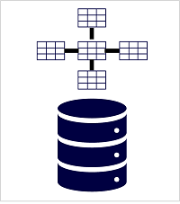
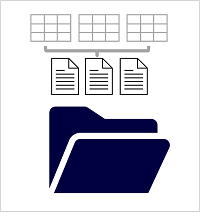

# M04.01 Explore fundamentals of large-scale analytics

## Unit 1 of 10

### Introduction

Large-scale data analytics solutions combine conventional data warehousing used to support business intelligence (BI) with *data lakehouse* techniques that are used to integrate data from files and external sources. A conventional data warehousing solution typically involves copying data from transactional data stores into a relational database with a schema that's optimized for querying and building multidimensional models. Data lakehouse solutions on the other hand, are used with large volumes of data in multiple formats, which is batch loaded or captured in real-time streams and stored in a *data lake* from which distributed processing engines like Apache Spark are used to process it.

### Learning Objectives

In this module, you will learn how to:

- Identify common elements of a large-scale data analytics solution
- Describe key features for data ingestion pipelines
- Identify common types of analytical data store
- Identify platform-as-a-service (PaaS) analytics services in Azure
- Provision Azure Synapse Analytics and use it to ingest, process, and query data
- Describe features of Microsoft Fabric - a software-as-a-service (SaaS) solution for data analytics
- Use Microsoft Fabric to ingest and analyze data

### Next unit: Describe data warehousing architecture

## Unit 2 of 10

### Describe data warehousing architecture

Large-scale data analytics architecture can vary, as can the specific technologies used to implement it; but in general, the following elements are included:

1. **Data ingestion and processing** – data from one or more transactional data stores, files, real-time streams, or other sources is loaded into a data lake or a relational data warehouse. The load operation usually involves an *extract, transform, and load* (ETL) or *extract, load, and transform* (ELT) process in which the data is cleaned, filtered, and restructured for analysis. In ETL processes, the data is transformed before being loaded into an analytical store, while in an ELT process the data is copied to the store and then transformed. Either way, the resulting data structure is optimized for analytical queries. The data processing is often performed by distributed systems that can process high volumes of data in parallel using multi-node clusters. Data ingestion includes both batch processing of static data and real-time processing of streaming data.
2. **Analytical data store** – data stores for large scale analytics include relational *data warehouses*, file-system based *data lakes*, and hybrid architectures that combine features of data warehouses and data lakes (sometimes called *data lakehouses* or *lake databases*). We'll discuss these in more depth later.
3. **Analytical data model** – while data analysts and data scientists can work with the data directly in the analytical data store, it’s common to create one or more data models that pre-aggregate the data to make it easier to produce reports, dashboards, and interactive visualizations. Often these data models are described as *cubes*, in which numeric data values are aggregated across one or more dimensions (for example, to determine total sales by product and region). The model encapsulates the relationships between data values and dimensional entities to support "drill-up/drill-down" analysis.
4. **Data visualization** – data analysts consume data from analytical models, and directly from analytical stores to create reports, dashboards, and other visualizations. Additionally, users in an organization who may not be technology professionals might perform self-service data analysis and reporting. The visualizations from the data show trends, comparisons, and key performance indicators (KPIs) for a business or other organization, and can take the form of printed reports, graphs and charts in documents or PowerPoint presentations, web-based dashboards, and interactive environments in which users can explore data visually.

### Next unit: Explore data ingestion pipelines

## Unit 3 of 10

### Explore data ingestion pipelines

Now that you understand a little about the architecture of a large-scale data warehousing solution, and some of the distributed processing technologies that can be used to handle large volumes of data, it's time to explore how data is ingested into an analytical data store from one or more sources.

On Azure, large-scale data ingestion is best implemented by creating *pipelines* that orchestrate ETL processes. You can create and run pipelines using [Azure Data Factory](https://azure.microsoft.com/services/data-factory), or you can use a similar pipeline engine in [Azure Synapse Analytics](https://azure.microsoft.com/services/synapse-analytics) or [Microsoft Fabric](https://learn.microsoft.com/en-us/fabric/data-factory/data-factory-overview) if you want to manage all of the components of your data analytics solution in a unified workspace.

In either case, pipelines consist of one or more *activities* that operate on data. An input dataset provides the source data, and activities can be defined as a data flow that incrementally manipulates the data until an output dataset is produced. Pipelines can connect to external data sources to integrate with a wide variety of data services.

### Next unit: Explore analytical data stores

## Unit 4 of 10

### Explore analytical data stores

There are two common types of analytical data store.

#### Data warehouses

A *data warehouse* is a relational database in which the data is stored in a schema that is optimized for data analytics rather than transactional workloads. Commonly, the data from a transactional store is transformed into a schema in which numeric values are stored in central *fact* tables, which are related to one or more *dimension* tables that represent entities by which the data can be aggregated. For example a fact table might contain sales order data, which can be aggregated by customer, product, store, and time dimensions (enabling you, for example, to easily find monthly total sales revenue by product for each store). This kind of fact and dimension table schema is called a *star schema*; though it's often extended into a *snowflake schema* by adding additional tables related to the dimension tables to represent dimensional hierarchies (for example, product might be related to product categories). A data warehouse is a great choice when you have transactional data that can be organized into a structured schema of tables, and you want to use SQL to query them.

#### Data lakehouses

A *data lake* is a file store, usually on a distributed file system for high performance data access. Technologies like Spark or Hadoop are often used to process queries on the stored files and return data for reporting and analytics. These systems often apply a *schema-on-read* approach to define tabular schemas on semi-structured data files at the point where the data is read for analysis, without applying constraints when it's stored. Data lakes are great for supporting a mix of structured, semi-structured, and even unstructured data that you want to analyze without the need for schema enforcement when the data is written to the store.

You can use a hybrid approach that combines features of data lakes and data warehouses in a *lake database* or *data lakehouse*. The raw data is stored as files in a data lake, and a relational storage layer abstracts the underlying files and expose them as tables, which can be queried using SQL. SQL pools in Azure Synapse Analytics include *PolyBase*, which enables you to define external tables based on files in a data lake (and other sources) and query them using SQL. Synapse Analytics also supports a Lake Database approach in which you can use database templates to define the relational schema of your data warehouse, while storing the underlying data in data lake storage – separating the storage and compute for your data warehousing solution. Data lakehouses are a relatively new approach in Spark-based systems, and are enabled through technologies like *Delta Lake*; which adds relational storage capabilities to Spark, so you can define tables that enforce schemas and transactional consistency, support batch-loaded and streaming data sources, and provide a SQL API for querying.

### Next unit: Explore platform-as-a-service (PaaS) solutions

## Unit 5 of 10

### Explore platform-as-a-service (PaaS) solutions

On Azure, there are three main platform-as-a-service (PaaS) services that you can use to implement a large-scale analytical store

[**Azure Synapse Analytics**](https://azure.microsoft.com/services/synapse-analytics) is a unified, end-to-end solution for large scale data analytics. It brings together multiple technologies and capabilities, enabling you to combine the data integrity and reliability of a scalable, high-performance SQL Server based relational data warehouse with the flexibility of a data lake and open-source Apache Spark. It also includes native support for log and telemetry analytics with Azure Synapse Data Explorer pools, as well as built in data pipelines for data ingestion and transformation. All Azure Synapse Analytics services can be managed through a single, interactive user interface called Azure Synapse Studio, which includes the ability to create interactive notebooks in which Spark code and markdown content can be combined. Synapse Analytics is a great choice when you want to create a single, unified analytics solution on Azure.

[**Azure Databricks**](https://azure.microsoft.com/services/databricks) is an Azure implementation of the popular Databricks platform. Databricks is a comprehensive data analytics solution built on Apache Spark, and offers native SQL capabilities as well as workload-optimized Spark clusters for data analytics and data science. Databricks provides an interactive user interface through which the system can be managed and data can be explored in interactive notebooks. Due to its common use on multiple cloud platforms, you might want to consider using Azure Databricks as your analytical store if you want to use existing expertise with the platform or if you need to operate in a multicloud environment or support a cloud-portable solution.

[**Azure HDInsight**](https://azure.microsoft.com/services/hdinsight) is an Azure service that supports multiple open-source data analytics cluster types. Although not as user-friendly as Azure Synapse Analytics and Azure Databricks, it can be a suitable option if your analytics solution relies on multiple open-source frameworks or if you need to migrate an existing on-premises Hadoop-based solution to the cloud.

> **Note:** Each of these services can be thought of as an analytical data *store*, in the sense that they provide a schema and interface through which the data can be queried. In many cases however, the data is actually stored in a data lake and the service is used to process the *data* and run queries. Some solutions might even combine the use of these services. An *extract, load, and transform* (ELT) ingestion process might copy data into the data lake, and then use one of these services to transform the data, and another to query it. For example, a pipeline might use a MapReduce job running in HDInsight or a notebook running in Azure Databricks to process a large volume of data in the data lake, and then load it into tables in a SQL pool in Azure Synapse Analytics.

### Next unit: Exercise: Explore data analytics in Azure with Azure Synapse Analytics

## Unit 6 of 10

### Exercise: Explore data analytics in Azure with Azure Synapse Analytics

In this exercise, you'll create an Azure Synapse Analytics workspace and use it to ingest and analyze some data.

The exercise is designed to familiarize you with some key elements of a large-scale data warehousing solution, not as a comprehensive guide to performing advanced data analysis with Azure Synapse Analytics. The exercise should take around 30 minutes to complete.

> **Note:** To complete this lab, you will need an [Azure subscription](https://azure.microsoft.com/free) in which you have administrative access.

Launch the exercise and follow the instructions.

[Launch Exercise](https://aka.ms/dp900-synapse-lab)

### Next unit: Explore Microsoft Fabric

## Unit 7 of 10

### Explore Microsoft Fabric

Scalable analytics with PaaS services can be complex, fragmented, and expensive. With [Microsoft Fabric](https://www.microsoft.com/microsoft-fabric), you don't have to spend all of your time combining various services and implementing interfaces through which business users can access them. Instead, you can use a single product that is easy to understand, set up, create, and manage. Fabric is a unified software-as-a-service (SaaS) offering, with all your data stored in a single open format in OneLake.

OneLake is Fabric's lake-centric architecture that provides a single, integrated environment for data professionals and the business to collaborate on data projects. Think of it like OneDrive for data; OneLake combines storage locations across different regions and clouds into a single logical lake, without moving or duplicating data. Data can be stored in any file format in OneLake and can be structured or unstructured. For tabular data, the analytical engines in Fabric will write data in delta format when writing to OneLake. All engines will know how to read this format and treat delta files as tables no matter which engine writes it.

### Next unit: Exercise: Explore Microsoft Fabric

## Unit 8 of 10

### Exercise: Explore Microsoft Fabric

In this exercise, you'll create a Microsoft Fabric workspace and use it to ingest and analyze some data.

The exercise is designed to familiarize you with some key elements of a large-scale data analytics solution, not as a comprehensive guide to performing advanced data analysis with Microsoft Fabric. The exercise should take around 25 minutes to complete.

> **Note:** You need a Microsoft Fabric trial license with the Fabric preview enabled in your tenant. See [Getting started with Fabric](https://learn.microsoft.com/en-us/fabric/get-started/fabric-trial) to enable your Fabric trial license.

Launch the exercise and follow the instructions.

[Launch Exercise](https://aka.ms/dp900-fabric-lab)

### Next unit: Knowledge check

## Unit 9 of 10

### Knowledge check

Choose the best response for each of the questions below. Then select Check your answers.

### Check your knowledge

1. Which Azure PaaS services can you use to create a pipeline for data ingestion and processing?

    - ☑ Azure SQL Database and Azure Cosmos DB
    - ☐ Azure Synapse Analytics and Azure Data Factory
    - ☐ Azure HDInsight and Azure Databricks

2. What must you define to implement a pipeline that reads data from Azure Blob Storage?

    - ☐ A linked service for your Azure Blob Storage account
    - ☐ A dedicated SQL pool in your Azure Synapse Analytics workspace
    - ☐ An Azure HDInsight cluster in your subscription

3. Which open-source distributed processing engine does Azure Synapse Analytics include?

    - ☐ Apache Hadoop
    - ☐ Apache Spark
    - ☐ Apache Storm

### Next unit: Summary
