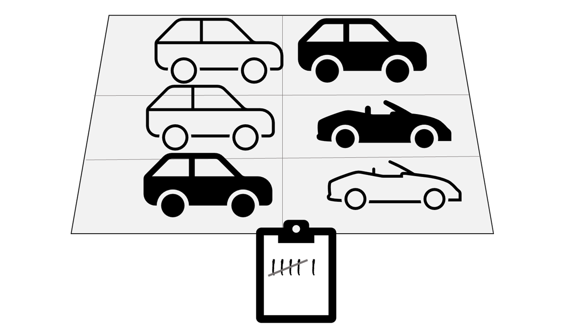
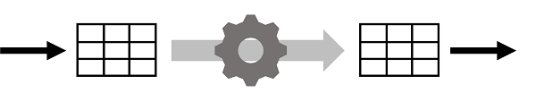

# M04.02 Explore fundamentals of real-time analytics

## Unit 1 of 11

### Introduction

Increased use of technology by individuals, companies, and other organizations, together with the proliferation of smart devices and Internet access has led to a massive growth in the volume of data that can be generated, captured, and analyzed. Much of this data can be processed in real-time (or at least, *near* real-time) as a perpetual *stream* of data, enabling the creation of systems that reveal instant insights and trends, or take immediate responsive action to events as they occur.

### Learning Objectives

In this module, you'll learn about the basics of stream processing and real-time analytics, and the services in Microsoft Azure that you can use to implement real-time data processing solutions. Specifically, you'll learn how to:

- Compare batch and stream processing
- Describe common elements of streaming data solutions
- Describe features and capabilities of Azure Stream Analytics
- Describe features and capabilities of Spark Structured Streaming on Azure
- Describe features and capabilities of realtime analytics in Microsoft Fabric

> **Note:** This module is designed to present a conceptual overview of real-time processing and describe Azure services that can be used to build real-time analytics solutions. It is not intended to teach implementation details for creating a stream processing solution.

### Next unit: Understand batch and stream processing

## Unit 2 of 11

### Understand batch and stream processing

Data processing is simply the conversion of raw data to meaningful information through a process. There are two general ways to process data:

- *Batch processing*, in which multiple data records are collected and stored before being processed together in a single operation.
- *Stream processing*, in which a source of data is constantly monitored and processed in real time as new data events occur.

#### Understand batch processing

In batch processing, newly arriving data elements are collected and stored, and the whole group is processed together as a batch. Exactly when each group is processed can be determined in a number of ways. For example, you can process data based on a scheduled time interval (for example, every hour), or it could be triggered when a certain amount of data has arrived, or as the result of some other event.

For example, suppose you want to analyze road traffic by counting the number of cars on a stretch of road. A batch processing approach to this would require that you collect the cars in a parking lot, and then count them in a single operation while they're at rest.

If the road is busy, with a large number of cars driving along at frequent intervals, this approach may be impractical; and note that you don't get any results until you have parked a batch of cars and counted them.

A real world example of batch processing is the way that credit card companies handle billing. The customer doesn't receive a bill for each separate credit card purchase but one monthly bill for all of that month's purchases.

Advantages of batch processing include:

- Large volumes of data can be processed at a convenient time.
- It can be scheduled to run at a time when computers or systems might otherwise be idle, such as overnight, or during off-peak hours.

Disadvantages of batch processing include:

- The time delay between ingesting the data and getting the results.
- All of a batch job's input data must be ready before a batch can be processed. This means data must be carefully checked. Problems with data, errors, and program crashes that occur during batch jobs bring the whole process to a halt. The input data must be carefully checked before the job can be run again. Even minor data errors can prevent a batch job from running.

#### Understand stream processing

In stream processing, each new piece of data is processed when it arrives. Unlike batch processing, there's no waiting until the next batch processing interval - data is processed as individual units in real-time rather than being processed a batch at a time. Stream data processing is beneficial in scenarios where new, dynamic data is generated on a continual basis.

For example, a better approach to our hypothetical car counting problem might be to apply a *streaming* approach, by counting the cars in real-time as they pass:

In this approach, you don't need to wait until all of the cars have parked to start processing them, and you can aggregate the data over time intervals; for example, by counting the number of cars that pass each minute.

Real world examples of streaming data include:

- A financial institution tracks changes in the stock market in real time, computes value-at-risk, and automatically rebalances portfolios based on stock price movements.
- An online gaming company collects real-time data about player-game interactions, and feeds the data into its gaming platform. It then analyzes the data in real time, offers incentives and dynamic experiences to engage its players.
- A real-estate website that tracks a subset of data from mobile devices, and makes real-time property recommendations of properties to visit based on their geo-location.

Stream processing is ideal for time-critical operations that require an instant real-time response. For example, a system that monitors a building for smoke and heat needs to trigger alarms and unlock doors to allow residents to escape immediately in the event of a fire.

#### Understand differences between batch and streaming data

Apart from the way in which batch processing and streaming processing handle data, there are other differences:

- *Data scope*: Batch processing can process all the data in the dataset. Stream processing typically only has access to the most recent data received, or within a rolling time window (the last 30 seconds, for example).
- *Data size*: Batch processing is suitable for handling large datasets efficiently. Stream processing is intended for individual records or *micro batches* consisting of few records.
- *Performance*: *Latency* is the time taken for the data to be received and processed. The latency for batch processing is typically a few hours. Stream processing typically occurs immediately, with latency in the order of seconds or milliseconds.
- *Analysis*: You typically use batch processing to perform complex analytics. Stream processing is used for simple response functions, aggregates, or calculations such as rolling averages.

#### Combine batch and stream processing

Many large-scale analytics solutions include a mix of batch and stream processing, enabling both historical and real-time data analysis. It's common for stream processing solutions to capture real-time data, process it by filtering or aggregating it, and present it through real-time dashboards and visualizations (for example, showing the running total of cars that have passed along a road within the current hour), while also persisting the processed results in a data store for historical analysis alongside batch processed data (for example, to enable analysis of traffic volumes over the past year).

Even when real-time analysis or visualization of data is not required, streaming technologies are often used to capture real-time data and store it in a data store for subsequent batch processing (this is the equivalent of redirecting all of the cars that travel along a road into a parking lot before counting them).

The following diagram shows some ways in which batch and stream processing can be combined in a large-scale data analytics architecture.

1. Data events from a streaming data source are captured in real-time.
2. Data from other sources is ingested into a data store (often a *data lake*) for batch processing.
3. If real-time analytics is not required, the captured streaming data is written to the data store for subsequent batch processing.
4. When real-time analytics is required, a stream processing technology is used to prepare the streaming data for real-time analysis or visualization; often by filtering or aggregating the data over temporal windows.
5. The non-streaming data is periodically batch processed to prepare it for analysis, and the results are persisted in an analytical data store (often referred to as a *data warehouse*) for historical analysis.
6. The results of stream processing may also be persisted in the analytical data store to support historical analysis.
7. Analytical and visualization tools are used to present and explore the real-time and historical data.

> **Note:** Commonly used solution architectures for combined batch and stream data processing include *lambda* and *delta* architectures. Details of these architectures are beyond the scope of this course, but they incorporate technologies for both large-scale batch data processing and real-time stream processing to create an end-to-end analytical solution.

### Next unit: Explore common elements of stream processing architecture

## Unit 3 of 11

### Explore common elements of stream processing architecture

There are many technologies that you can use to implement a stream processing solution, but while specific implementation details may vary, there are common elements to most streaming architectures.

#### A general architecture for stream processing

At its simplest, a high-level architecture for stream processing looks like this:

1. An event generates some data. This might be a signal being emitted by a sensor, a social media message being posted, a log file entry being written, or any other occurrence that results in some digital data.
2. The generated data is captured in a streaming *source* for processing. In simple cases, the source may be a folder in a cloud data store or a table in a database. In more robust streaming solutions, the source may be a "queue" that encapsulates logic to ensure that event data is processed in order and that each event is processed only once.
3. The event data is processed, often by a perpetual query that operates on the event data to select data for specific types of events, project data values, or aggregate data values over temporal (time-based) periods (or *windows*) - for example, by counting the number of sensor emissions per minute.
4. The results of the stream processing operation are written to an output (or *sink*), which may be a file, a database table, a real-time visual dashboard, or another queue for further processing by a subsequent downstream query.

#### Real-time analytics in Azure

Microsoft Azure supports multiple technologies that you can use to implement real-time analytics of streaming data, including:

- **Azure Stream Analytics**: A platform-as-a-service (PaaS) solution that you can use to define *streaming jobs* that ingest data from a streaming source, apply a perpetual query, and write the results to an output.
- **Spark Structured Streaming**: An open-source library that enables you to develop complex streaming solutions on Apache Spark based services, including **Azure Synapse Analytics**, **Azure Databricks**, and **Azure HDInsight**.
- **Azure Data Explorer**: A high-performance database and analytics service that is optimized for ingesting and querying batch or streaming data with a time-series element, and which can be used as a standalone Azure service or as an **Azure Synapse Data Explorer** runtime in an Azure Synapse Analytics workspace.

##### *Sources* for stream processing

The following services are commonly used to ingest data for stream processing on Azure:

- **Azure Event Hubs**: A data ingestion service that you can use to manage queues of event data, ensuring that each event is processed in order, exactly once.
- **Azure IoT Hub**: A data ingestion service that is similar to Azure Event Hubs, but which is optimized for managing event data from *Internet-of-things* (IoT) devices.
- **Azure Data Lake Store Gen 2**: A highly scalable storage service that is often used in *batch processing* scenarios, but which can also be used as a source of streaming data.
- **Apache Kafka**: An open-source data ingestion solution that is commonly used together with Apache Spark. You can use Azure HDInsight to create a Kafka cluster.

##### *Sinks* for stream processing

The output from stream processing is often sent to the following services:

- **Azure Event Hubs**: Used to queue the processed data for further downstream processing.
- **Azure Data Lake Store Gen 2** or **Azure blob storage**: Used to persist the processed results as a file.
- **Azure SQL Database** or **Azure Synapse Analytics**, or **Azure Databricks**: Used to persist the processed results in a database table for querying and analysis.
- **Microsoft Power BI**: Used to generate real time data visualizations in reports and dashboards.

### Next unit: Explore Azure Stream Analytics

## Unit 4 of 11

### Explore Azure Stream Analytics

Azure Stream Analytics is a service for complex event processing and analysis of streaming data. Stream Analytics is used to:

- Ingest data from an *input*, such as an Azure event hub, Azure IoT Hub, or Azure Storage blob container.
- Process the data by using a *query* to select, project, and aggregate data values.
- Write the results to an *output*, such as Azure Data Lake Gen 2, Azure SQL Database, Azure Synapse Analytics, Azure Functions, Azure event hub, Microsoft Power BI, or others.

Once started, a Stream Analytics query runs perpetually, processing new data as it arrives in the input and storing results in the output.

Azure Stream Analytics is a great technology choice when you need to continually capture data from a streaming source, filter or aggregate it, and send the results to a data store or downstream process for analysis and reporting.

#### Azure Stream Analytics jobs and clusters

The easiest way to use Azure Stream Analytics is to create a Stream Analytics *job* in an Azure subscription, configure its input(s) and output(s), and define the query that the job will use to process the data. The query is expressed using structured query language (SQL) syntax, and can incorporate static reference data from multiple data sources to supply lookup values that can be combined with the streaming data ingested from an input.

If your stream process requirements are complex or resource-intensive, you can create a Stream Analysis *cluster*, which uses the same underlying processing engine as a Stream Analytics job, but in a dedicated tenant (so your processing isn't affected by other customers) and with configurable scalability that enables you to define the right balance of throughput and cost for your specific scenario.

> **Note:** To learn more about the capabilities of Azure Stream Analytics, see the [Azure Stream Analytics documentation](https://learn.microsoft.com/en-us/azure/stream-analytics/).

### Next unit: Exercise: Explore Azure Stream Analytics

## Unit 5 of 11

### Exercise: Explore Azure Stream Analytics

Now it's your opportunity to explore Azure Stream Analytics in a sample solution that aggregates streaming data from a simulated IoT device.

> **Note:** To complete this lab, you will need an [Azure subscription](https://azure.microsoft.com/free) in which you have administrative access.

Launch the exercise and follow the instructions.

[Launch Exercise](https://aka.ms/dp900-stream-lab)

### Next unit: Explore Apache Spark on Microsoft Azure

## Unit 6 of 11

### Explore Apache Spark on Microsoft Azure

Apache Spark is a distributed processing framework for large scale data analytics. You can use Spark on Microsoft Azure in the following services:

- Azure Synapse Analytics
- Azure Databricks
- Azure HDInsight

Spark can be used to run code (usually written in Python, Scala, or Java) in parallel across multiple cluster nodes, enabling it to process very large volumes of data efficiently. Spark can be used for both batch processing and stream processing.

#### Spark Structured Streaming

To process streaming data on Spark, you can use the *Spark Structured Streaming* library, which provides an application programming interface (API) for ingesting, processing, and outputting results from perpetual streams of data.

Spark Structured Streaming is built on a ubiquitous structure in Spark called a *dataframe*, which encapsulates a table of data. You use the Spark Structured Streaming API to read data from a real-time data source, such as a Kafka hub, a file store, or a network port, into a "boundless" dataframe that is continually populated with new data from the stream. You then define a query on the dataframe that selects, projects, or aggregates the data - often in temporal windows. The results of the query generate another dataframe, which can be persisted for analysis or further processing.

Spark Structured Streaming is a great choice for real-time analytics when you need to incorporate streaming data into a Spark based data lake or analytical data store.

> **Note:** For more information about Spark Structured Streaming, see the [Spark Structured Streaming programming guide](https://spark.apache.org/docs/latest/structured-streaming-programming-guide.html).

#### Delta Lake

Delta Lake is an open-source storage layer that adds support for transactional consistency, schema enforcement, and other common data warehousing features to data lake storage. It also unifies storage for streaming and batch data, and can be used in Spark to define relational tables for both batch and stream processing. When used for stream processing, a Delta Lake table can be used as a streaming source for queries against real-time data, or as a sink to which a stream of data is written.

The Spark runtimes in Azure Synapse Analytics and Azure Databricks include support for Delta Lake.

Delta Lake combined with Spark Structured Streaming is a good solution when you need to abstract batch and stream processed data in a data lake behind a relational schema for SQL-based querying and analysis.

> **Note:** For more information about Delta Lake, see What is Delta Lake?

### Next unit: Exercise: Explore Spark Streaming in Azure Synapse Analytics

## Unit 7 of 11

### Exercise: Explore Spark Streaming in Azure Synapse Analytics

In this exercise, you'll use *Spark Structured Streaming* and *delta tables* in Azure Synapse Analytics to process streaming data.

> **Note:** To complete this lab, you will need an [Azure subscription](https://azure.microsoft.com/free) in which you have administrative access.

Launch the exercise and follow the instructions.

[Launch Exercise](https://aka.ms/dp900-spark-lab)

### Next unit: Explore Realtime Analytics in Microsoft Fabric

## Unit 8 of 11

### Explore Realtime Analytics in Microsoft Fabric

Microsoft Fabric includes native support for real-time data analytics, including real-time data ingestion from multiple streaming sources.

In Microsoft Fabric, you can use an eventstream to capture real-time event data from a streaming source and persist it in a destination such as a table in a Lakehouse or a KQL database.

When writing eventstream data to a Lakehouse table, you can apply aggregations and filters to summarize the captured data. A KQL database supports tables based on the Data Explorer engine, enabling you to perform real-time analytics on the data in tables by running KQL queries. After capturing real-time data in a table, you can use Power BI in Microsoft Fabric to create real-time data visualizations.

### Next unit: Exercise: Explore Realtime Analytics in Microsoft Fabric

## Unit 9 of 11

### Exercise: Explore Realtime Analytics in Microsoft Fabric

In this exercise, you'll use realtime analytics in Microsoft Fabric in Azure Synapse Analytics to process streaming data.

> **Note:** You need a Microsoft Fabric trial license with the Fabric preview enabled in your tenant. See [Getting started with Fabric](https://learn.microsoft.com/en-us/fabric/get-started/fabric-trial) to enable your Fabric trial license.

Launch the exercise and follow the instructions.

[Launch Exercise](https://aka.ms/dp900-fabric-rta-lab)

### Next unit: Knowledge check

## Unit 10 of 11

### Knowledge check

1. Which definition of stream processing is correct?

    - ☑ Data is processed continually as new data records arrives
    > Correct. Stream processing is used to continually process new data as it arrives.
    - ☐ Data is collected in a temporary store, and all records are processed together as a batch.
    - ☐ Data is incomplete and cannot be analyzed.

2. Which service would you use to continually capture data from an IoT Hub, aggregate it over temporal periods, and store results in Azure SQL Database?

    - ☐ Azure Cosmos DB
    - ☑ Azure Stream Analytics
    > Correct. Azure Stream Analytics can be used to query a stream of data from Azure IoT Hub and store the results in Azure SQL Database.
    - ☐ Azure Storage

### Next unit: Summary

## Unit 11 of 11

### Summary

Real-time processing is a common element of enterprise data analytics solutions. Microsoft Azure offers a variety of services that you can use to implement stream processing and real-time analysis.

In this module, you learned how to:

- Compare batch and stream processing
- Describe common elements of streaming data solutions
- Describe features and capabilities of Azure Stream Analytics
- Describe features and capabilities of Spark Structured Streaming on Azure
- Describe features and capabilities of Azure Synapse Data Explorer
- Describe features and capabilities of realtime analytics in Microsoft Fabric

### Next steps

Now that you've learned about stream processing and real-time analytics, consider learning more about data-related workloads on Azure by pursuing a Microsoft certification in [Azure Data Fundamentals](https://learn.microsoft.com/en-us/certifications/azure-data-fundamentals/).

### All units complete
