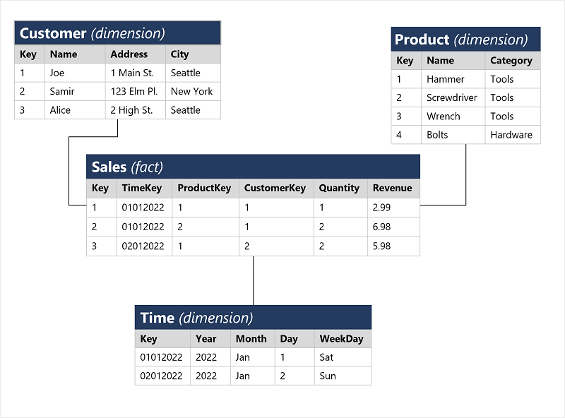
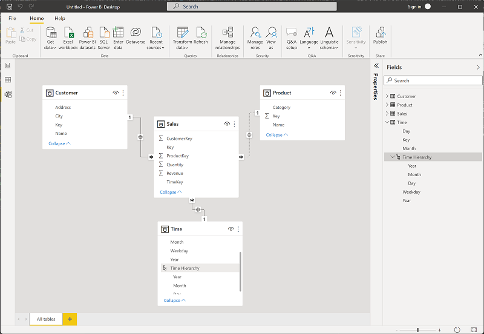
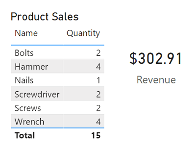
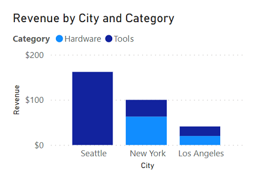
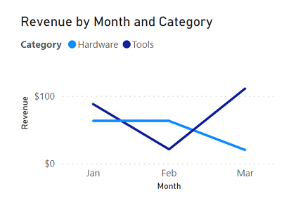
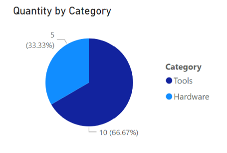
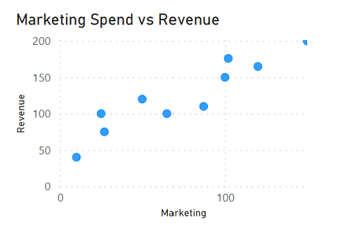
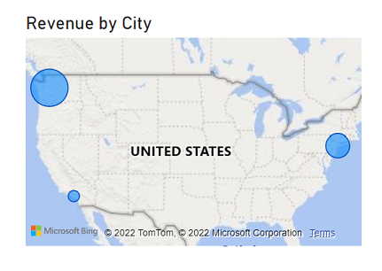
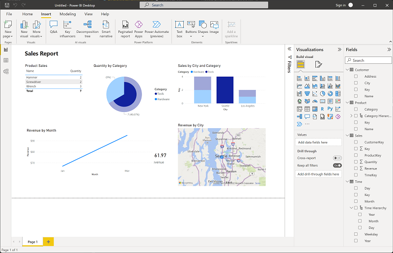

# M04.03 Explore fundamentals of data visualization

## Unit 1 of 7

### Introduction

Data modeling and visualization is at the heart of business intelligence (BI) workloads that are supported by large-scale data analytics solutions. Essentially, data visualization powers reporting and decision making that helps organizations succeed.

In this module, you'll learn about fundamental principles of analytical data modeling and data visualization, using Microsoft Power BI as a platform to explore these principles in action.

### Learning objectives

After completing this module, you'll be able to:

- Describe a high-level process for creating reporting solutions with Microsoft Power BI
- Describe core principles of analytical data modeling
- Identify common types of data visualization and their uses
- Create an interactive report with Power BI Desktop

### Next unit: Describe Power BI tools and workflow

## Unit 2 of 7

### Describe Power BI tools and workflow

There are many data visualization tools that data analysts can use to explore data and summarize insights visually; including chart support in productivity tools like Microsoft Excel and built-in data visualization widgets in notebooks used to explore data in services such as Azure Synapse Analytics and Azure Databricks. However, for enterprise-scale business analytics, an integrated solution that can support complex data modeling, interactive reporting, and secure sharing is often required.

#### Microsoft Power BI

Microsoft Power BI is a suite of tools and services that data analysts can use to build interactive data visualizations for business users to consume.

A typical workflow for creating a data visualization solution starts with **Power BI Desktop**, a Microsoft Windows application in which you can import data from a wide range of data sources, combine and organize the data from these sources in an analytics data model, and create reports that contain interactive visualizations of the data.

After you've created data models and reports, you can publish them to the **Power BI service**; a cloud service in which reports can be published and interacted with by business users. You can also do some basic data modeling and report editing directly in the service using a web browser, but the functionality for this is limited compared to the Power BI Desktop tool. You can use the service to schedule refreshes of the data sources on which your reports are based, and to share reports with other users. You can also define dashboards and apps that combine related reports in a single, easy to consume location.

Users can consume reports, dashboards, and apps in the Power BI service through a web browser, or on mobile devices by using the **Power BI phone app**.

### Next unit: Describe core concepts of data modeling

## Unit 3 of 7

### Describe core concepts of data modeling

Analytical models enable you to structure data to support analysis. Models are based on related tables of data and define the numeric values that you want to analyze or report (known as *measures*) and the entities by which you want to aggregate them (known as *dimensions*). For example, a model might include a table containing numeric measures for sales (such as revenue or quantity) and dimensions for products, customers, and time. This would enable you aggregate sale measures across one or more dimensions (for example, to identify total revenue by customer, or total items sold by product per month). Conceptually, the model forms a multidimensional structure, which is commonly referred to as a *cube*, in which any point where the dimensions intersect represents an aggregated measure for those dimensions.)

> **Note:** Although we commonly refer to an analytical model as a *cube*, there can be more (or fewer) than three dimensions – it’s just not easy for us to visualize more than three!

#### Tables and schema

*Dimension* tables represent the entities by which you want to aggregate numeric measures – for example product or customer. Each entity is represented by a row with a unique key value. The remaining columns represent attributes of an entity – for example, products have names and categories, and customers have addresses and cities. It’s common in most analytical models to include a *Time* dimension so that you can aggregate numeric measures associated with events over time.

The numeric measures that will be aggregated by the various dimensions in the model are stored in *Fact* tables. Each row in a fact table represents a recorded event that has numeric measures associated with it. For example, the **Sales** table in the schema below represents sales transactions for individual items, and includes numeric values for quantity sold and revenue.

This type of schema, where a fact table is related to one or more dimension tables, is referred to as a star schema (imagine there are five dimensions related to a single fact table – the schema would form a five-pointed star!). You can also define a more complex schema in which dimension tables are related to additional tables containing more details (for example, you could represent attributes of product categories in a separate **Category** table that is related to the **Product** table – in which case the design is referred to as a snowflake schema. The schema of fact and dimension tables is used to create an analytical model, in which measure aggregations across all dimensions are pre-calculated; making performance of analysis and reporting activities much faster than calculating the aggregations each time.)

#### Attribute hierarchies

One final thing worth considering about analytical models is the creation of attribute *hierarchies* that enable you to quickly *drill-up* or *drill-down* to find aggregated values at different levels in a hierarchical dimension. For example, consider the attributes in the dimension tables we’ve discussed so far. In the **Product** table, you can form a hierarchy in which each category might include multiple named products. Similarly, in the **Customer** table, a hierarchy could be formed to represent multiple named customers in each city. Finally, in the **Time** table, you can form a hierarchy of year, month, and day. The model can be built with pre-aggregated values for each level of a hierarchy, enabling you to quickly change the scope of your analysis – for example, by viewing total sales by year, and then drilling down to see a more detailed breakdown of total sales by month.

#### Analytical modeling in Microsoft Power BI

You can use Power BI to define an analytical model from tables of data, which can be imported from one or more data source. You can then use the data modeling interface on the **Model** tab of Power BI Desktop to define your analytical model by creating relationships between fact and dimension tables, defining hierarchies, setting data types and display formats for fields in the tables, and managing other properties of your data that help define a rich model for analysis.

### Next unit: Describe considerations for data visualization

## Unit 4 of 7

### Describe considerations for data visualization

After you've created a model, you can use it to generate data visualizations that can be included in a report.

There are many kinds of data visualization, some commonly used and some more specialized. Power BI includes an extensive set of built-in visualizations, which can be extended with custom and third-party visualizations. The rest of this unit discusses some common data visualizations but is by no means a complete list.

#### Tables and text

Tables and text are often the simplest way to communicate data. Tables are useful when numerous related values must be displayed, and individual text values in cards can be a useful way to show important figures or metrics.

#### Bar and column charts

Bar and column charts are a good way to visually compare numeric values for discrete categories.

#### Line charts

Line charts can also be used to compare categorized values and are useful when you need to examine trends, often over time.

#### Pie charts

Pie charts are often used in business reports to visually compare categorized values as proportions of a total.

#### Scatter plots

Scatter plots are useful when you want to compare two numeric measures and identify a relationship or correlation between them.

#### Maps

Maps are a great way to visually compare values for different geographic areas or locations.

#### Interactive reports in Power BI

In Power BI, the visual elements for related data in a report are automatically linked to one another and provide interactivity. For example, selecting an individual category in one visualization will automatically filter and highlight that category in other related visualizations in the report. In the image above, the city *Seattle* has been selected in the **Sales by City and Category** column chart, and the other visualizations are filtered to reflect values for Seattle only.

### Next unit: Exercise – Explore fundamentals of data visualization with Power BI

## Unit 5 of 7

### Exercise – Explore fundamentals of data visualization with Power BI

Now it's your chance to explore data modeling and visualization with Microsoft Power BI.

> **Note:** To complete this exercise, you will need a computer running Microsoft Windows.

Launch the exercise and follow the instructions.

[Launch Exercise](https://aka.ms/dp900-pbi-lab)

### Next unit: Knowledge check

## Unit 6 of 7
