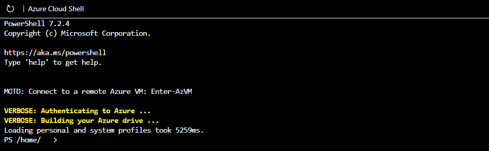
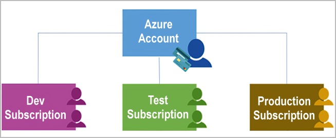

# M02.01 Describe the core architectural components of Azure

## Unit 1 of 9

### Introduction

In this module, you’ll be introduced to the core architectural components of Azure. You’ll learn about the physical organization of Azure: datacenters, availability zones, and regions; and you’ll learn about the organizational structure of Azure: resources and resource groups, subscriptions, and management groups.

### Learning Objectives

After completing this module, you’ll be able to:

- Describe Azure regions, region pairs, and sovereign regions.
- Describe Availability Zones.
- Describe Azure datacenters.
- Describe Azure resources and Resource Groups.
- Describe subscriptions.
- Describe management groups.
- Describe the hierarchy of resource groups, subscriptions, and management groups.

### Next unit: What is Microsoft Azure

## Unit 2 of 9

### What is Microsoft Azure

``` python
from IPython.display import HTML

# Embedding the video link using HTML iframe
video_url = 'https://www.microsoft.com/en-us/videoplayer/embed/RWEsag?postJsllMsg=true'
embed_code = f'<iframe width="560" height="315" src="{video_url}" frameborder="0" allowfullscreen></iframe>'
HTML(embed_code)
```

Azure is a continually expanding set of cloud services that help you meet current and future business challenges. Azure gives you the freedom to build, manage, and deploy applications on a massive global network using your favorite tools and frameworks.

### What does Azure offer?

**Limitless innovation**. Build intelligent apps and solutions with advanced technology, tools, and services to take your business to the next level. Seamlessly unify your technology to simplify platform management and to deliver innovations efficiently and securely on a trusted cloud.

**Bring ideas to life**: Build on a trusted platform to advance your organization with industry-leading AI and cloud services.
**Seamlessly unify**: Efficiently manage all your infrastructure, data, analytics, and AI solutions across an integrated platform.
**Innovate on trust**: Rely on trusted technology from a partner who's dedicated to security and responsibility.

### What can I do with Azure?

Azure provides more than 100 services that enable you to do everything from running your existing applications on virtual machines to exploring new software paradigms, such as intelligent bots and mixed reality.

Many teams start exploring the cloud by moving their existing applications to virtual machines (VMs) that run in Azure. Migrating your existing apps to VMs is a good start, but the cloud is much more than a different place to run your VMs.

For example, Azure provides artificial intelligence (AI) and machine-learning (ML) services that can naturally communicate with your users through vision, hearing, and speech. It also provides storage solutions that dynamically grow to accommodate massive amounts of data. Azure services enable solutions that aren't feasible without the power of the cloud.

### Next unit: Get started with Azure accounts

## Unit 3 of 9

### Get started with Azure accounts

To create and use Azure services, you need an Azure subscription. When you're completing Learn modules, most of the time a temporary subscription is created for you, which runs in an environment called the Learn sandbox. When you're working with your own applications and business needs, you need to create an Azure account, and a subscription will be created for you. After you've created an Azure account, you're free to create additional subscriptions. For example, your company might use a single Azure account for your business and separate subscriptions for development, marketing, and sales departments. After you've created an Azure subscription, you can start creating Azure resources within each subscription.


If you're new to Azure, you can sign up for a free account on the Azure website to start exploring at no cost to you. When you're ready, you can choose to upgrade your free account. You can also create a new subscription that enables you to start paying for Azure services you need beyond the limits of a free account.

### Create an Azure account

You can purchase Azure access directly from Microsoft by signing up on the Azure website or through a Microsoft representative. You can also purchase Azure access through a Microsoft partner. Cloud Solution Provider partners offer a range of complete managed-cloud solutions for Azure.

``` python
from IPython.display import HTML

# Embedding the video link using HTML iframe
video_url = 'https://www.microsoft.com/en-us/videoplayer/embed/RWK1QU?postJsllMsg=true'
embed_code = f'<iframe width="560" height="315" src="{video_url}" frameborder="0" allowfullscreen></iframe>'
HTML(embed_code)
```

### What is the Azure free account?

The Azure free account includes:

- Free access to popular Azure products for 12 months.
- A credit to use for the first 30 days.
- Access to more than 25 products that are always free.

The [Azure free account](https://azure.microsoft.com/free) is an excellent way for new users to get started and explore. To sign up, you need a phone number, a credit card, and a Microsoft or GitHub account. The credit card information is used for identity verification only. You won't be charged for any services until you upgrade to a paid subscription.

### What is the Azure free student account?

The Azure free student account offer includes:

- Free access to certain Azure services for 12 months.
- A credit to use in the first 12 months.
- Free access to certain software developer tools.

The [Azure free student account](https://azure.microsoft.com/free/students/) is an offer for students that gives $100 credit and free developer tools. Also, you can sign up without a credit card.

### What is the Microsoft Learn sandbox?

Many of the Learn exercises use a technology called the sandbox, which creates a temporary subscription that's added to your Azure account. This temporary subscription allows you to create Azure resources during a Learn module. Learn automatically cleans up the temporary resources for you after you've completed the module.

When you're completing a Learn module, you're welcome to use your personal subscription to complete the exercises in a module. However, the sandbox is the preferred method to use because it allows you to create and test Azure resources at no cost to you.

### Next unit: Exercise - Explore the Learn sandbox

## Unit 4 of 9

### Exercise - Explore the Learn sandbox

In this exercise, you explore the Learn sandbox. You can interact with the Learn sandbox in three different ways. During exercises, you'll be provided for instructions for at least one of the methods below.

You start by activating the Learn sandbox. Then, you’ll investigate each of the methods to work in the Learn sandbox.

### Activate the Learn Sandbox

If you haven’t already, use the Activate sandbox button above to activate the Learn sandbox.

If you receive a notice saying Microsoft Learn needs your permission to create Azure resource, use the Review permission button to review and accept the permissions. Once you approve the permissions, it may take a few minutes for the sandbox to activate.

### Task 1: Use the PowerShell CLI

Once the sandbox launches, half the screen will be in PowerShell command line interface (CLI) mode. If you’re familiar with PowerShell, you can manage your Azure environment using PowerShell commands.



> Tip: You can tell you're in PowerShell mode by the PS before your directory on the command line.

Use the PowerShell Get-date command to get the current date and time.

``` PowerShell
Get-date
```

Most Azure specific commands will start with the letters az. The Get-date command you just ran is a PowerShell specific command. Let's try an Azure command to check what version of the CLI you're using right now.

```PowerShell
az version
```

### Task 2: Use the BASH CLI

If you’re more familiar with BASH, you can use BASH command instead by shifting to the BASH CLI.

Enter bash to switch to the BASH CLI.

```PowerShell
bash
```


> Tip: You can tell you're in BASH mode by the username displayed on the command line. It will be your username@azure.

Again, use the Get-date command to get the current date and time.

``` Azure CLI
Get-date
```

You received an error because Get-date is a PowerShell specific command.


Use the date command to get the current date and time.

```Azure CLI
date
```

Just like in the PowerShell mode of the CLI, you can use the letters az to start an Azure command in the BASH mode. Try to run an update to the CLI with az upgrade.

```Azure CLI
az upgrade
```

You can change back to PowerShell mode by entering pwsh on the BASH command line.

### Task 3: Use Azure CLI interactive mode

Another way to interact is using the Azure CLI interactive mode. This changes CLI behavior to more closely resemble an integrated development environment (IDE). Interactive mode provides autocompletion, command descriptions, and even examples. If you’re unfamiliar with BASH and PowerShell, but want to use the command line, interactive mode may help you.

Enter az interactive to enter interactive mode.

```Azure CLI
az interactive
```

Decide whether you wish to send telemetry data and enter YES or NO.

You may have to wait a minute or two to allow the interactive mode to fully initialize. Then, enter the letter “a” and auto-completion should start to work. If auto-completion isn’t working, erase what you’ve entered, wait a bit longer, and try again.


Once initialized, you can use the arrow keys or tab to help complete your commands. Interactive mode is set up specifically for Azure, so you don't need to enter az to start a command (but you can if you want to or are used to it). Try the upgrade or version commands again, but this time without az in front.

```Azure CLI
version
```

```Azure CLI
upgrade
```

The commands should have worked the same as before, and given you the same results. Use the exit command to leave interactive mode.

```Azure CLI
exit
```

### Task 4: Use the Azure portal

You’ll also have the option of using the Azure portal during sandbox exercises. You need to use the link provided in the exercise to access the Azure portal. Using the provided link, instead of opening the portal yourself, ensures the correct subscription is used and the exercise remains free for you to complete.

Sign in to the [Azure portal](https://portal.azure.com/learn.docs.microsoft.com) to check out the Azure web interface. Once in the portal, you can see all the services Azure has to offer as well as look around at resource groups and so on.

### Continue

You're all set for now. We'll come back to this sandbox later in this module and actually create an Azure resource!

### Azure Cloud Shell

This module requires a sandbox to complete. A [sandbox](https://learn.microsoft.com/en-us/training/support/faq?pivots=sandbox) gives you access to Azure resources. Your Azure subscription will not be charged. The sandbox may only be used to complete training on Microsoft Learn. Use for any other reason is prohibited, and may result in permanent loss of access to the sandbox.

Microsoft provides this lab experience and related content for educational purposes. All presented information is owned by Microsoft and intended solely for learning about the covered products and services in this Microsoft Learn module.

### Next unit: Describe Azure physical infrastructure

## Unit 5 of 9

### Describe Azure physical infrastructure

Throughout your journey with Microsoft Azure, you’ll hear and use terms like Regions, Availability Zones, Resources, Subscriptions, and more. This module focuses on the core architectural components of Azure. The core architectural components of Azure may be broken down into two main groupings: the physical infrastructure, and the management infrastructure.

### Physical infrastructure

The physical infrastructure for Azure starts with datacenters. Conceptually, the datacenters are the same as large corporate datacenters. They’re facilities with resources arranged in racks, with dedicated power, cooling, and networking infrastructure.

As a global cloud provider, Azure has datacenters around the world. However, these individual datacenters aren’t directly accessible. Datacenters are grouped into Azure Regions or Azure Availability Zones that are designed to help you achieve resiliency and reliability for your business-critical workloads.

The [Global infrastructure](https://infrastructuremap.microsoft.com/) site gives you a chance to interactively explore the underlying Azure infrastructure.

#### Regions

A region is a geographical area on the planet that contains at least one, but potentially multiple datacenters that are nearby and networked together with a low-latency network. Azure intelligently assigns and controls the resources within each region to ensure workloads are appropriately balanced.

When you deploy a resource in Azure, you'll often need to choose the region where you want your resource deployed.

> Note: Some services or virtual machine (VM) features are only available in certain regions, such as specific VM sizes or storage types. There are also some global Azure services that don't require you to select a particular region, such as Microsoft Entra ID, Azure Traffic Manager, and Azure DNS.

#### Availability Zones

Availability zones are physically separate datacenters within an Azure region. Each availability zone is made up of one or more datacenters equipped with independent power, cooling, and networking. An availability zone is set up to be an isolation boundary. If one zone goes down, the other continues working. Availability zones are connected through high-speed, private fiber-optic networks.


> Important: To ensure resiliency, a minimum of three separate availability zones are present in all availability zone-enabled regions. However, not all Azure Regions currently support availability zones.

#### Use availability zones in your apps

You want to ensure your services and data are redundant so you can protect your information in case of failure. When you host your infrastructure, setting up your own redundancy requires that you create duplicate hardware environments. Azure can help make your app highly available through availability zones.

You can use availability zones to run mission-critical applications and build high-availability into your application architecture by co-locating your compute, storage, networking, and data resources within an availability zone and replicating in other availability zones. Keep in mind that there could be a cost to duplicating your services and transferring data between availability zones.

Availability zones are primarily for VMs, managed disks, load balancers, and SQL databases. Azure services that support availability zones fall into three categories:

- Zonal services: You pin the resource to a specific zone (for example, VMs, managed disks, IP addresses).
- Zone-redundant services: The platform replicates automatically across zones (for example, zone-redundant storage, SQL Database).
- Non-regional services: Services are always available from Azure geographies and are resilient to zone-wide outages as well as region-wide outages.

Even with the additional resiliency that availability zones provide, it’s possible that an event could be so large that it impacts multiple availability zones in a single region. To provide even further resilience, Azure has Region Pairs.

#### Region pairs

Most Azure regions are paired with another region within the same geography (such as US, Europe, or Asia) at least 300 miles away. This approach allows for the replication of resources across a geography that helps reduce the likelihood of interruptions because of events such as natural disasters, civil unrest, power outages, or physical network outages that affect an entire region. For example, if a region in a pair was affected by a natural disaster, services would automatically fail over to the other region in its region pair.

> Important: Not all Azure services automatically replicate data or automatically fall back from a failed region to cross-replicate to another enabled region. In these scenarios, recovery and replication must be configured by the customer.

Examples of region pairs in Azure are West US paired with East US and South-East Asia paired with East Asia. Because the pair of regions are directly connected and far enough apart to be isolated from regional disasters, you can use them to provide reliable services and data redundancy.


#### Additional advantages of region pairs

- If an extensive Azure outage occurs, one region out of every pair is prioritized to make sure at least one is restored as quickly as possible for applications hosted in that region pair.
- Planned Azure updates are rolled out to paired regions one region at a time to minimize downtime and risk of application outage.
- Data continues to reside within the same geography as its pair (except for Brazil South) for tax- and law-enforcement jurisdiction purposes.

> Important: Most regions are paired in two directions, meaning they are the backup for the region that provides a backup for them (West US and East US back each other up). However, some regions, such as West India and Brazil South, are paired in only one direction. In a one-direction pairing, the Primary region does not provide backup for its secondary region. So, even though West India’s secondary region is South India, South India does not rely on West India. West India's secondary region is South India, but South India's secondary region is Central India. Brazil South is unique because it's paired with a region outside of its geography. Brazil South's secondary region is South Central US. The secondary region of South Central US isn't Brazil South.

#### Sovereign Regions

In addition to regular regions, Azure also has sovereign regions. Sovereign regions are instances of Azure that are isolated from the main instance of Azure. You may need to use a sovereign region for compliance or legal purposes.

Azure sovereign regions include:

- US DoD Central, US Gov Virginia, US Gov Iowa and more: These regions are physical and logical network-isolated instances of Azure for U.S. government agencies and partners. These datacenters are operated by screened U.S. personnel and include additional compliance certifications.
- China East, China North, and more: These regions are available through a unique partnership between Microsoft and 21Vianet, whereby Microsoft doesn't directly maintain the datacenters.

### Next unit: Describe Azure management infrastructure

## Unit 6 of 9

### Describe Azure management infrastructure

The management infrastructure includes Azure resources and resource groups, subscriptions, and accounts. Understanding the hierarchical organization will help you plan your projects and products within Azure.

#### Azure resources and resource groups

A resource is the basic building block of Azure. Anything you create, provision, deploy, etc. is a resource. Virtual Machines (VMs), virtual networks, databases, cognitive services, etc. are all considered resources within Azure.


Resource groups are simply groupings of resources. When you create a resource, you’re required to place it into a resource group. While a resource group can contain many resources, a single resource can only be in one resource group at a time. Some resources may be moved between resource groups, but when you move a resource to a new group, it will no longer be associated with the former group. Additionally, resource groups can't be nested, meaning you can’t put resource group B inside of resource group A.

Resource groups provide a convenient way to group resources together. When you apply an action to a resource group, that action will apply to all the resources within the resource group. If you delete a resource group, all the resources will be deleted. If you grant or deny access to a resource group, you’ve granted or denied access to all the resources within the resource group.

When you’re provisioning resources, it’s good to think about the resource group structure that best suits your needs.

For example, if you’re setting up a temporary dev environment, grouping all the resources together means you can deprovision all of the associated resources at once by deleting the resource group. If you’re provisioning compute resources that will need three different access schemas, it may be best to group resources based on the access schema, and then assign access at the resource group level.

There aren’t hard rules about how you use resource groups, so consider how to set up your resource groups to maximize their usefulness for you.

#### Azure subscriptions

In Azure, subscriptions are a unit of management, billing, and scale. Similar to how resource groups are a way to logically organize resources, subscriptions allow you to logically organize your resource groups and facilitate billing.



Using Azure requires an Azure subscription. A subscription provides you with authenticated and authorized access to Azure products and services. It also allows you to provision resources. An Azure subscription links to an Azure account, which is an identity in Microsoft Entra ID or in a directory that Microsoft Entra ID trusts.

An account can have multiple subscriptions, but it’s only required to have one. In a multi-subscription account, you can use the subscriptions to configure different billing models and apply different access-management policies. You can use Azure subscriptions to define boundaries around Azure products, services, and resources. There are two types of subscription boundaries that you can use:

- **Billing boundary**: This subscription type determines how an Azure account is billed for using Azure. You can create multiple subscriptions for different types of billing requirements. Azure generates separate billing reports and invoices for each subscription so that you can organize and manage costs.
- **Access control boundary**: Azure applies access-management policies at the subscription level, and you can create separate subscriptions to reflect different organizational structures. An example is that within a business, you have different departments to which you apply distinct Azure subscription policies. This billing model allows you to manage and control access to the resources that users provision with specific subscriptions.

#### Create additional Azure subscriptions

Similar to using resource groups to separate resources by function or access, you might want to create additional subscriptions for resource or billing management purposes. For example, you might choose to create additional subscriptions to separate:

- **Environments**: You can choose to create subscriptions to set up separate environments for development and testing, security, or to isolate data for compliance reasons. This design is particularly useful because resource access control occurs at the subscription level.
- **Organizational structures**: You can create subscriptions to reflect different organizational structures. For example, you could limit one team to lower-cost resources, while allowing the IT department a full range. This design allows you to manage and control access to the resources that users provision within each subscription.
- **Billing**: You can create additional subscriptions for billing purposes. Because costs are first aggregated at the subscription level, you might want to create subscriptions to manage and track costs based on your needs. For instance, you might want to create one subscription for your production workloads and another subscription for your development and testing workloads.

#### Azure management groups

The final piece is the management group. Resources are gathered into resource groups, and resource groups are gathered into subscriptions. If you’re just starting in Azure that might seem like enough hierarchy to keep things organized. But imagine if you’re dealing with multiple applications, multiple development teams, in multiple geographies.

If you have many subscriptions, you might need a way to efficiently manage access, policies, and compliance for those subscriptions. Azure management groups provide a level of scope above subscriptions. You organize subscriptions into containers called management groups and apply governance conditions to the management groups. All subscriptions within a management group automatically inherit the conditions applied to the management group, the same way that resource groups inherit settings from subscriptions and resources inherit from resource groups. Management groups give you enterprise-grade management at a large scale, no matter what type of subscriptions you might have. Management groups can be nested.

#### Management group, subscriptions, and resource group hierarchy

You can build a flexible structure of management groups and subscriptions to organize your resources into a hierarchy for unified policy and access management. The following diagram shows an example of creating a hierarchy for governance by using management groups.


Some examples of how you could use management groups might be:

- **Create a hierarchy that applies a policy**. You could limit VM locations to the US West Region in a group called Production. This policy will inherit onto all the subscriptions that are descendants of that management group and will apply to all VMs under those subscriptions. This security policy can't be altered by the resource or subscription owner, which allows for improved governance.
- **Provide user access to multiple subscriptions**. By moving multiple subscriptions under a management group, you can create one Azure role-based access control (Azure RBAC) assignment on the management group. Assigning Azure RBAC at the management group level means that all sub-management groups, subscriptions, resource groups, and resources underneath that management group would also inherit those permissions. One assignment on the management group can enable users to have access to everything they need instead of scripting Azure RBAC over different subscriptions.

Important facts about management groups:

- 10,000 management groups can be supported in a single directory.
- A management group tree can support up to six levels of depth. This limit doesn't include the root level or the subscription level.
- Each management group and subscription can support only one parent.

### Next unit: Exercise - Create an Azure resource

## Unit 7 of 9

### Exercise - Create an Azure resource

In this exercise, you’ll use the Azure portal to create a resource. The focus of the exercise is observing how Azure resource groups populate with created resources.

> Important: The sandbox should already be activated, but if the sandbox closed, reactivate the sandbox before continuing.

### Task 1: Create a virtual machine

In this task, you’ll create a virtual machine using the Azure portal.

1. Sign in to the Azure portal.
2. Select Create a resource > Compute > Virtual Machine > Create.
3. The Create a virtual machine pane opens to the basics tab.
4. Verify or enter the following values for each setting. If a setting isn’t specified, leave the default value.

     Basics tab

     |Setting  |Value    |
     |:-- |:-- |
     |Subscription  |Concierge Subscription  |
     |Resource group     |Select the resource group name that begins with **learn**. |
     |Virtual machine name    |my-VM    |
     |Region   |Leave default |
     |Availability options    |Leave default |
     |Security type |Leave default |
     |Image    |Leave default |
     |VM architecture    |Leave default |
     |Run with Azure Spot discount |Unchecked     |
     |Size     |Leave default |
     |Authentication type     |Password |
     |Username |azureuser     |
     |Password |Enter a custom password |
     |Confirm password   |Reenter the custom password  |
     |Public inbound ports    |None     |

5. Select Review and Create.

     > Important: Product details will include a cost associated with creating the virtual machine. This is a system function. If you’re creating the VM in the Learn sandbox, you won’t actually incur any costs.

6. Select Create

     Wait while the VM is provisioned. Deployment is in progress will change to Deployment is complete when the VM is ready.

### Task 2: Verify resources created

Once the deployment is created, you can verify that Azure created not only a VM, but all of the associated resources the VM needs.

1. Select Home
2. Select Resource groups
3. Select the [sandbox resource group name] resource group

You should see a list of resources in the resource group. The storage account and virtual network are associated with the Learn sandbox. However, the rest of the resources were created when you created the virtual machine. By default, Azure gave them all a similar name to help with association and grouped them in the same resource group.

Congratulations! You've created a resource in Azure and had a chance to see how resources get grouped on creation.

### Clean up

The sandbox automatically cleans up your resources when you're finished with this module.

When you're working in your own subscription, it's a good idea at the end of a project to identify whether you still need the resources you created. Resources that you leave running can cost you money. You can delete resources individually or delete the resource group to delete the entire set of resources.

### Next unit: Knowledge check

## Unit 8 of 9

### Knowledge check

Choose the best response for each question. Then select Check your answers.

### Check your knowledge

1. How many resource groups can a resource be in at the same time?
    - ☑ One
        > A resource can only be in one group at a time.
    - ☐ Two
    - ☐ Three

2. What happens to the resources within a resource group when an action or setting at the Resource Group level is applied?
    - ☐ Current resources inherit the setting, but future resources don't.
    - ☐ Future resources inherit the setting, but current ones don't.
    - ☑ The setting is applied to current and future resources.
        > Resources inherit permissions from their resource group.

3. What Azure feature replicates resources across regions that are at least 300 miles away from each other?
    - ☑ Region pairs
        > Most Azure regions are paired with another region within the same geography (such as US, Europe, or Asia) at least 300 miles away.
    - ☐ Availability Zones
    - ☐ Sovereign regions

### Next unit: Summary

## Unit 9 of 9

### Summary

In this module, you learned about the physical and management structure of Microsoft Azure. You were introduced to the relationship between datacenters, availability zones, and regions. You explored how the infrastructure supports the benefits of the cloud, such as high availability and reliability. You also learned about the management infrastructure of Azure. You explored how resources and resource groups are related, and how subscriptions and management groups can help manage resources.

### Learning objectives

You should now be able to:

- Describe Azure regions, region pairs, and sovereign regions.
- Describe Availability Zones.
- Describe Azure datacenters.
- Describe Azure resources and Resource Groups.
- Describe subscriptions.
- Describe management groups.
- Describe the hierarchy of resource groups, subscriptions, and management groups.

### All units complete
