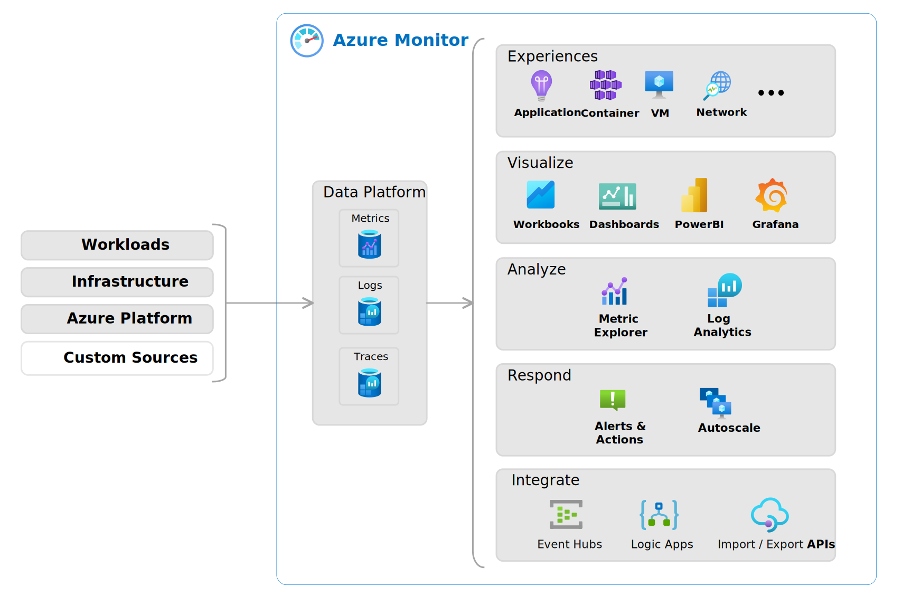
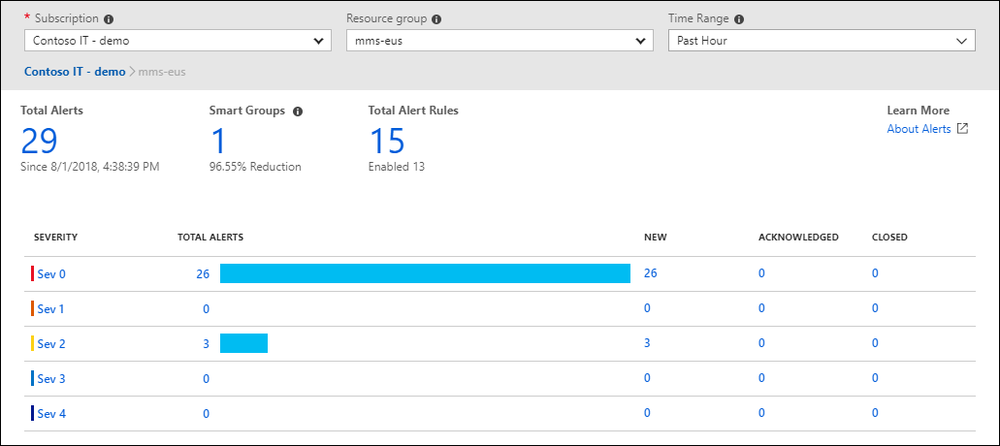

# M03.04 Describe monitoring tools in Azure

## Unit 1 of 6

### Introduction

In this module, you’ll be introduced to tools that help you monitor your environment and applications, both in Azure and in on-premises or multicloud environments.

### Learning Objectives

After completing this module, you’ll be able to:

- Describe the purpose of Azure Advisor.
- Describe Azure Service Health.
- Describe Azure Monitor, including Azure Log Analytics, Azure Monitor Alerts, and Application Insights.

### Next unit: Describe the purpose of Azure Advisor

## Unit 2 of 6

### Describe the purpose of Azure Advisor

Azure Advisor evaluates your Azure resources and makes recommendations to help improve reliability, security, and performance, achieve operational excellence, and reduce costs. Azure Advisor is designed to help you save time on cloud optimization. The recommendation service includes suggested actions you can take right away, postpone, or dismiss.

The recommendations are available via the Azure portal and the API, and you can set up notifications to alert you to new recommendations.

When you're in the Azure portal, the Advisor dashboard displays personalized recommendations for all your subscriptions. You can use filters to select recommendations for specific subscriptions, resource groups, or services. The recommendations are divided into five categories:

- **Reliability** is used to ensure and improve the continuity of your business-critical applications.
- **Security** is used to detect threats and vulnerabilities that might lead to security breaches.
- **Performance** is used to improve the speed of your applications.
- **Operational Excellence** is used to help you achieve process and workflow efficiency, resource manageability, and deployment best practices.
- **Cost** is used to optimize and reduce your overall Azure spending.

The following image shows the Azure Advisor dashboard.

### Next unit: Describe Azure Service Health

## Unit 3 of 6

### Describe Azure Service Health

Microsoft Azure provides a global cloud solution to help you manage your infrastructure needs, reach your customers, innovate, and adapt rapidly. Knowing the status of the global Azure infrastructure and your individual resources could seem like a daunting task. Azure Service Health helps you keep track of Azure resource, both your specifically deployed resources and the overall status of Azure. Azure service health does this by combining three different Azure services:

- **Azure Status** is a broad picture of the status of Azure globally. Azure status informs you of service outages in Azure on the Azure Status page. The page is a global view of the health of all Azure services across all Azure regions. It’s a good reference for incidents with widespread impact.
  - **Service Health** provides a narrower view of Azure services and regions. It focuses on the Azure services and regions you're using. This is the best place to look for service impacting communications about outages, planned maintenance activities, and other health advisories because the authenticated Service Health experience knows which services and resources you currently use. You can even set up Service Health alerts to notify you when service issues, planned maintenance, or other changes may affect the Azure services and regions you use.
  - **Resource Health** is a tailored view of your actual Azure resources. It provides information about the health of your individual cloud resources, such as a specific virtual machine instance. Using Azure Monitor, you can also configure alerts to notify you of availability changes to your cloud resources.

By using Azure status, Service health, and Resource health, Azure Service Health gives you a complete view of your Azure environment-all the way from the global status of Azure services and regions down to specific resources. Additionally, historical alerts are stored and accessible for later review. Something you initially thought was a simple anomaly that turned into a trend, can readily be reviewed and investigated thanks to the historical alerts.

Finally, in the event that a workload you’re running is impacted by an event, Azure Service Health provides links to support.

### Next unit: Describe Azure Monitor

## Unit 4 of 6

### Describe Azure Monitor

Azure Monitor is a platform for collecting data on your resources, analyzing that data, visualizing the information, and even acting on the results. Azure Monitor can monitor Azure resources, your on-premises resources, and even multi-cloud resources like virtual machines hosted with a different cloud provider.

The following diagram illustrates just how comprehensive Azure Monitor is:

On the left is a list of the sources of logging and metric data that can be collected at every layer in your application architecture, from application to operating system and network.

In the center, the logging and metric data are stored in central repositories.

On the right, the data is used in several ways. You can view real-time and historical performance across each layer of your architecture or aggregated and detailed information. The data is displayed at different levels for different audiences. You can view high-level reports on the Azure Monitor Dashboard or create custom views by using Power BI and Kusto queries.

Additionally, you can use the data to help you react to critical events in real time, through alerts delivered to teams via SMS, email, and so on. Or you can use thresholds to trigger autoscaling functionality to scale to meet the demand.

### Azure Log Analytics

Azure Log Analytics is the tool in the Azure portal where you’ll write and run log queries on the data gathered by Azure Monitor. Log Analytics is a robust tool that supports both simple, complex queries, and data analysis. You can write a simple query that returns a set of records and then use features of Log Analytics to sort, filter, and analyze the records. You can write an advanced query to perform statistical analysis and visualize the results in a chart to identify a particular trend. Whether you work with the results of your queries interactively or use them with other Azure Monitor features such as log query alerts or workbooks, Log Analytics is the tool that you're going to use to write and test those queries.

### Azure Monitor Alerts

Azure Monitor Alerts are an automated way to stay informed when Azure Monitor detects a threshold being crossed. You set the alert conditions, the notification actions, and then Azure Monitor Alerts notifies when an alert is triggered. Depending on your configuration, Azure Monitor Alerts can also attempt corrective action.

Alerts can be set up to monitor the logs and trigger on certain log events, or they can be set to monitor metrics and trigger when certain metrics are crossed. For example, you could set a metric-based alert up to notify you when the CPU usage on a virtual machine exceeded 80%. Alert rules based on metrics provide near real time alerts based on numeric values. Rules based on logs allow for complex logic across data from multiple sources.

Azure Monitor Alerts use action groups to configure who to notify and what action to take. An action group is simply a collection of notification and action preferences that you associate with one or multiple alerts. Azure Monitor, Service Health, and Azure Advisor all use actions groups to notify you when an alert has been triggered.

### Application Insights

Application Insights, an Azure Monitor feature, monitors your web applications. Application Insights is capable of monitoring applications that are running in Azure, on-premises, or in a different cloud environment.

There are two ways to configure Application Insights to help monitor your application. You can either install an SDK in your application, or you can use the Application Insights agent. The Application Insights agent is supported in C#.NET, VB.NET, Java, JavaScript, Node.js, and Python.

Once Application Insights is up and running, you can use it to monitor a broad array of information, such as:

- Request rates, response times, and failure rates
- Dependency rates, response times, and failure rates, to show whether external services are slowing down performance
- Page views and load performance reported by users' browsers
- AJAX calls from web pages, including rates, response times, and failure rates
- User and session counts
- Performance counters from Windows or Linux server machines, such as CPU, memory, and network usage

Not only does Application Insights help you monitor the performance of your application, but you can also configure it to periodically send synthetic requests to your application, allowing you to check the status and monitor your application even during periods of low activity.

### Next unit: Knowledge check

## Unit 5 of 6

### Knowledge check

Choose the best response for each question. Then select Check your answers.

## Check your knowledge

1. Which is not one of the recommendation categories for Azure Advisor?
    - ☐ Reliability
    - ☑ Capacity
        > Correct. The five recommendation categories for Azure Advisor are: Reliability, Security, Performance, Operational Excellence, and Cost.
    - ☐ Cost

2. You receive an email notification that virtual machines (VMs) in an Azure region where you have VMs deployed is experiencing an outage. Which component of Azure Service Health will let you know if your application is impacted?
    - ☐ Azure status
    - ☐ Service health
    - ☑ Resource health
        > Correct. Resource Health is a tailored view of your actual Azure resources. It provides information about the health of your individual cloud resources

### Next unit: Summary

## Unit 6 of 6

### Summary

In this module, you were introduced to tools that help you monitor your environment and applications, both in Azure and in on-premises or multicloud environments.

### Learning objectives

You should now be able to:

- Describe the purpose of Azure Advisor.
- Describe Azure Service Health.
- Describe Azure Monitor, including Azure Log Analytics, Azure Monitor Alerts, and Application Insights.

### Additional resources

The following additional resources are intended to provide more information on topics in this module or on additional topics related to this module.

- [Get started with Azure Advisor](https://learn.microsoft.com/en-us/learn/modules/get-started-azure-advisor/) is a Microsoft Learn module that helps you get started with Azure Advisor.
- [Intro to Azure Service Health](https://learn.microsoft.com/en-us/learn/modules/intro-to-azure-service-health/) is a Microsoft Learn module that provides additional information about Azure Service Health.
- [Monitor the usage, performance, and availability of resources with Azure Monitor](https://learn.microsoft.com/en-us/learn/paths/monitor-usage-performance-availability-resources-azure-monitor/) is a Microsoft Learn learning path that dives deeper into Azure Monitor. It provides helpful guidance on setting up and getting the most from the Azure Monitor service.

### All units complete
